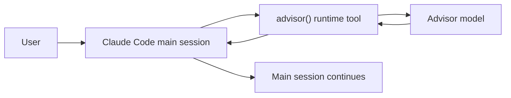
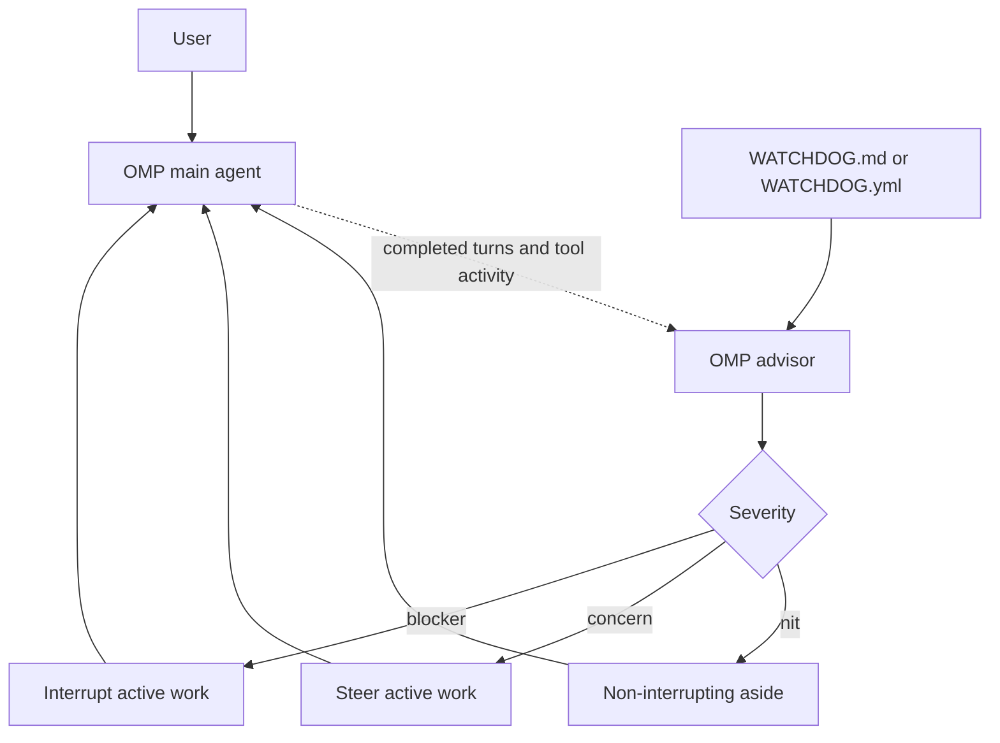
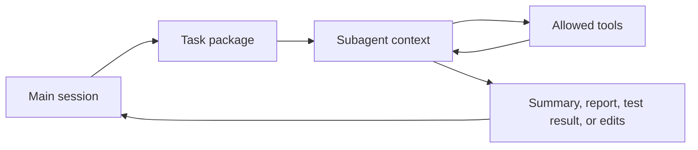
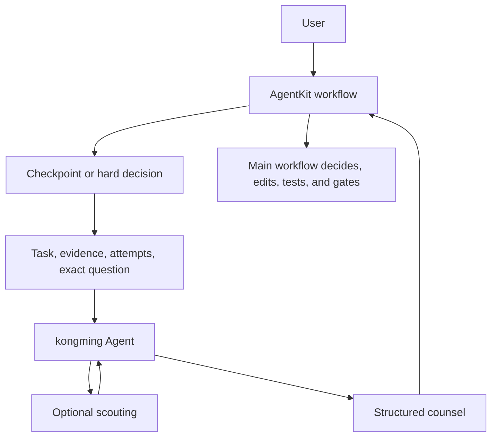
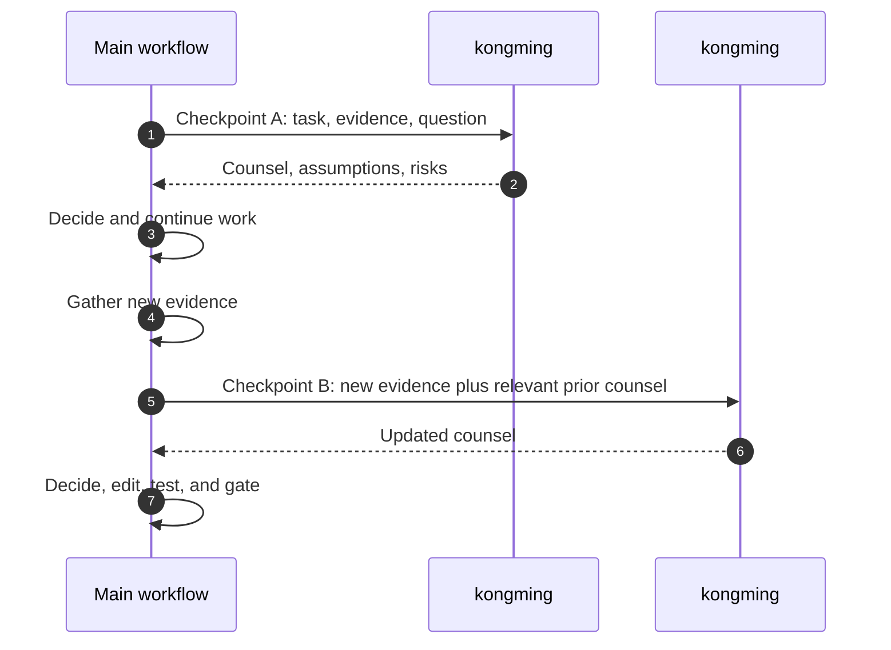
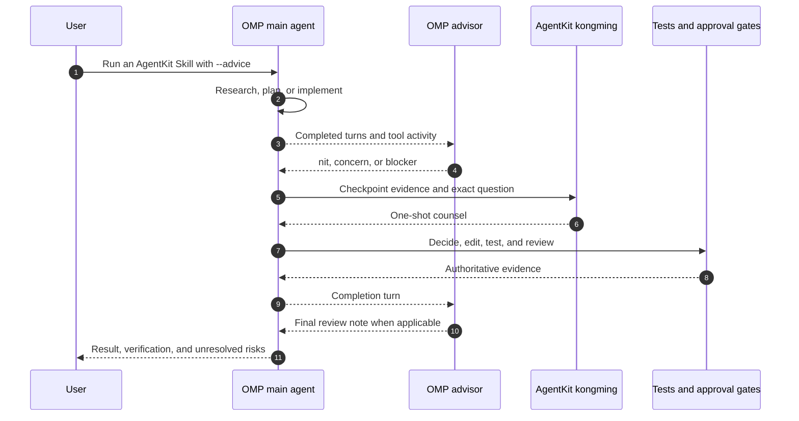
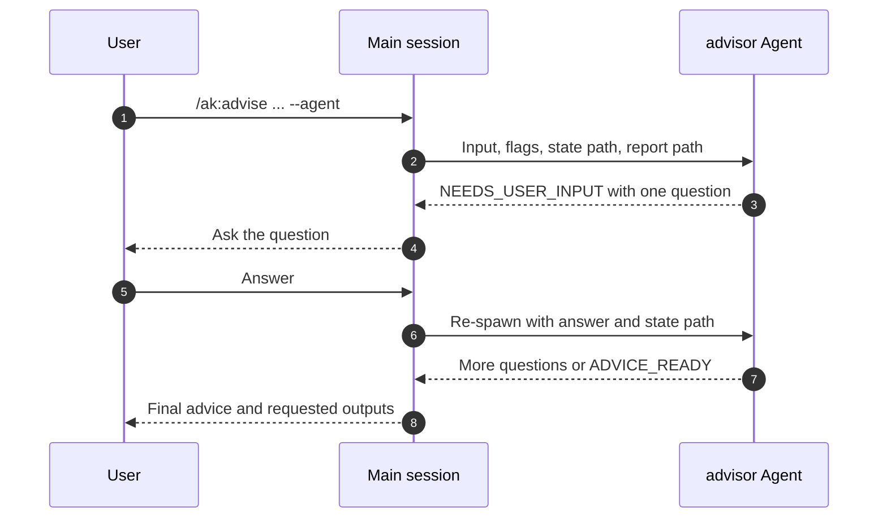

Advisory supervision is the AgentKit pattern for asking a stronger or more
specialized adviser to examine a decision without handing it authority to
implement. The adviser gives counsel; the main workflow still owns the plan,
edits, tests, approvals, and final decision.

This matters because several tools sound similar:

- Claude Code's built-in advisor is a runtime-native advisor tool.
- Oh My Pi's native advisor is a background reviewer that follows the session
  and can steer or interrupt the main agent.
- An ordinary subagent is an isolated worker that can run its own task loop.
- AgentKit `kongming` is a one-shot advisory Agent used at workflow checkpoints.
- AgentKit `advisor` is the interview-driven Agent behind
  `/ak:advise --agent`.

They are all useful, but they have different context, lifecycle, and authority
boundaries.

## The short version

Use the built-in Claude Code advisor when you want the current Claude Code
session to consult a native adviser during its own generation. Use `kongming`
when an AgentKit workflow reaches a hard checkpoint and needs explicit,
evidence-packed counsel from a fresh advisory Agent. Use `/ak:advise` when the
problem itself needs to be reframed through a user interview. Use an ordinary
subagent when you want delegated work, not just counsel.

Use the Oh My Pi advisor when you want continuous review across completed turns,
including severity-aware notes that may steer active work. You can combine it
with AgentKit `--advice`: the native advisor watches the session, while
`kongming` performs explicit one-shot reviews at workflow checkpoints.

`kongming` and `advisor` are AgentKit Agents. They are advisory-only by
contract. They may inspect evidence that the runtime allows them to inspect, but
they do not become the owner of implementation or approval.

## Built-in advisor in Claude Code

Claude Code exposes its own advisor feature through `/advisor`, the
`advisorModel` setting, and the `--advisor <model>` CLI flag. Anthropic describes
the underlying advisor tool as a way for an executor model to consult an adviser
model mid-generation; the adviser reads the conversation and returns strategic
guidance to the executor.

That makes it a runtime-native consultation. You do not package a task for an
AgentKit Agent, choose AgentKit checkpoints, or create an isolated AgentKit
state file. The main Claude Code session continues after receiving the advice.



See the public Claude documentation for the
[advisor tool](https://docs.anthropic.com/en/agents-and-tools/tool-use/advisor-tool),
the [Claude Code CLI flag](https://docs.anthropic.com/en/docs/claude-code/cli-reference),
and [Claude Code settings](https://docs.anthropic.com/en/docs/claude-code/settings).

## Native advisor in Oh My Pi

Oh My Pi provides a different runtime-native advisor. It runs as a background
reviewer and follows completed main-agent turns, including prompts, responses,
reasoning, and tool activity. Its default review tools can read and search the
project so it can verify claims against workspace evidence.

Accepted notes have three severities:

| Severity | Effect |
| --- | --- |
| `nit` | Adds a non-interrupting cleanup or low-risk note at a safe boundary |
| `concern` | Can steer active work when it finds a material risk or missed constraint |
| `blocker` | Can interrupt active work when continuing is likely to waste effort or produce a broken result |

Enablement requires both a resolvable `modelRoles.advisor` assignment and an
enabled advisor runtime, either persistently with `advisor.enabled`, temporarily
with `/advisor on`, or for a headless run with `--advisor`. `WATCHDOG.md` adds
review priorities without putting the same guidance in the main agent's ordinary
context. `WATCHDOG.yml` can define a roster of specialized advisors.



See the public Oh My Pi documentation for
[Advisor and WATCHDOG.md](https://github.com/can1357/oh-my-pi/blob/main/docs/advisor-watchdog.md).

## Ordinary subagents

Ordinary subagents are a delegation mechanism. Claude Code documents subagents
as specialized assistants that run in their own context window with their own
prompt, tool access, and permissions. They are useful when a side task would
flood the main session with logs, file reads, search results, or implementation
details.

A normal subagent can be asked to scout, test, review, write a report, or
sometimes edit files, depending on the task and runtime permissions. It is not
inherently advisory-only. Its authority comes from its prompt, tools, and the
user's or caller's instructions.



See Anthropic's [Claude Code subagents](https://docs.anthropic.com/en/docs/claude-code/sub-agents)
documentation for the runtime model.

## AgentKit kongming

`kongming` is implemented as an AgentKit Agent, but its contract is narrower
than a normal worker subagent:

| Property | `kongming` behavior |
| --- | --- |
| Purpose | Strategic counsel for hard design, debugging, trade-off, or go/no-go calls |
| Lifecycle | One-shot: one prompt in, one final answer out |
| User interview | None |
| Implementation authority | None |
| Expected input | Task, evidence, approaches tried, and the exact question |
| Expected output | Structured advice, assumptions, risks, checklist, and success metrics |

AgentKit Skills such as `ak:plan`, `ak:cook`, `ak:fix`, and `ak:vibe` use
`--advice` to add `kongming` supervision at checkpoints. Typical checkpoints
include:

- after a phase, gate, or major analysis completes;
- when repeated attempts fail or evidence conflicts;
- before a high-stakes architecture, public-contract, security-sensitive, or
  irreversible decision;
- after a pull request is open and required checks are green, when the workflow
  requires a final advisory review.

The calling workflow gives `kongming` enough context to answer in one reply.
`kongming` may scout with allowed read, search, or exploration tools, but it
does not interview the user and does not apply code changes.



## One-shot lifecycle

Each `kongming` consultation is fresh. If the workflow reaches checkpoint A, it
spawns `kongming #1`, receives advice, and continues. If new evidence appears
later at checkpoint B, the workflow spawns `kongming #2`.

The second consultation does not automatically inherit the first one's hidden
state. Forward the relevant prior counsel, evidence, and decision history
explicitly in the new prompt.



Treat `kongming` advice as a high-quality input, not as a verdict that executes
itself. The main workflow must still resolve conflicts, choose the path, make
the edits, run validation, satisfy approval gates, and record what happened.

## Combine the Oh My Pi advisor with AgentKit --advice

The two mechanisms can run together because they operate at different layers:

- the Oh My Pi advisor continuously reviews the main session and emits
  severity-aware notes;
- AgentKit `--advice` asks a fresh `kongming` Agent for one-shot counsel at the
  checkpoints defined by the active Skill.

On the Oh My Pi target, AgentKit projects Skills and Agents to OMP-native
discovery locations. The installed runtime still owns model resolution,
credentials, and live Agent delegation. A projected `kongming` file proves that
the Agent is discoverable; it does not prove that its requested model resolves
or that a checkpoint invocation completed.



A minimal topology makes the subagent policy explicit:

```yaml
modelRoles:
  default: provider/main-model
  advisor: provider/review-model

advisor:
  enabled: true

task:
  agentAdvisor:
    kongming: "off"
```

OMP subagents run without their own native advisor by default.
`task.agentAdvisor` controls that nested advisor per Agent; it does not select
the Agent's primary model. Setting `kongming: "off"` is therefore redundant
unless Agent frontmatter or another configuration layer enables it, but it makes
the intended topology explicit. Do not use the legacy `advisor.subagents`
switch for this purpose: `true` migrates only the bundled generic `task` Agent
to `task.agentAdvisor: { task: "on" }`, not every Agent and not `kongming`.

On OMP, AgentKit maps `kongming`'s `fable` tier to `model: "@advisor"`.
Without an override, the native default advisor and `kongming` therefore both
resolve through `modelRoles.advisor`. They still make separate requests with
separate contexts, but they do not provide model diversity.

To give `kongming` a different primary model, override the projected Agent:

```yaml
modelRoles:
  default: provider/main-model
  advisor: provider/background-review-model

advisor:
  enabled: true

task:
  agentModelOverrides:
    kongming: provider/checkpoint-model
  agentAdvisor:
    kongming: "off"
```

`task.agentModelOverrides.kongming` takes precedence over the Agent's projected
`model: "@advisor"`. Keep `task.agentAdvisor.kongming` off unless you
deliberately want a second, native OMP advisor inside each spawned `kongming`
session. If `modelRoles.advisor` is missing or unavailable, the native default
advisor and an unoverridden `kongming` checkpoint cannot resolve their model;
explicit roster models and an explicit `kongming` override are independent of
that role.

## ak:advise inline and ak:advise --agent

AgentKit `advisor` is different from `kongming`.

`/ak:advise` is an interview-driven Skill. It analyzes a prompt or URL, scouts
when project evidence matters, asks one question at a time, confirms the
reframed problem, then delivers candid advice.

Without `--agent`, Claude Code runs `/ak:advise` inline in the main session. The
same Skill workflow still applies: the main session analyzes the input, scouts
when useful, asks the interview questions directly, confirms the reframing, and
returns the advice or requested report artifacts. No separate AgentKit
`advisor` Agent is spawned.

With `--agent` on Claude Code, the Skill delegates that whole interview to the
`advisor` Agent.

Because the interview needs user participation, `advisor` uses a relay pattern:
it asks exactly one question, persists its state, returns a structured
`NEEDS_USER_INPUT` request to the orchestrating session, then is re-spawned with
the user's answer. When the interview converges, it writes the advice report and
returns `ADVICE_READY`.



Use `advisor` when the advice depends on discovering the real requirements with
the user. Use `kongming` when the workflow already knows the checkpoint question
and needs a one-shot strategic review.

## Runtime notes

Runtime support is not identical.

| Runtime | Advisory behavior to know |
| --- | --- |
| Claude Code | `/ak:advise` without `--agent` runs inline in the main session. `/ak:advise --agent` delegates the interview to the AgentKit `advisor` Agent. AgentKit marks `kongming` and `advisor` with the `fable` model tier. Claude Code also has its own built-in advisor, which is separate from AgentKit Agents. |
| Codex | AgentKit maps `kongming` to a Codex frontier model override with high reasoning effort. The shared `fable` frontmatter remains portable, but Codex-specific model IDs are emitted only by the Codex adapter. `/ak:advise --agent` does not imply the Claude Code relay path; use inline `ak:advise` unless your installed runtime reports support. |
| Cursor | AgentKit can project Agents and Skills, but do not assume Claude Code advisor behavior or AgentKit `advisor` relay parity from file presence alone. Check the runtime adapter output and the Skill page for the active surface. |
| Oh My Pi | AgentKit projects Skills and Agents to OMP-native discovery surfaces. `--advice` requires live Agent delegation and a resolvable model for `kongming`; the native OMP advisor is a separate background-review subsystem. Both can run together, but file presence alone does not prove either review completed. |

### Claude Code

Claude Code has two AgentKit `ak:advise` shapes:

- **Inline `/ak:advise`** keeps the interview in the current main session. Use
  this when you want the ordinary Skill flow, visible conversation state, and no
  separate AgentKit adviser context.
- **`/ak:advise --agent`** makes the main session an orchestrator for the
  AgentKit `advisor` Agent. Use this when you want the long interview and advice
  generation isolated in an adviser context on the strongest configured tier.

Both modes are different from Claude Code's built-in `/advisor`. The built-in
advisor is a runtime-native consultation tool; AgentKit `ak:advise` is a Skill
workflow, with optional delegation to the AgentKit `advisor` Agent.

### Codex

Codex uses native Skill discovery for AgentKit Skills, so `ak:advise` runs as a
Skill in the current Codex session. The Claude Code-only `advisor` relay behind
`/ak:advise --agent` is not the Codex contract; outside Claude Code, use the
inline interview unless the installed runtime explicitly reports an adviser
relay surface.

For workflow supervision, Codex does support Agent delegation. When a Skill such
as `ak:plan`, `ak:cook`, `ak:fix`, or `ak:vibe` runs with `--advice`, the
workflow can consult `kongming` through Codex's delegation capability when
delegation is available in the session. AgentKit emits `kongming` with a
Codex-specific frontier model override and high reasoning effort, while keeping
the shared `model: fable` source portable.

The same ownership rule applies: `kongming` returns advice only. The Codex main
session still applies patches, runs commands, updates plans, and decides whether
to continue.

### Cursor

Cursor has a native AgentKit projection for Skills and Agents:

- Skills are emitted under Cursor's `.cursor/skills/` discovery tree.
- Agents are emitted under `.cursor/agents/`.
- AgentKit command files are preserved as sidecar content because Cursor does
  not have the same command-file surface.

In practice, `ak:advise` is the safe Cursor path: run the Skill inline and let
it ask the interview questions in the current session. `--agent` should not be
treated as equivalent to Claude Code's adviser relay. The AgentKit `advisor`
Agent may be projected, but the documented relay protocol for
`/ak:advise --agent` is Claude Code-only.

For `--advice`, Cursor exposes a native subagent capability and can project
`kongming` as an Agent. That means an AgentKit workflow can ask for `kongming`
counsel at checkpoints when the live Cursor setup supports Agent invocation.
Cursor remaps the shared `fable` tier to a Cursor model ID at emit time. Current
AgentKit conformance still records live Cursor Agent install, update, and
invocation canary coverage as deferred, and model availability can vary by
Cursor plan. Treat adapter output and the active Cursor session as the source of
truth.

### Oh My Pi

AgentKit installs portable Skills below `.omp/skills/`, Agents below
`.omp/agents/`, and rules below `.omp/rules/` for a project-scoped OMP
projection. A global projection uses the active OMP profile root. Installation
and dispatch remain separate: installation creates discoverable inventory,
while `ak run --target omp` dispatches a resolved Skill through the local OMP
CLI.

Oh My Pi owns the configured backend, credentials, model roles, and live Agent
capabilities. Before relying on `--advice`, inspect the installed `kongming`
Agent, confirm its requested model resolves, and verify that the active OMP
session can delegate to it. Configure and check the native advisor separately;
do not infer `advisor.enabled` from the presence of AgentKit files.

### Model availability and fallback

AgentKit does not silently downgrade advisory Agents when a subscription,
provider, or runtime plan cannot use the configured frontier model. A model tier
or emitted model ID is a request to the runtime, not proof that the user's
account can run it.

If the runtime rejects the model, treat the advisory step as not completed. The
safe fallback is explicit:

- Run the advice inline in the main session when the task is `/ak:advise` and
  isolation is not required.
- Reconfigure the installed Agent or runtime model to one the account can use,
  then rerun the advisory step.
- Continue without `--advice` only when the workflow owner accepts losing the
  `kongming` checkpoint.
- Report the model or entitlement failure instead of claiming frontier counsel
  happened.

In Codex, an Agent can either request a specific model or inherit the current
session default. If an Agent is marked `inherit`, or AgentKit does not recognize
its model tier, AgentKit writes no Codex model override for that Agent. Codex
then runs it with the session's default model.

`kongming` is different: AgentKit writes an explicit Codex frontier-model
override for it. If that model is not available to the account, do not assume
Codex will fall back to the session default. Treat the advisory checkpoint as
blocked until the model is changed or the workflow continues without that
checkpoint.

For broader installation differences, see [Runtime adapters](./runtime-adapters).

## Choosing the right tool

| Need | Use |
| --- | --- |
| Native mid-generation second opinion inside Claude Code | Claude Code built-in advisor |
| Continuous severity-aware review across Oh My Pi turns | Oh My Pi native advisor |
| One-shot strategic checkpoint inside an AgentKit workflow | `kongming`, usually through `--advice` |
| Continuous OMP review plus explicit workflow checkpoints | Oh My Pi advisor together with AgentKit `--advice`, after both model paths are verified |
| Interview-driven reframing before deciding what to do | `/ak:advise`, or `/ak:advise --agent` on Claude Code |
| Isolated research, testing, review, or implementation work | An ordinary subagent with a bounded task |
| Parallel or multi-session coordination | Agent team or workflow support, not advisory supervision alone |

Good `kongming` prompts include the current task, the phase or gate, concrete
evidence, file or command findings when available, approaches already tried,
constraints, the specific decision, and what kind of answer would help the main
workflow continue.

Weak prompts ask for general wisdom without evidence. Advisory supervision works
best when the adviser can inspect the same facts the main workflow is using and
answer a precise question.

## Keep ownership in the main workflow

Advisory supervision is deliberately asymmetric:

- The adviser can challenge, reframe, and recommend.
- The main workflow chooses, implements, tests, and records.
- Approval gates, branch protections, review blockers, security policy, and
  runtime permissions still apply.
- A later checkpoint should pass forward the relevant prior advice explicitly.

That separation is the point. AgentKit uses advisory supervision to improve
judgment without confusing advice with execution authority.
