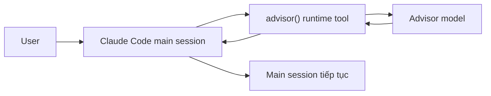
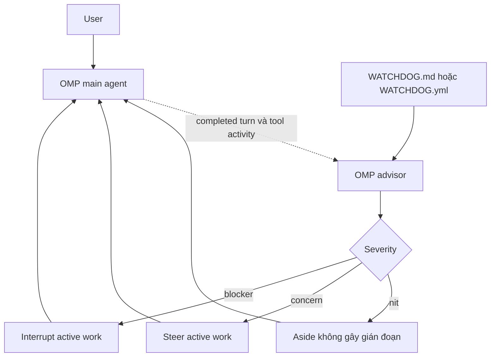
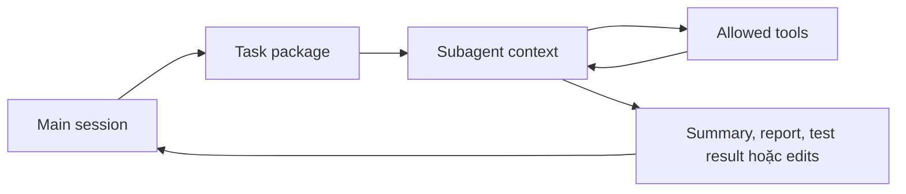
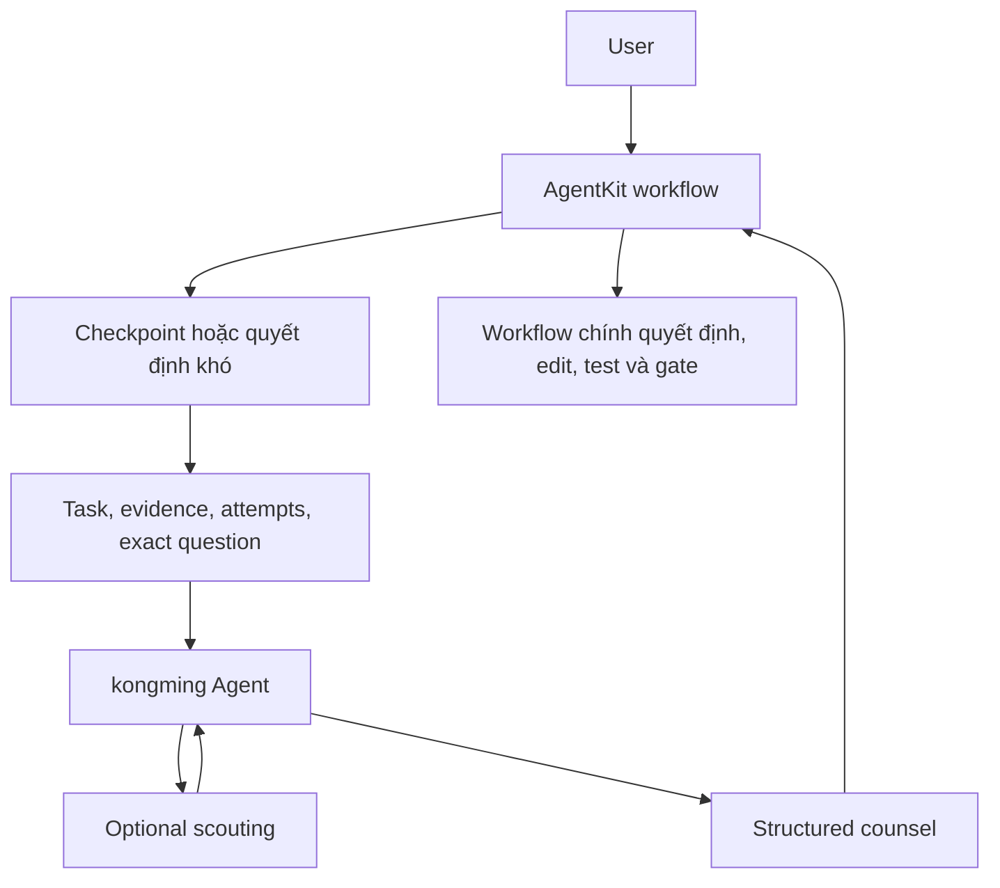
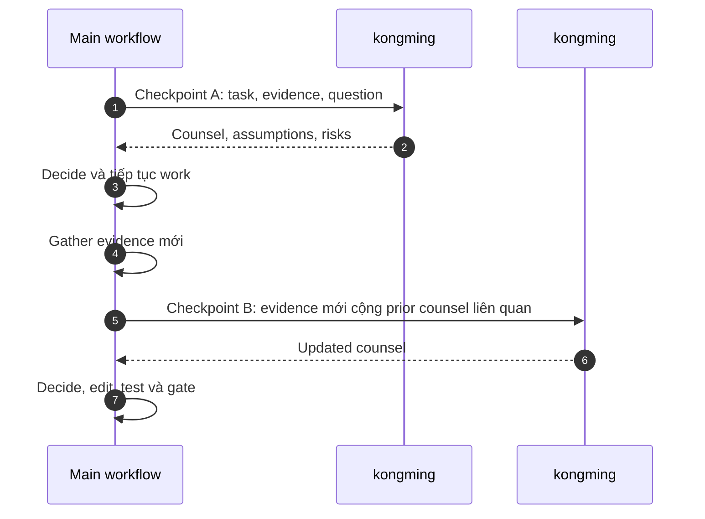
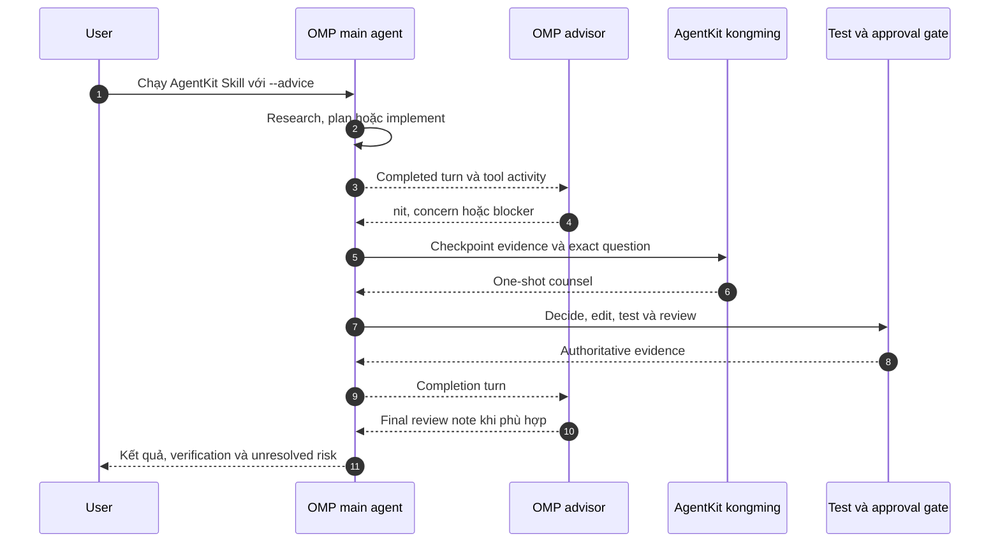
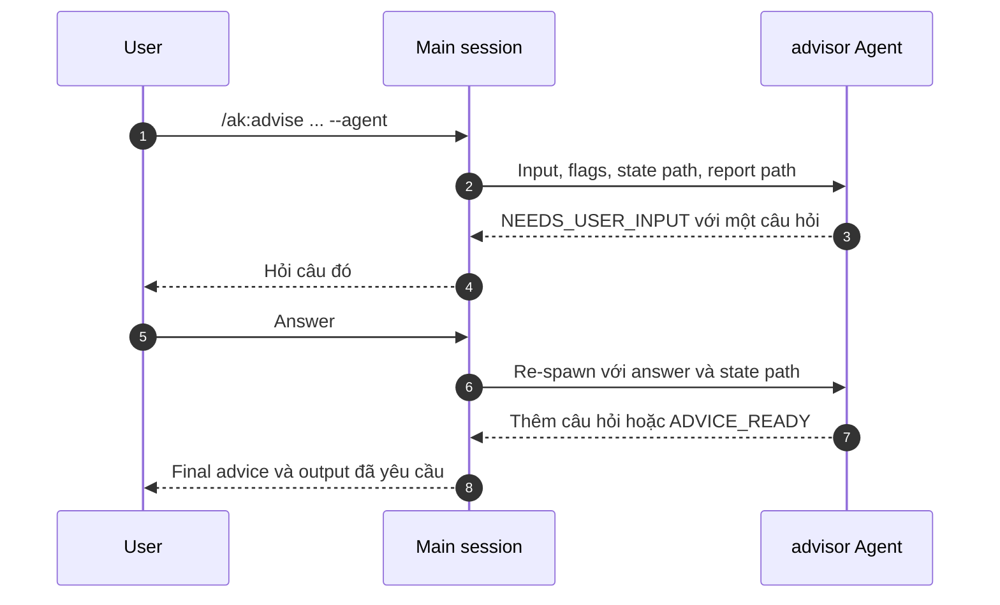

Giám sát tư vấn là pattern của AgentKit để nhờ một adviser mạnh hơn hoặc chuyên
biệt hơn xem xét một quyết định mà không giao quyền implementation cho adviser
đó. Adviser đưa counsel; workflow chính vẫn sở hữu plan, edit, test, approval
và quyết định cuối cùng.

Điều này quan trọng vì vài công cụ nghe khá giống nhau:

- Built-in advisor của Claude Code là advisor tool native của runtime.
- Native advisor của Oh My Pi là background reviewer theo dõi session và có thể
  steer hoặc interrupt main agent.
- Subagent thông thường là worker cô lập có thể chạy task loop riêng.
- AgentKit `kongming` là Agent tư vấn one-shot dùng tại checkpoint của workflow.
- AgentKit `advisor` là Agent phỏng vấn phía sau `/ak:advise --agent`.

Chúng đều hữu ích, nhưng khác nhau về context, lifecycle và ranh giới authority.

## Tóm tắt nhanh

Dùng built-in advisor của Claude Code khi bạn muốn session Claude Code hiện tại
consult một adviser native trong lúc tự sinh phản hồi. Dùng `kongming` khi một
workflow AgentKit tới checkpoint khó và cần counsel được đóng gói rõ bằng chứng
từ một Agent tư vấn mới. Dùng `/ak:advise` khi chính problem cần được reframe
qua interview với người dùng. Dùng subagent thông thường khi bạn muốn giao việc,
không chỉ xin counsel.

Dùng advisor của Oh My Pi khi bạn muốn review liên tục qua các completed turn,
bao gồm note theo severity có thể steer công việc đang chạy. Bạn có thể kết hợp
nó với AgentKit `--advice`: native advisor theo dõi session, còn `kongming`
review one-shot tại các workflow checkpoint rõ ràng.

`kongming` và `advisor` là Agent của AgentKit. Theo contract, chúng chỉ tư vấn.
Chúng có thể kiểm tra evidence mà runtime cho phép, nhưng không trở thành chủ sở
hữu implementation hay approval.

## Built-in advisor trong Claude Code

Claude Code cung cấp advisor riêng qua `/advisor`, setting `advisorModel` và
CLI flag `--advisor <model>`. Tài liệu Anthropic mô tả advisor tool bên dưới như
cách để executor model consult một adviser model trong lúc sinh phản hồi; adviser
đọc conversation và trả strategic guidance về executor.

Vì vậy đây là consultation native của runtime. Bạn không đóng gói task cho một
Agent của AgentKit, không chọn checkpoint của AgentKit và không tạo state file cô
lập của AgentKit. Main session Claude Code tiếp tục sau khi nhận advice.



Xem tài liệu công khai của Claude về
[advisor tool](https://docs.anthropic.com/en/agents-and-tools/tool-use/advisor-tool),
[CLI flag của Claude Code](https://docs.anthropic.com/en/docs/claude-code/cli-reference)
và [Claude Code settings](https://docs.anthropic.com/en/docs/claude-code/settings).

## Native advisor trong Oh My Pi

Oh My Pi cung cấp một runtime-native advisor có lifecycle khác. Nó chạy như
background reviewer và theo dõi các completed turn của main agent, gồm prompt,
response, reasoning cùng tool activity. Các review tool mặc định có thể đọc và
search project để kiểm tra claim dựa trên workspace evidence.

Note được chấp nhận có ba severity:

| Severity | Tác dụng |
| --- | --- |
| `nit` | Thêm note cleanup hoặc low-risk không gây gián đoạn tại ranh giới an toàn |
| `concern` | Có thể steer active work khi phát hiện material risk hoặc constraint bị bỏ sót |
| `blocker` | Có thể interrupt active work khi tiếp tục dễ lãng phí công sức hoặc tạo kết quả hỏng |

Để bật, cần cả assignment `modelRoles.advisor` resolve được và advisor runtime
được enable: persistent bằng `advisor.enabled`, tạm thời bằng `/advisor on`,
hoặc cho headless run bằng `--advisor`. `WATCHDOG.md` thêm review priority mà
không đưa cùng guidance vào ordinary context của main agent. `WATCHDOG.yml` có
thể khai báo roster gồm nhiều advisor chuyên biệt.



Xem tài liệu công khai của Oh My Pi về
[Advisor và WATCHDOG.md](https://github.com/can1357/oh-my-pi/blob/main/docs/advisor-watchdog.md).

## Subagent thông thường

Subagent thông thường là cơ chế delegation. Tài liệu Claude Code mô tả subagent
như assistant chuyên biệt chạy trong context window riêng, với prompt, tool
access và permission riêng. Chúng hữu ích khi một side task sẽ làm main session
đầy log, file read, search result hoặc implementation detail.

Một subagent thông thường có thể scout, test, review, viết report hoặc đôi khi
edit file, tùy task và permission của runtime. Nó không mặc định là
advisory-only. Authority của nó đến từ prompt, tools và instruction của người
dùng hoặc caller.



Xem tài liệu
[Claude Code subagents](https://docs.anthropic.com/en/docs/claude-code/sub-agents)
của Anthropic để biết runtime model.

## AgentKit kongming

`kongming` được triển khai như một Agent của AgentKit, nhưng contract hẹp hơn
một worker subagent thông thường:

| Thuộc tính | Hành vi của `kongming` |
| --- | --- |
| Mục đích | Counsel chiến lược cho design, debugging, trade-off hoặc go/no-go khó |
| Lifecycle | One-shot: một prompt vào, một final answer ra |
| User interview | Không |
| Implementation authority | Không |
| Input kỳ vọng | Task, evidence, approach đã thử và câu hỏi chính xác |
| Output kỳ vọng | Advice có cấu trúc, assumption, risk, checklist và success metric |

Các Skill của AgentKit như `ak:plan`, `ak:cook`, `ak:fix` và `ak:vibe` dùng
`--advice` để thêm giám sát bằng `kongming` tại checkpoint. Checkpoint thường
gồm:

- Sau khi một phase, gate hoặc phân tích lớn hoàn tất;
- Khi nhiều lần thử thất bại hoặc evidence mâu thuẫn;
- Trước quyết định architecture, public contract, security-sensitive hoặc không
  dễ đảo ngược;
- Sau khi pull request đã mở và required checks xanh, khi workflow yêu cầu
  advisory review cuối.

Workflow gọi cung cấp đủ context để `kongming` trả lời trong một lần.
`kongming` có thể scout bằng các tool đọc, search hoặc explore được phép, nhưng
không phỏng vấn người dùng và không áp dụng code change.



## Lifecycle one-shot

Mỗi lần consult `kongming` là mới. Nếu workflow tới checkpoint A, nó spawn
`kongming #1`, nhận advice và tiếp tục. Nếu sau đó có evidence mới tại
checkpoint B, workflow spawn `kongming #2`.

Lần consult thứ hai không tự kế thừa hidden state của lần thứ nhất. Hãy chuyển
rõ prior counsel, evidence và decision history liên quan trong prompt mới.



Hãy coi advice của `kongming` là input chất lượng cao, không phải verdict tự
thực thi. Workflow chính vẫn phải giải quyết conflict, chọn hướng đi, sửa code,
chạy validation, đáp ứng approval gate và ghi lại điều đã xảy ra.

## Kết hợp Oh My Pi advisor với AgentKit --advice

Hai cơ chế có thể chạy cùng nhau vì chúng hoạt động ở hai lớp khác nhau:

- Oh My Pi advisor review liên tục main session và phát severity-aware note;
- AgentKit `--advice` gọi một Agent `kongming` mới để nhận counsel one-shot tại
  các checkpoint do Skill đang chạy định nghĩa.

Trên target Oh My Pi, AgentKit project Skill và Agent vào native discovery
location của OMP. Runtime đã cài vẫn sở hữu model resolution, credential và live
Agent delegation. Tệp `kongming` đã được project chỉ chứng minh Agent có thể được
discover; nó không chứng minh model yêu cầu resolve được hoặc checkpoint
invocation đã hoàn tất.



Cách tách role tối thiểu:

```yaml
modelRoles:
  default: provider/main-model
  advisor: provider/review-model

advisor:
  enabled: true
  subagents: false
```

Giữ `advisor.subagents: false` khi mới kết hợp hai cơ chế. Nếu bật, native
advisor cũng chạy trong các spawned subagent session đủ điều kiện, khiến
background reviewer có thể supervise chính `kongming`. Lớp bổ sung này thường
trùng lặp và làm tăng cost cùng latency.

Nếu cả hai cơ chế resolve qua cùng advisor role, chúng vẫn tạo request và
context riêng, nhưng không tạo model diversity. Nếu advisor role bị thiếu hoặc
không khả dụng, coi native advisor cùng mọi `kongming` checkpoint bị ảnh hưởng
là chưa hoàn tất; không báo rằng hai independent review đã xảy ra.

## ak:advise inline và ak:advise --agent

AgentKit `advisor` khác với `kongming`.

`/ak:advise` là Skill có interview. Skill phân tích prompt hoặc URL, scout khi
project evidence quan trọng, hỏi từng câu, xác nhận problem đã reframe, rồi đưa
advice thẳng thắn.

Khi không có `--agent`, Claude Code chạy `/ak:advise` inline trong main session.
Cùng workflow Skill vẫn áp dụng: main session phân tích input, scout khi hữu
ích, hỏi các interview question trực tiếp, xác nhận reframing và trả advice hoặc
report artifact đã yêu cầu. Không có AgentKit `advisor` Agent riêng được spawn.

Với `--agent` trên Claude Code, Skill giao toàn bộ interview đó cho Agent
`advisor`.

Vì interview cần người dùng tham gia, `advisor` dùng relay pattern: nó hỏi đúng
một câu, lưu state, trả một request `NEEDS_USER_INPUT` có cấu trúc cho session
orchestrating, rồi được re-spawn với answer của người dùng. Khi interview hội
tụ, nó viết advice report và trả `ADVICE_READY`.



Dùng `advisor` khi advice phụ thuộc việc khám phá requirement thật với người
dùng. Dùng `kongming` khi workflow đã biết câu hỏi checkpoint và cần strategic
review one-shot.

## Ghi chú runtime

Runtime không hỗ trợ giống hệt nhau.

| Runtime | Điều cần biết về advisory |
| --- | --- |
| Claude Code | `/ak:advise` không có `--agent` chạy inline trong main session. `/ak:advise --agent` giao interview cho AgentKit `advisor` Agent. AgentKit đánh dấu `kongming` và `advisor` bằng model tier `fable`. Claude Code cũng có built-in advisor riêng, tách biệt với các Agent của AgentKit. |
| Codex | AgentKit map `kongming` sang frontier model override của Codex với high reasoning effort. Frontmatter `fable` dùng chung vẫn portable, nhưng model ID riêng của Codex chỉ do adapter Codex emit. `/ak:advise --agent` không đồng nghĩa có relay path của Claude Code; dùng inline `ak:advise` trừ khi runtime đã cài báo hỗ trợ. |
| Cursor | AgentKit có thể project Agents và Skills, nhưng đừng suy ra behavior của Claude Code advisor hoặc parity của relay `advisor` trong AgentKit chỉ từ việc file tồn tại. Kiểm tra output của runtime adapter và trang Skill để biết surface đang active. |
| Oh My Pi | AgentKit project Skill và Agent vào native discovery surface của OMP. `--advice` cần live Agent delegation cùng model resolve được cho `kongming`; native OMP advisor là background-review subsystem riêng. Hai cơ chế có thể chạy cùng nhau, nhưng chỉ có tệp không chứng minh review nào đã hoàn tất. |

### Claude Code

Claude Code có hai shape cho AgentKit `ak:advise`:

- **Inline `/ak:advise`** giữ interview trong main session hiện tại. Dùng khi
  bạn muốn flow Skill thông thường, conversation state hiển thị rõ và không cần
  adviser context riêng của AgentKit.
- **`/ak:advise --agent`** biến main session thành orchestrator cho AgentKit
  `advisor` Agent. Dùng khi bạn muốn interview dài và advice generation được cô
  lập trong adviser context trên tier mạnh nhất đã cấu hình.

Cả hai mode đều khác built-in `/advisor` của Claude Code. Built-in advisor là
consultation tool native của runtime; AgentKit `ak:advise` là Skill workflow,
có thể tùy chọn delegate sang AgentKit `advisor` Agent.

### Codex

Codex dùng native Skill discovery cho các Skill của AgentKit, nên `ak:advise`
chạy như một Skill trong session Codex hiện tại. Relay `advisor` chỉ dành cho
Claude Code phía sau `/ak:advise --agent` không phải contract của Codex; ngoài
Claude Code, hãy dùng inline interview trừ khi runtime đã cài báo rõ có adviser
relay surface.

Với workflow supervision, Codex có hỗ trợ Agent delegation. Khi một Skill như
`ak:plan`, `ak:cook`, `ak:fix` hoặc `ak:vibe` chạy với `--advice`, workflow có
thể consult `kongming` qua capability delegation của Codex khi session cho phép
delegation. AgentKit emit `kongming` với frontier model override riêng của Codex
và high reasoning effort, trong khi vẫn giữ source chung `model: fable` portable.

Quy tắc ownership vẫn giống nhau: `kongming` chỉ trả advice. Main session Codex
vẫn apply patch, chạy command, update plan và quyết định có tiếp tục hay không.

### Cursor

Cursor có projection native của AgentKit cho Skills và Agents:

- Skills được emit vào discovery tree `.cursor/skills/` của Cursor.
- Agents được emit vào `.cursor/agents/`.
- Command file của AgentKit được giữ như sidecar content vì Cursor không có cùng
  command-file surface.

Trong thực tế, `ak:advise` là đường an toàn trên Cursor: chạy Skill inline và để
Skill hỏi các interview question trong session hiện tại. Không nên coi `--agent`
tương đương adviser relay của Claude Code. Agent `advisor` của AgentKit có thể
được project, nhưng relay protocol được document cho `/ak:advise --agent` chỉ
dành cho Claude Code.

Với `--advice`, Cursor có native subagent capability và có thể project
`kongming` như một Agent. Nghĩa là workflow AgentKit có thể xin counsel từ
`kongming` tại checkpoint khi setup Cursor live hỗ trợ Agent invocation. Cursor
remap tier chung `fable` sang model ID của Cursor tại thời điểm emit. Conformance
hiện tại của AgentKit vẫn ghi live canary cho Cursor Agent install, update và
invocation là deferred, và model availability có thể khác nhau theo Cursor plan.
Hãy coi adapter output và session Cursor đang active là nguồn sự thật.

### Oh My Pi

AgentKit cài Skill portable dưới `.omp/skills/`, Agent dưới `.omp/agents/` và
rule dưới `.omp/rules/` cho OMP projection ở project scope. Global projection
dùng root của active OMP profile. Installation và dispatch vẫn là hai tuyến
riêng: installation tạo inventory có thể discover, còn `ak run --target omp`
dispatch Skill đã resolve qua OMP CLI cục bộ.

Oh My Pi sở hữu backend, credential, model role và live Agent capability đã cấu
hình. Trước khi dựa vào `--advice`, hãy kiểm tra Agent `kongming` đã cài, xác
nhận model nó yêu cầu resolve được và xác minh active OMP session có thể delegate
tới Agent đó. Cấu hình và kiểm tra native advisor riêng; đừng suy ra
`advisor.enabled` chỉ từ việc AgentKit file tồn tại.

### Model availability và fallback

AgentKit không tự động downgrade các Agent tư vấn khi subscription, provider
hoặc runtime plan không dùng được frontier model đã cấu hình. Model tier hoặc
model ID được emit là request gửi tới runtime, không phải bằng chứng account của
người dùng chạy được model đó.

Nếu runtime từ chối model, hãy coi advisory step là chưa hoàn tất. Fallback an
toàn phải rõ ràng:

- Chạy advice inline trong main session khi task là `/ak:advise` và không cần
  isolation.
- Cấu hình lại Agent đã cài hoặc runtime model sang model account dùng được, rồi
  chạy lại advisory step.
- Chỉ tiếp tục không có `--advice` khi workflow owner chấp nhận mất checkpoint
  `kongming`.
- Báo lỗi model hoặc entitlement thay vì claim rằng frontier counsel đã xảy ra.

Trong Codex, một Agent có thể yêu cầu model riêng hoặc dùng default của session
hiện tại. Nếu Agent được đánh dấu `inherit`, hoặc AgentKit không nhận diện được
model tier của Agent đó, AgentKit không ghi model override cho Codex. Khi đó
Codex chạy Agent bằng model mặc định của session.

`kongming` thì khác: AgentKit ghi frontier-model override rõ cho Codex. Nếu
account không dùng được model đó, đừng giả định Codex sẽ tự rơi về default của
session. Hãy coi checkpoint tư vấn đang bị chặn cho đến khi đổi model hoặc
workflow tiếp tục mà không có checkpoint đó.

Để xem khác biệt cài đặt rộng hơn, đọc [Runtime adapters](./runtime-adapters).

## Chọn đúng công cụ

| Nhu cầu | Dùng |
| --- | --- |
| Second opinion native giữa lúc sinh phản hồi trong Claude Code | Built-in advisor của Claude Code |
| Continuous severity-aware review qua các turn của Oh My Pi | Native advisor của Oh My Pi |
| Strategic checkpoint one-shot trong workflow AgentKit | `kongming`, thường qua `--advice` |
| Continuous OMP review cộng checkpoint rõ của workflow | Oh My Pi advisor cùng AgentKit `--advice`, sau khi xác minh cả hai model path |
| Reframing có interview trước khi quyết định làm gì | `/ak:advise`, hoặc `/ak:advise --agent` trên Claude Code |
| Research, testing, review hoặc implementation cô lập | Subagent thông thường với task có ranh giới |
| Điều phối parallel hoặc nhiều session | Agent team hoặc workflow support, không chỉ advisory supervision |

Prompt tốt cho `kongming` gồm task hiện tại, phase hoặc gate, evidence cụ thể,
finding từ file hoặc command khi có, approach đã thử, constraint, quyết định
đang cần chọn và kiểu answer giúp workflow chính tiếp tục.

Prompt yếu xin lời khuyên chung chung mà không có evidence. Giám sát tư vấn hoạt
động tốt nhất khi adviser có thể xem cùng facts mà workflow chính đang dùng và
trả lời một câu hỏi chính xác.

## Giữ ownership ở workflow chính

Giám sát tư vấn cố ý bất đối xứng:

- Adviser có thể challenge, reframe và recommend.
- Workflow chính chọn, implement, test và record.
- Approval gate, branch protection, review blocker, security policy và runtime
  permission vẫn áp dụng.
- Checkpoint sau nên chuyển rõ prior advice liên quan.

Sự tách biệt đó là mục đích của pattern này. AgentKit dùng giám sát tư vấn để
cải thiện judgment mà không nhầm advice với execution authority.
