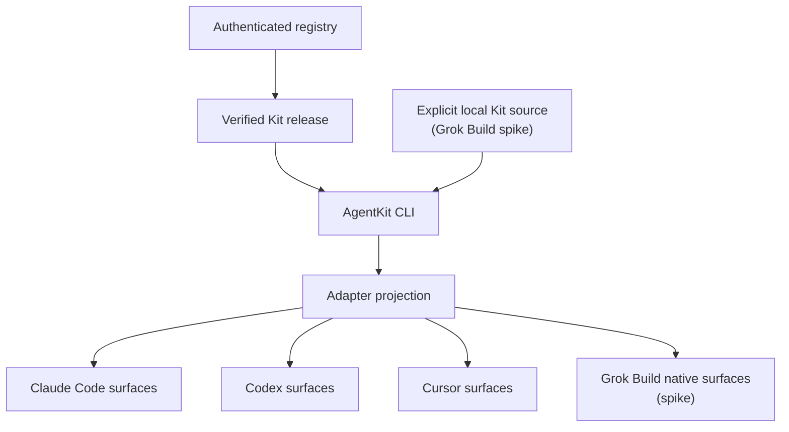

AgentKit sits between Kit sources and coding assistants. The CLI handles
installation and lifecycle operations and can start adapter dispatch; the
assistant still runs the AI session and its tools.

## The parts of the system

- **AgentKit CLI (`ak`)** authenticates access, resolves released kit packages,
  verifies release material, installs through a selected adapter, and manages
  updates, diagnostics, uninstall, and recovery snapshots. Source-only targets
  can instead use an explicit local Kit source for development or CI.
- **A Kit package** bundles workflows and their supporting components as a unit.
  Released packages are versioned and verified; a local source is development
  input, not evidence that a runtime package was released.
- **A runtime adapter** translates supported Kit surfaces into the files and
  registrations understood by Claude Code, Codex, Cursor, or the Grok Build
  spike. It also reports content that the target cannot activate.
- **A project or user scope** determines where the adapted content is available.
  Project scope is the default for the current workspace. User scope makes the
  installation available through that runtime's user directories.
- **The coding assistant** discovers the installed content and performs the
  workflow using its own model, tools, permission system, and lifecycle events.

## What happens when you use a workflow

1. You choose an outcome and invoke a Skill, or ask the runtime to perform a
   workflow that delegates to an Agent.
2. The runtime loads the adapted instructions and any supporting files it knows
   how to use.
3. Skills, Agents, and supported Hooks coordinate the work. The exact behavior
   depends on the runtime's capabilities.
4. The workflow may create or change project artifacts such as code, plans, or
   reports.
5. You review the result and decide what to keep, commit, publish, or send.

Installing a Kit does not run its workflows. It also does not commit or publish
project changes. A workflow that can affect a remote system, disclose data, or
incur cost still needs the permissions and confirmation required by that
runtime and workflow.

## Installation and execution are separate

AgentKit owns the installation lifecycle for files it can identify as its own.
The coding assistant owns execution. Your repository and user-created artifacts
remain yours.

For native Grok Build, `--target grok` selects AgentKit's projection and dispatch
boundary. AgentKit owns its installed paths and process launch; Grok and the user
own the effective model, authentication, project trust, permissions, sandbox,
and `.grok/config.toml`. This target remains a `spike`: source registration and
a disposable native discovery path do not make it a production or remotely
obtainable runtime package.

This separation matters during updates and removal: AgentKit can replace or
remove an unchanged file it previously installed, but it preserves unknown or
user-modified files when ownership cannot be proven. See
[Projects, artifacts, and checkpoints](./projects-artifacts-checkpoints) for the
recovery model.

## Continue learning

- [Kits, Skills, Agents, and Hooks](./building-blocks)
- [Runtime adapters](./runtime-adapters)
- [Installation](../getting-started/installation)
- [CLI reference](../reference/cli)
