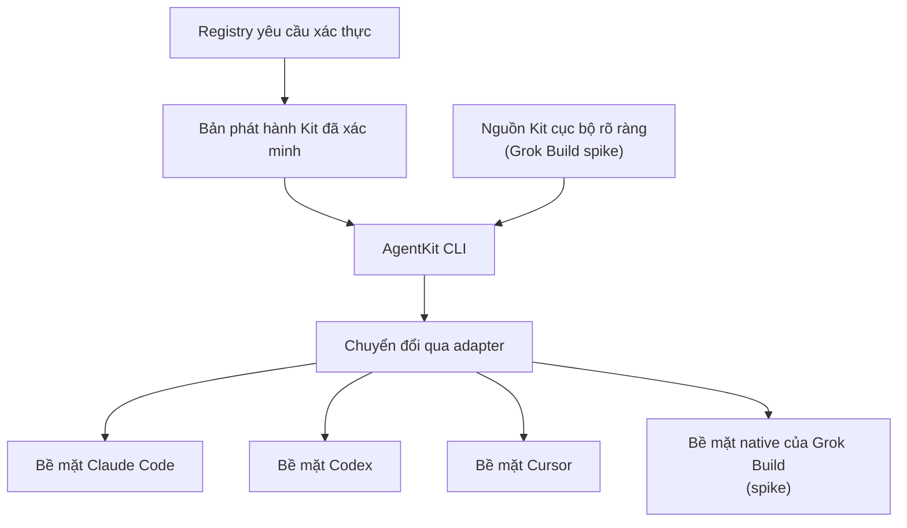

AgentKit nằm giữa các nguồn Kit và coding assistant. CLI xử lý việc cài đặt,
các thao tác lifecycle và có thể bắt đầu dispatch qua adapter; assistant vẫn
chạy phiên AI và các công cụ của nó.

## Các phần của hệ thống

- **AgentKit CLI (`ak`)** xác thực quyền truy cập, phân giải gói Kit đã phát
  hành, xác minh nội dung phát hành, cài đặt qua adapter được chọn và quản lý cập
  nhật, chẩn đoán, gỡ cài đặt cùng snapshot khôi phục. Target chỉ có trong source
  có thể dùng nguồn Kit cục bộ rõ ràng cho development hoặc CI.
- **Gói Kit** đóng gói workflow và các thành phần hỗ trợ thành một đơn vị. Gói đã
  phát hành có phiên bản và được xác minh; nguồn cục bộ là input development,
  không phải bằng chứng rằng package cho runtime đã được phát hành.
- **Runtime adapter** chuyển các bề mặt được hỗ trợ của Kit thành tệp và đăng ký
  mà Claude Code, Codex, Cursor hoặc Grok Build spike hiểu được. Adapter cũng báo
  nội dung mà runtime đích không thể kích hoạt.
- **Scope project hoặc người dùng** quyết định nội dung đã chuyển đổi có hiệu lực
  ở đâu. Scope project là mặc định cho workspace hiện tại. Scope người dùng làm
  cho bản cài khả dụng qua các thư mục người dùng của runtime đó.
- **Coding assistant** khám phá nội dung đã cài và thực hiện workflow bằng model,
  công cụ, hệ thống quyền và lifecycle event của chính nó.

## Điều gì xảy ra khi bạn dùng một workflow

1. Bạn chọn outcome và gọi một Skill, hoặc yêu cầu runtime chạy workflow có giao
   việc cho Agent.
2. Runtime tải hướng dẫn đã được chuyển đổi cùng các tệp hỗ trợ mà nó biết cách
   sử dụng.
3. Các Skill, Agent và Hook được hỗ trợ phối hợp thực hiện công việc. Hành vi
   chính xác phụ thuộc vào capability của runtime.
4. Workflow có thể tạo hoặc thay đổi artifact trong project như code, plan hay
   report.
5. Bạn review kết quả và quyết định nội dung nào được giữ, commit, publish hoặc
   gửi ra ngoài.

Cài một Kit không tự chạy workflow. Việc cài đặt cũng không tự commit hoặc
publish thay đổi trong project. Workflow có thể tác động đến hệ thống bên ngoài,
làm lộ dữ liệu hoặc phát sinh chi phí vẫn cần quyền và xác nhận theo yêu cầu của
runtime và workflow đó.

## Cài đặt và thực thi là hai việc riêng

AgentKit sở hữu lifecycle cài đặt đối với các tệp mà nó xác định được là do mình
quản lý. Coding assistant sở hữu việc thực thi. Repository và artifact do bạn
tạo vẫn thuộc về bạn.

Với Grok Build native, `--target grok` chọn ranh giới projection và dispatch của
AgentKit. AgentKit sở hữu các đường dẫn đã cài cùng thao tác khởi chạy process;
Grok và người dùng sở hữu model thực tế, xác thực, trust của project, quyền,
sandbox và `.grok/config.toml`. Target này vẫn là `spike`: việc đăng ký trong
source và đường khám phá native dùng một lần không biến nó thành package runtime
production hoặc có thể lấy từ remote.

Sự tách biệt này quan trọng khi cập nhật và gỡ cài đặt: AgentKit có thể thay thế
hoặc xóa tệp chưa đổi mà nó đã cài trước đó, nhưng sẽ giữ tệp không rõ nguồn gốc
hoặc đã được người dùng sửa khi không chứng minh được quyền sở hữu. Xem
[Projects, artifacts và checkpoints](./projects-artifacts-checkpoints) để hiểu
mô hình khôi phục.

## Tìm hiểu tiếp

- [Kits, Skills, Agents và Hooks](./building-blocks)
- [Runtime adapter](./runtime-adapters)
- [Cài đặt](../getting-started/installation)
- [Tham chiếu CLI](../reference/cli)
