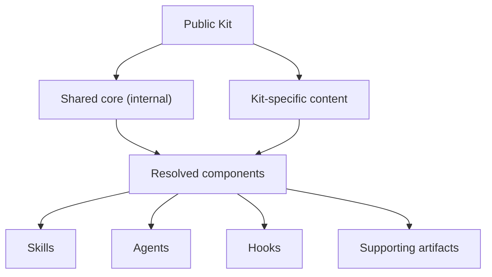

A Kit is the unit you install. Skills, Agents, and Hooks are different ways its
workflows become active inside a supported runtime.

## Kit

A **Kit** is a versioned package for a group of work. It brings together Skills,
Agents, Hooks, rules, and supporting files that are intended to work together.
Installing a Kit adapts its supported contents to a runtime; it does not run
every component or grant them unrestricted access.

Choose a Kit by the kind of work you want to do. If you only need part of it,
the installer can include or exclude selected Skills while keeping the companion
files those Skills require.

## How a Kit is composed

A public Kit is resolved from shared core material and content specific to that
Kit. The core is an internal composition input, not a separate product you can
list or install.

## Skill

A **Skill** is a reusable workflow for a specific outcome. You normally invoke
it deliberately, then give it a goal or input. It can contain an ordered process,
decision points, references, scripts, or expected outputs.

Start with a Skill when you can name the outcome, such as clarifying an idea,
planning a change, implementing approved work, or investigating a failure. The
runtime decides how installed Skills are discovered and invoked.

## Agent

An **Agent** is a specialized role used for focused work or task isolation. A
Skill may delegate part of its workflow to an Agent, or a runtime may let you
select one directly.

Agents are not automatically more authoritative than Skills. They operate with
the tools and permissions the runtime grants, and their output returns to the
calling workflow or user for review.

## Hook

A **Hook** attaches automation to a lifecycle event supported by the runtime,
such as the end of a turn or subagent task. Hooks can keep workflow state in
sync, run checks, or provide feedback without requiring a separate manual
invocation.

A Hook is not a security boundary. Runtime event models differ, so an adapter
may translate a Hook, omit an unsupported event with a warning, or run it at a
different supported boundary. The existence of a Hook file alone does not prove
that the runtime registered or executed it.

## How they work together

After installation, you invoke a Skill for an outcome, delegate focused work to
an Agent when useful, let supported Hooks react at lifecycle boundaries, and
review the resulting artifacts.

You usually do not need to select an Agent or trigger a Hook yourself. Begin
with the Kit when choosing a broad work area; begin with a Skill when you already
know the outcome. Check [Runtime adapters](./runtime-adapters) before assuming a
component behaves the same in every assistant.
