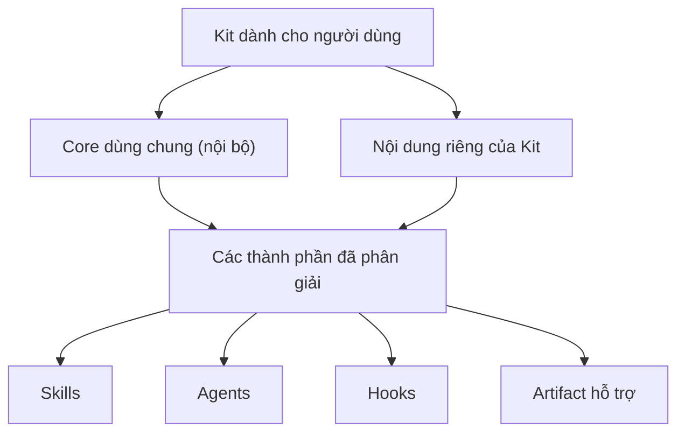

Kit là đơn vị bạn cài đặt. Skills, Agents và Hooks là những cách khác nhau để
workflow trong Kit hoạt động bên trong một runtime được hỗ trợ.

## Kit

**Kit** là gói có phiên bản dành cho một nhóm công việc. Kit tập hợp Skills,
Agents, Hooks, rules và các tệp hỗ trợ được thiết kế để phối hợp với nhau. Cài
một Kit sẽ chuyển đổi nội dung được hỗ trợ cho runtime; việc đó không tự chạy mọi
thành phần hay cấp quyền truy cập không giới hạn cho chúng.

Hãy chọn Kit theo loại công việc bạn muốn thực hiện. Nếu chỉ cần một phần, trình
cài đặt có thể bao gồm hoặc loại trừ các Skills đã chọn trong khi vẫn giữ những
tệp đi kèm mà các Skills đó cần.

## Một Kit được cấu thành như thế nào

Một Kit dành cho người dùng được phân giải từ nội dung core dùng chung và nội
dung riêng của Kit đó. Core là đầu vào nội bộ cho quá trình cấu thành, không
phải sản phẩm riêng để bạn liệt kê hay cài đặt.

## Skill

**Skill** là workflow có thể tái sử dụng cho một outcome cụ thể. Thông thường,
bạn chủ động gọi Skill rồi cung cấp mục tiêu hoặc input. Skill có thể chứa quy
trình theo thứ tự, điểm quyết định, tài liệu tham khảo, script hoặc output mong
đợi.

Hãy bắt đầu bằng Skill khi bạn có thể gọi tên outcome, chẳng hạn làm rõ ý tưởng,
lập kế hoạch thay đổi, triển khai công việc đã duyệt hoặc điều tra lỗi. Runtime
quyết định cách khám phá và gọi các Skill đã cài.

### Cách Skill đưa công việc đến outcome

Các Skill của AgentKit được viết quanh kết quả bạn yêu cầu, không quanh một
chuỗi phê duyệt cố định.

- **Phạm vi đã chấp nhận được dùng lại.** Skill dùng lại outcome, ràng buộc,
  quyết định và bằng chứng xác minh bạn đã chấp nhận, chẳng hạn một plan đã
  duyệt, thay vì hỏi lại ở mỗi giai đoạn. Trong phạm vi đó, Skill triển khai
  tiếp tục qua implementation, các check liên quan và sửa regression do chính
  thay đổi của nó gây ra. Skill chỉ hỏi khi thiếu một quyết định quan trọng
  hoặc một hành động nằm ngoài phạm vi bạn đã ủy quyền.
- **Mode tường minh giữ quy tắc riêng.** Khi bạn chọn mode interactive,
  advisory hoặc ultra trên Skill có hỗ trợ, checkpoint của mode đó được áp
  dụng. Hành động phá hủy, truy cập tài khoản hoặc credential, chi tiêu và xuất
  bản vẫn cần ủy quyền riêng; tiếp tục một tác vụ không bao giờ ngầm cho phép
  những việc đó.
- **Hướng dẫn được load khi tác vụ cần.** Tệp entry của Skill định tuyến đến
  reference cho tác vụ đã chọn trước khi đọc chi tiết, thay vì load mọi
  reference ngay từ đầu. Khi một định dạng dễ vỡ hoặc contract chính xác phụ
  thuộc vào toàn bộ quy trình, Skill vẫn đọc đầy đủ; ví dụ, tạo và sửa tài liệu
  Word load đầy đủ hướng dẫn định dạng. Xem
  [`ak:document-skills`](../kits/engineer/skills/document-skills).

Mỗi trang Skill mô tả mode và ranh giới riêng của nó. Để viết hoặc đánh giá
Skill theo phong cách này, xem [`ak:skill-creator`](../kits/engineer/skills/skill-creator).

## Agent

**Agent** là vai trò chuyên biệt dành cho công việc cần tập trung hoặc cô lập
task. Một Skill có thể giao một phần workflow cho Agent, hoặc runtime có thể cho
phép bạn chọn Agent trực tiếp.

Agent không tự động có thẩm quyền cao hơn Skill. Agent hoạt động với công cụ và
quyền do runtime cấp; output của nó quay lại workflow gọi hoặc người dùng để
review.

## Hook

**Hook** gắn automation vào lifecycle event được runtime hỗ trợ, chẳng hạn cuối
một lượt làm việc hoặc task của subagent. Hook có thể đồng bộ trạng thái
workflow, chạy kiểm tra hoặc cung cấp phản hồi mà không cần một lần gọi thủ công
riêng.

Hook không phải là ranh giới bảo mật. Mô hình event khác nhau giữa các runtime,
vì vậy adapter có thể chuyển đổi Hook, bỏ qua event không được hỗ trợ kèm cảnh
báo hoặc chạy Hook tại một ranh giới khác mà runtime hỗ trợ. Chỉ có tệp Hook
không chứng minh rằng runtime đã đăng ký hoặc thực thi nó.

## Cách các thành phần phối hợp

Sau khi cài đặt, bạn gọi Skill cho một outcome, giao phần việc cần tập trung cho
Agent khi hữu ích, để các Hook được hỗ trợ phản ứng tại ranh giới lifecycle và
review artifact được tạo ra.

Thông thường, bạn không cần tự chọn Agent hay kích hoạt Hook. Hãy bắt đầu từ Kit
khi chọn một nhóm công việc rộng; bắt đầu từ Skill khi đã biết outcome. Kiểm tra
[Runtime adapter](./runtime-adapters) trước khi cho rằng một thành phần hoạt động
giống nhau trong mọi assistant.
