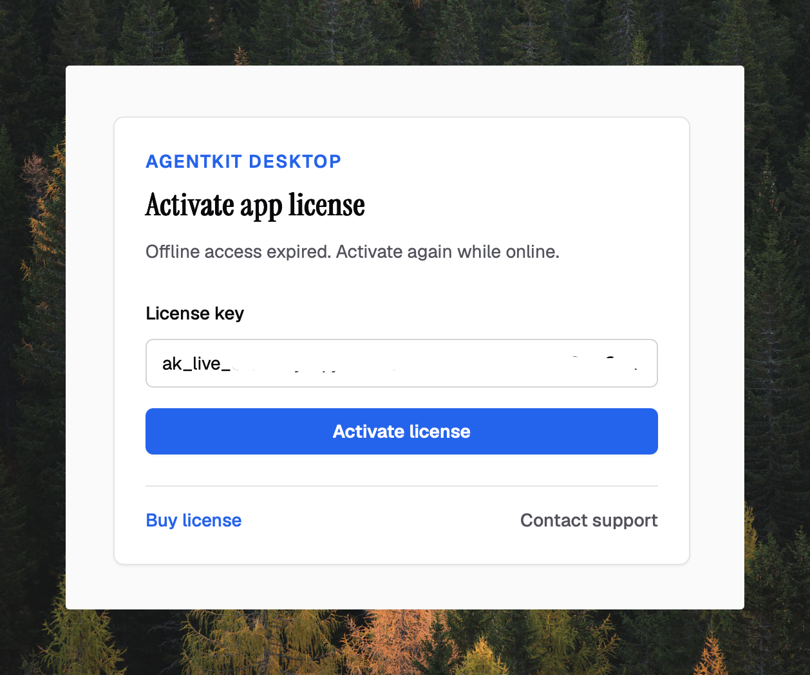

After this page, Desktop will be activated for this device and you will know
which first-run steps change local AgentKit or coding-assistant state.

## Activate this device

Open the verified Desktop package and enter an App license key beginning with
`ak_live_`. The first activation needs network access. Desktop must verify an
App session before it opens the main interface; a CLI or coding-assistant login
does not unlock it.

| Session | What it unlocks | Sign-out boundary |
| --- | --- | --- |
| Desktop App license | Desktop and entitled Kit catalog actions on this device | **Profile → Sign out** removes only the local App session |
| AgentKit CLI login | Authenticated CLI commands | `ak logout` removes only the CLI session |
| Coding-assistant or provider login | That runtime or provider | Managed by that assistant or provider |

The App and CLI slots are stored separately in
`$AGENTKIT_HOME/auth/session.json`. The default AgentKit home is `~/.agentkit`
on macOS and Linux and `%USERPROFILE%\.agentkit` on Windows. The session file is
protected with owner-only permissions where the operating system supports
them; it is not a reason to share the file or license key.

After a successful online verification, Desktop allows up to 72 hours of
offline use. When that grace period expires, reconnect and verify the license
again. Signing out in Desktop clears local App credentials; it does not revoke
the license remotely or sign the CLI out.

## Complete onboarding

Desktop scans the local setup for supported coding agents, registered projects,
installed and entitled Kits, configuration, health, licenses, and updates.
Review the results before applying changes.

The optional Kit step installs only the Kits you select, globally for the
detected coding agents, from the Kit catalog used by Desktop v2.12.1-beta.8. You can
skip it when you do not have a matching runtime or entitlement. After
installation, restart the coding assistant or open a new runtime session before
using the new skills.

Desktop v2.12.1-beta.8 does not start a Kit skill or agent run. Launch the installed
skill from its coding assistant, or use the appropriate CLI workflow.

## Use the main workflows

| Area | Supported work | Important boundary |
| --- | --- | --- |
| Kits and skills | Browse entitlements, inspect skills, install Kits, preview and apply supported Kit updates | Kit removal is a CLI workflow; preview it before confirming with `--yes` |
| Projects | Register a local project and inspect its Kit state | Removing a project removes its AgentKit registry entry, not the project directory |
| Activity | Follow local AgentKit activity while the window is open | The source is `$AGENTKIT_HOME/activity/events.ndjson` |
| Sessions | Inspect supported Claude Code and Codex session evidence | Desktop is an inspector, not a session launcher |
| MCP | List and verify servers, and preview supported configuration changes before applying them | Review the preview because the target runtime configuration can change |
| Config and stores | Edit AgentKit settings, inspect effective values, and locate local stores | Secret values are masked in Desktop; do not copy raw config or session files into reports |

For a screen-by-screen walkthrough of these surfaces, see [Interface
overview](./interface-overview), [Managing entities](./managing-entities),
[Projects and plans](./projects-and-plans), and [Settings and
system](./settings-and-system).

## Understand the local process

Desktop embeds its interface and calls its Go backend in-process. It does not
start the browser dashboard, bind an HTTP port, or write dashboard server state.
Closing the window stops Desktop APIs, Activity streaming, session indexing,
and the local analytics reconciler.

The browser dashboard is separate. `ak config start` serves it on loopback
`127.0.0.1:8766` by default. The API server is also separate and defaults to
`127.0.0.1:8765` when started with `ak api start`.

## Know what stays local and what uses the network

Desktop reads AgentKit state such as `config.yaml`, `projects.json`,
`activity/events.ndjson`, and the local `analytics/analytics.db` index under
the AgentKit home. The index can reconcile supported Claude Code and Codex
session sources while the window is open. Interface preferences and onboarding
progress are local Desktop state; authentication remains in the protected
AgentKit session file.

Network access depends on the action:

- App activation, entitlement checks, and Kit catalog actions contact AgentKit
  services;
- Update checks, changelog, and announcements contact the release service; and
- Feedback is sent only when you submit it.

Never include a license key, session file, unmasked config value, or private
session content in feedback or diagnostics. Next, review [signed Desktop
updates](./updating) or go to [troubleshooting](./troubleshooting).
