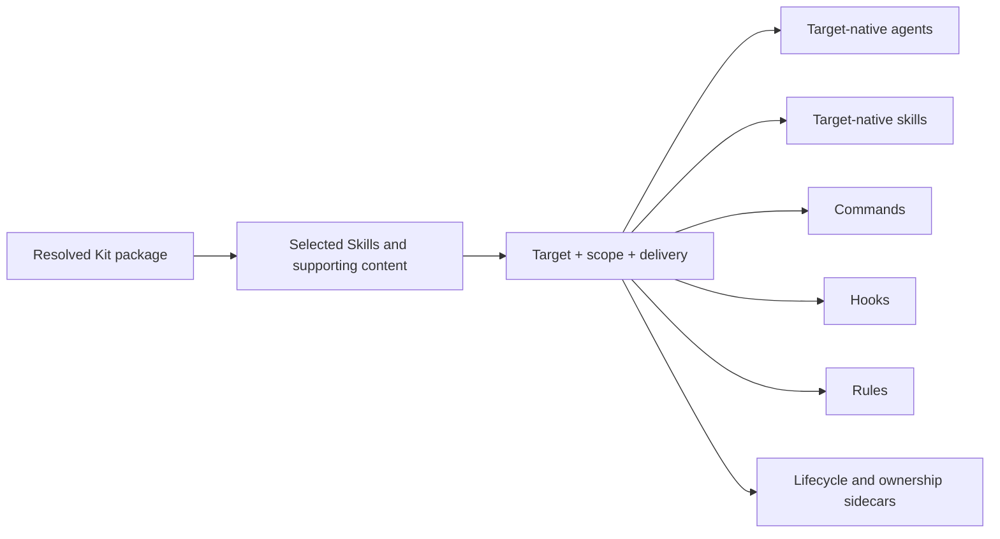

import { Callout } from 'fumadocs-ui/components/callout';

A **kit** bundles skills and their supporting files for a coding assistant. This
guide helps you install the kit into the right runtime and scope without
overwriting unrelated work.

## Before you start

Sign in and confirm that your account can install the kit:

```bash
ak whoami
ak licenses
```

An unauthenticated local state can still exit `0`; read the command output
rather than treating a successful exit as proof of authentication or
entitlement.

Released kits come from the authenticated AgentKit registry by default. You do
not need `--remote`. Local Kit sources are for development and CI, not the
normal installation flow.

## Predict lifecycle changes

Think of each command as a state transition. Updating one layer does not imply
that the other layers changed.

| Command | State it reads | State it may mutate | Main safety boundary |
| --- | --- | --- | --- |
| [`ak self-update`](../reference/cli/self-update) | Installed CLI and signed release metadata | The `ak` binary only | Verifies the replacement and restores the previous binary if replacement fails |
| [`ak update`](../reference/cli/update) | Project or user install records, resolved Kit content, and current files | AgentKit-owned project or user content selected by the update plan | Previews first, snapshots before apply, and preserves user-modified files by default |
| [`ak kit init`](../reference/cli/kit/init) | Resolved Kit package, target, scope, delivery mode, and Skill selection | Target-native files plus lifecycle sidecars for the selected route | Previews the destination and refuses unresolved ownership conflicts |
| [`ak kit refresh`](../reference/cli/kit/refresh) | The installed route, its selected Skills, current package, and ownership fingerprints | Current managed output and retired clean output for that same route | Snapshots before destructive writes and preserves modified, unknown, unsafe, or shared paths |
| [`ak kit uninstall`](../reference/cli/kit/uninstall) | The installed route and ownership records | Matching unchanged AgentKit-owned paths for that route | Previews removal, snapshots before apply, and never treats the whole runtime home as owned |
| [`ak migrate`](../reference/cli/migrate) | Migration inputs, current destination state, and a planned change set | Only paths in the reviewed migration plan | Plans first, snapshots before apply, and provides a rollback path for applied migration work |

The table describes ownership and state, not every flag. Use the linked CLI
reference for the exact syntax supported by the active release.

## Choose a runtime and scope

Released runtime installs use `--target claude-code`, `--target codex`,
`--target cursor`, `--target grok`, `--target pi`, or `--target omp`. Claude
Code is the default when you omit the flag. Released registry packages are
resolved for one runtime at a time, so run a separate install for each runtime
you use. Pi projection and Oh My Pi dispatch are separate: Pi uses
`ak kit init ... --target pi` for installable Kit content, while Oh My Pi can
also be selected by `ak run --target omp` for Skill dispatch.

Every remote Kit operation below passes `--channel <channel>`. Replace
`<channel>` with the release channel selected in the docs header. Omitting the
flag resolves `stable`, which can return `version_not_available` when the
selected runtime package exists only on another channel.

The default scope is the current project. Add `--global` when you want the kit
in the runtime's user directory and available beyond one project. Together,
target, scope, and delivery mode identify one install route:

| Target route | Scope | Delivery | Primary destination |
| --- | --- | --- | --- |
| Claude Code native project | Project | Native | `<project>/.claude` plus project lifecycle metadata |
| Claude Code native user | Global | Native | `~/.claude` plus user-scope lifecycle metadata |
| Claude Code project plugin | Project | Plugin | Project-scoped Claude Code plugin source and enablement state |
| Claude Code user plugin | Global | Plugin | `~/.claude/plugins/ak-<kit>` and user plugin enablement state |
| Codex project | Project | Native | `<project>/.agents/skills` and corresponding `<project>/.codex` surfaces |
| Codex user | Global | Native | `~/.agents/skills` and corresponding `~/.codex` surfaces |
| Grok Build project | Project | Native | `<project>/.grok` plus `<project>/.agentkit/adapters/grok/<kit>` |
| Grok Build user | Global | Native | `${GROK_HOME:-~/.grok}` plus `${AGENTKIT_HOME:-~/.agentkit}/adapters/grok/<kit>` |
| Pi project | Project | Native spike | `<project>/.pi/{skills,agents,rules,extensions}` plus Pi lifecycle metadata |
| Pi user | Global | Native spike | Active Pi coding-agent profile (`PI_CODING_AGENT_DIR` or `~/.pi/agent`) with no extra `.pi/` segment |
| Oh My Pi project | Project | Native | `<project>/.omp/{skills,agents,rules}`, `<project>/AGENTS.md`, and `<project>/.agentkit/adapters/omp/<kit>` |
| Oh My Pi user | Global | Native | `{skills,agents,rules}` and `AGENTS.md` below the resolved OMP root, plus user-scope lifecycle metadata |

Cursor, Grok, and AGY use their own target surfaces, while `portable` is an
export and does not create installed lifecycle state. The previewed destination
is the authority when an environment overrides a normal runtime root.

Project-scoped installs write runtime content in the current project and keep
AgentKit lifecycle metadata there. Global installs write into the selected
runtime's user scope. Review the destination shown in the install preview
before confirming.

`portable` is export-only. `--target portable` without `--out` exits `1` before
preview, confirmation, registry resolution, lifecycle preflight, or disk writes:

```text
init: target "portable" is export-only and has no install mode; re-run with --out DIR to export a standalone build
```

`--out` implies build mode and preserves the remote source default; explicit
`--build-only --out` remains valid but selects the local-development source
default. Portable exports create no installed-lifecycle metadata.

`agy` is global-only. A remote AGY install resolves and caches the signed
`claude-code` registry package, then projects Skills to
`~/.gemini/config/skills/` and `~/.gemini/antigravity-cli/skills/`. Optional
Agents go to `~/.gemini/config/agents/<name>/agent.md`, receive
`subagent: true`, and omit incompatible tool-allowlist frontmatter. Routing and
ownership files are projected alongside them. Unsupported parts warn and are
skipped. AGY is not a registry runtime identity or a refresh lifecycle peer.

For Codex, native skills go to `.agents/skills` in a project or
`~/.agents/skills` at user scope; other Codex resources use the corresponding
project or user `.codex` surfaces. Cursor uses the corresponding `.cursor`
scope.

Project and global copies can coexist. Installing one does not remove the
other: project commands or rules may shadow user entries, and hooks from both
scopes may run. Remove an unwanted copy through the matching uninstall route.

<Callout type="info">
  Cursor is a registered production target, but this release does not claim the
  same end-to-end install, update, and invocation verification as Claude Code
  and Codex. Verify skill discovery in Cursor after installation before relying
  on it.
</Callout>

### Use native Grok Build

Use the signed registry package for normal installs:

```bash
ak kit init engineer --target grok --channel <channel>
ak kit init engineer --target grok --global --channel <channel>
ak kit refresh engineer --target grok --channel <channel>
```

Project installs use `<project>/.grok`; global installs use
`${GROK_HOME:-~/.grok}`. Lifecycle ownership stays in the separate
`.agentkit/adapters/grok/<kit>` route shown above. Use an explicit local source
only for development or CI, for example `ak kit init engineer --local --kits-dir
./kits --target grok`.

This native route is distinct from Grok's Claude-compat scanner reading
`.claude/settings.json`. Native project Hooks remain inactive until you
explicitly trust the project in Grok. Hook timeout, crash, and malformed
output fail open; only an applicable `PreToolUse` denial blocks an action. For
AgentKit dispatch, `ak run <kit>/<skill> --target grok` resolves
`AGENTKIT_GROK_BIN` or `grok`, while Grok and the user retain ownership of model,
authentication, trust, permissions, sandbox, and `.grok/config.toml`. See
[Grok CLI Hook errors](../troubleshooting/grok-hooks) only when you deliberately
use Claude-compat scanning.

### Use native Pi

Install one Kit into a project-local Pi projection, or into an empty or
AgentKit-owned active Pi coding-agent profile:

```bash
ak kit init engineer --target pi --channel <channel>
ak kit init engineer --target pi --global --channel <channel>
```

Project installs write `.pi/skills/ak-<slug>/SKILL.md`, remapped Agents below
`.pi/agents/`, owned rules below `.pi/rules/`, and first-party extensions under
`.pi/extensions/`. Global installs resolve the active profile from
`PI_CODING_AGENT_DIR` or `~/.pi/agent` and write `skills/`, `agents/`, `rules/`,
and `extensions/` directly below that profile. AgentKit refuses an occupied
global profile that is not empty or already AgentKit-owned.

When the trusted project also contains the same `ak-<slug>` under
`.agents/skills/`, AgentKit emits a warning without deleting either copy. A
project Pi install under `.pi/skills/` takes precedence; for a global Pi
install, the trusted project's `.agents/skills/` copy takes precedence over the
profile copy.

Pi is a spike Kit projection in this release. AgentKit does not provide
`ak run --target pi`, does not wrap Pi's agent loop, and does not write
`.pi/commands/`. Use Pi's own Skill discovery for installed `.pi/skills/*`
content, and use `ak run --target omp` only when you intentionally dispatch
through Oh My Pi instead.

### Use native Oh My Pi

Install one Kit into the current project or the OMP user scope:

```bash
ak kit init engineer --target omp --channel <channel>
ak kit init engineer --target omp --global --channel <channel>
```

Project installs write `.omp/skills/<name>/SKILL.md`,
`.omp/agents/<name>.md`, and `.omp/rules/<name>.md`. Kit instructions are merged
into the project `AGENTS.md` between
`<!-- AGENTKIT-OMP:START:<kit> -->` and
`<!-- AGENTKIT-OMP:END:<kit> -->`; AgentKit preserves text outside that Kit's
managed block. Unsupported surfaces are retained as inactive content under
`.agentkit/adapters/omp/<kit>/sidecars/`.

For `--global`, the OMP root resolves from `AGENTKIT_OMP_HOME`, then `OMP_HOME`,
then `PI_CODING_AGENT_DIR`, and finally `~/.omp/agent`. Skills, Agents, rules,
and `AGENTS.md` use the corresponding paths below that root. Review the preview
when you override the root so the selected destination is explicit.

Use `ak run <kit>/<skill> --target omp` when you want to dispatch one local
Skill non-interactively through OMP. That command is a separate execution route;
it does not replace the project or global install above.

## Choose Claude Code delivery

Claude Code supports two delivery modes:

- **Native** is the default. AgentKit merges its managed resources into the
  project or user Claude Code structure.
- **Plugin** is explicit. Add `--switch-to-plugin` at either scope.

```bash
# project plugin
ak kit install engineer --target claude-code --switch-to-plugin --channel <channel>

# user plugin
ak kit install engineer --target claude-code --global --switch-to-plugin --channel <channel>
```

Native Claude Code content goes to `<project>/.claude` or `~/.claude`.
The user plugin is installed as `ak-<kit>` under the Claude Code plugin root;
for example, the default Engineer Kit path is
`~/.claude/plugins/ak-engineer`. Keep the same delivery and scope flags when
you later refresh it. For uninstall, match the same route with `--plugin-mode`
instead of `--switch-to-plugin`.

<Callout type="info">
  Native and plugin delivery are different install modes, not interchangeable
  names for the same files. Switching modes produces a transition preview and
  creates recovery snapshots before it changes managed surfaces.
</Callout>

## Follow the projection

AgentKit resolves the Kit package first, then projects the selected content into
the native surfaces supported by the install route.



A target may drop or narrow a surface it cannot support; the install report
discloses that projection. The sidecars preserve route identity, selected
Skills, owners, and fingerprints so later refresh, audit, and uninstall can
reason about the files already present.

“Workflow” is a product concept, not a separately synchronized `workflows/`
directory in the current package. Workflow behavior is composed through the
projected rules, Skills, agents, commands, and hooks. Do not use the absence of a
`workflows/` directory as evidence that projection failed.

## Select skills

Without a selection flag, AgentKit installs every skill in the kit. Use one of
these mutually exclusive choices when you want a smaller set:

```bash
# install only these skills
ak kit install engineer --target codex --skills ak-cook,ak-plan --channel <channel>

# install everything except this skill
ak kit install engineer --target claude-code --exclude-skills ak-video --channel <channel>

# choose interactively
ak kit install engineer --target claude-code --select-skills --channel <channel>
```

`--select-skills` requires an interactive terminal. Use `--skills` or
`--exclude-skills` in scripts. AgentKit installs the supporting references,
scripts, and assets required by the selected skills.

## Choose a release channel

Kit installation and refresh use the `stable` registry channel by default. To
try a prerelease kit, opt into `beta` explicitly and keep the CLI on a
compatible channel:

```bash
ak kit install engineer --target claude-code --channel beta
```

Do not mix channels as a troubleshooting shortcut. If a kit reports that it
requires a newer `ak`, update the CLI on the same channel, then retry the kit
operation.

## Understand ownership and fingerprints

AgentKit records both the managed path and a fingerprint of the bytes it wrote.
Later operations compare the current path and content with that evidence rather
than adopting whatever happens to exist at the destination.

| Current path class | Meaning | Refresh or uninstall behavior |
| --- | --- | --- |
| Clean AgentKit-owned | The recorded owner and content fingerprint still match | May be rewritten, or removed when the generated path is retired |
| Modified AgentKit-owned | The path is recorded, but its current bytes no longer match | Preserved and reported for review |
| Unknown or custom | No matching AgentKit ownership record exists | Preserved; it is not silently adopted as managed content |
| Shared | More than one installed Kit owns the same matching path | Preserved until every owner releases it |

Symlinks, unsafe path transitions, and other ambiguous filesystem state normally
fail closed or remain preserved. The bounded exception is a POSIX Codex
`hooks` leaf that points exactly to the resolved user's canonical
`~/.codex/hooks`; AgentKit uses that canonical identity for the complete Hook
lifecycle. Linked parents, other targets, and Windows links or reparse points
still fail closed. Ownership evidence qualifies cleanup; it never means deleting
an entire `.claude`, `.codex`, `.grok`, or user runtime directory.

## Refresh an installed kit

Refresh re-emits the current Kit and removes stale generated or owned paths only
when they still match AgentKit's ownership evidence. Modified, unsafe, linked,
or other-kit-shared paths are preserved. Released targets use the remote
registry by default and create a snapshot before destructive writes. The Grok
Build from a local development source instead requires the explicit `--local --kits-dir` source shown
above:

```bash
ak kit refresh engineer --target codex
ak kit refresh engineer --global --switch-to-plugin
```

The refresh preview is a confirmation screen, not a dry run. In a script, JSON
mode, or another non-interactive session, the prompt is skipped and the
operation can proceed to writes. Use `--yes` for an intentional scripted
refresh. Use the preview-only `ak update` flow from the
[update guide](./updating) when you need a plan that cannot apply changes.

If the previous install selected only some skills, refresh reuses that selected
set. Skills removed from the new release do not make the refresh fail, and new
skills are not added to that subset automatically.

Review the preview before confirming. Do not add `--no-backup`, and do not use a
broad `--force` reinstall as routine recovery. First resolve an incorrect
target, scope, delivery mode, or ownership conflict.

### Reconcile current and stale output

Refresh compares the new projection with the recorded projection for the same
route:

| Before refresh | New projection | Result |
| --- | --- | --- |
| Clean owned path | Still generated | Rewrite it with the current generated bytes and fingerprint |
| Clean owned path | Retired | Remove it and release that owner |
| Modified owned path | Current or retired | Preserve it and report the mismatch |
| Unknown/custom path | Any state | Preserve it because AgentKit has no ownership claim |
| Shared path | One Kit releases it | Preserve it while another owner remains |

The previous selected-Skill subset remains the selection for this route unless
you explicitly change it. A Skill newly added to the package is therefore not
silently added to a previously restricted install.

### Read a `.claude` before/after example

The names below are illustrative; they show lifecycle classes without copying a
mutable Kit inventory.

Before refresh:

```text
.claude/
├── rules/current-rule.md          clean owned; old fingerprint
├── rules/retired-rule.md          clean owned; no longer projected
├── rules/shared-rule.md           clean; owned by Kit A and Kit B
├── skills/edited-skill/SKILL.md   owned; user-edited bytes
└── custom-note.md                 unknown custom file
```

After refreshing Kit A:

```text
.claude/
├── rules/current-rule.md          rewritten; new fingerprint
├── rules/shared-rule.md           preserved; Kit B still owns it
├── skills/edited-skill/SKILL.md   preserved; modification reported
└── custom-note.md                 preserved; never adopted
```

`retired-rule.md` is removed only because it was still clean. The shared rule is
removed only after every owner releases it. The edited Skill and custom file are
not overwritten merely because their locations overlap the projected tree.

## Audit and migrate safely

[`ak audit`](../reference/cli/audit) is read-only. It compares current content
with recorded ownership fingerprints and reports drift without repairing,
adopting, or deleting paths. Use that evidence to explain why a refresh
preserved a file.

[`ak migrate`](../reference/cli/migrate) is a separate planned mutation. Review
the plan, keep the pre-apply snapshot, and use its migration rollback path when
you need to reverse applied migration work. Migration does not broaden Kit
ownership to unrelated runtime content.

## Read Codex hook disclosures

A successful Codex install can report both **Hooks dropped (unsupported on this
target)** and **Hook matchers narrowed (some tool matches unsupported on this
target)**. A full drop removes an unsupported group. A narrow keeps its handlers
on the supported matcher subset and reports only the removed atoms.

In JSON output, inspect the optional `hooksDropped`, `droppedHookSummaries`,
`hookMatchersNarrowed`, and `narrowedHookSummaries` fields. Engineer currently
has one full drop and two shared narrows; Marketing has no full drop and three
narrows. These are runtime capability limits, not install failures; reinstalling
with `--force` does not restore unsupported matcher atoms.

For global Codex Hooks on POSIX, a wrapper-managed Codex home may alias only its
final `hooks` leaf to canonical `~/.codex/hooks`. Do not generalize this to a
linked Codex home or arbitrary Hook target; those remain refused, as do all
Windows links and reparse points.

## Verify the result

After installation or refresh:

1. Confirm the command reports the expected target, scope, delivery mode, and
   selected-skill count.
2. Reopen the target runtime if it was already running.
3. Invoke one of the skills you installed. For example, use `/ak:cook` in
   Claude Code and `$ak:cook` in Codex.

If the runtime cannot find the skill, check the target, scope, and Claude Code
delivery mode before reinstalling.

### If files did not change

Use this decision order instead of deleting `.claude` or retrying with
`--force`:

1. **Command:** did you update the binary, update project-owned content, or
   refresh the installed Kit route?
2. **Versions and channel:** do the CLI and resolved Kit versions match what you
   expected?
3. **Route:** does target, project/global scope, and native/plugin delivery match
   the original install?
4. **Selection:** was the missing file part of the recorded selected-Skill
   subset?
5. **Projection:** did the target report that a resource or hook matcher was
   dropped or narrowed?
6. **Ownership:** does audit show the path as modified, unknown, unsafe, linked,
   or shared?
7. **Result:** inspect preserved and skipped paths in the preview or summary,
   then choose recovery or a deliberate route-specific change.

See [Updating AgentKit and Kits](./updating) for choosing the correct update
layer and preview flow. Use the generated references linked above for current
flags rather than copying flags from an older command.

## Remove a kit

Preview uninstall with the same scope and delivery mode as the install. The
examples below select a Claude Code user plugin:

```bash
ak kit uninstall engineer --global --plugin-mode --dry-run
ak kit uninstall engineer --global --plugin-mode --yes
```

The dry run changes nothing and exits `3`. This is expected preview behavior;
apply only after reviewing the preserved and removed paths.

For a project plugin, replace `--global` with `--project-dir .`. For a native
project install, use `--project-dir .` without `--plugin-mode`; for a native
global install, use `--global` without `--plugin-mode`.

Uninstall removes matching AgentKit-owned files, preserves unknown or
user-modified files, and snapshots before applying changes. Never remove an
entire runtime configuration directory to uninstall one kit. If the operation
prints a recovery snapshot, keep that ID until you have verified the runtime.

For native installs, cleanup then removes only empty ancestor directories owned
by that installation. It stops at a shared-owner boundary or shared runtime
root, and keeps directories containing user content or links. Unsafe traversal
or a path replaced during cleanup is rejected rather than followed or removed.

## See also

- [Updating AgentKit and kits](./updating)
