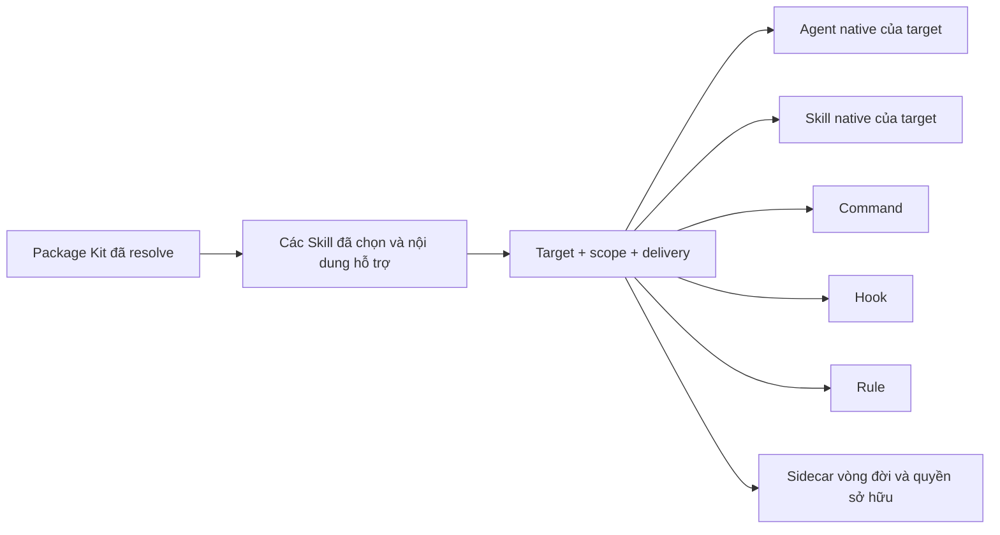

import { Callout } from 'fumadocs-ui/components/callout';

**Kit** đóng gói các Skill cùng những file hỗ trợ cho coding assistant. Hướng
dẫn này giúp bạn cài Kit vào đúng runtime và phạm vi mà không ghi đè công việc
không liên quan.

## Trước khi bắt đầu

Đăng nhập và xác nhận tài khoản có quyền cài Kit:

```bash
ak whoami
ak licenses
```

Trạng thái cục bộ chưa đăng nhập vẫn có thể trả mã `0`; hãy đọc output của lệnh
thay vì coi mã thoát thành công là bằng chứng đã đăng nhập hoặc có quyền dùng
Kit.

Theo mặc định, AgentKit lấy Kit đã phát hành từ registry có xác thực. Bạn không
cần thêm `--remote`. Nguồn Kit cục bộ dành cho development và CI, không phải
luồng cài đặt thông thường.

## Dự đoán thay đổi vòng đời

Hãy xem mỗi lệnh như một phép chuyển trạng thái. Cập nhật một lớp không đồng
nghĩa các lớp còn lại cũng thay đổi.

| Lệnh | Trạng thái được đọc | Trạng thái có thể bị thay đổi | Ranh giới an toàn chính |
| --- | --- | --- | --- |
| [`ak self-update`](../reference/cli/self-update) | CLI đã cài và metadata bản phát hành đã ký | Chỉ binary `ak` | Xác minh bản thay thế và khôi phục binary trước đó nếu thay thế thất bại |
| [`ak update`](../reference/cli/update) | Bản ghi cài đặt trong project hoặc phạm vi người dùng, nội dung Kit đã resolve và file hiện tại | Nội dung project hoặc người dùng thuộc quyền sở hữu AgentKit mà kế hoạch cập nhật chọn | Xem trước, tạo snapshot trước khi áp dụng và mặc định giữ file do người dùng sửa |
| [`ak kit init`](../reference/cli/kit/init) | Package Kit đã resolve, target, scope, delivery mode và lựa chọn Skill | File native của target cùng sidecar vòng đời cho tuyến đã chọn | Xem trước đích và từ chối xung đột quyền sở hữu chưa được giải quyết |
| [`ak kit refresh`](../reference/cli/kit/refresh) | Tuyến đã cài, các Skill đã chọn, package hiện tại và fingerprint quyền sở hữu | Output được quản lý hiện tại và output sạch đã nghỉ của cùng tuyến | Tạo snapshot trước thay đổi phá hủy và giữ đường dẫn đã sửa, không rõ nguồn gốc, không an toàn hoặc dùng chung |
| [`ak kit uninstall`](../reference/cli/kit/uninstall) | Tuyến đã cài và bản ghi quyền sở hữu | Đường dẫn thuộc quyền sở hữu AgentKit còn nguyên vẹn và khớp với tuyến | Xem trước thao tác gỡ, tạo snapshot trước khi áp dụng và không bao giờ coi toàn bộ runtime home là thuộc sở hữu |
| [`ak migrate`](../reference/cli/migrate) | Input migration, trạng thái đích hiện tại và tập thay đổi đã lập kế hoạch | Chỉ các đường dẫn trong kế hoạch migration đã review | Lập kế hoạch trước, tạo snapshot trước khi áp dụng và cung cấp đường rollback cho phần migration đã áp dụng |

Bảng mô tả trạng thái và quyền sở hữu, không liệt kê mọi flag. Dùng các liên kết
tham chiếu CLI để xem cú pháp chính xác của bản phát hành đang hoạt động.

## Chọn runtime và phạm vi

Các bản cài runtime đã phát hành dùng `--target claude-code`, `--target codex`,
`--target cursor`, `--target grok`, `--target pi` hoặc `--target omp`. Nếu bỏ qua flag này, mặc
định là Claude Code. Package từ registry được resolve cho từng runtime, vì vậy
hãy chạy một lệnh cài riêng cho mỗi runtime bạn sử dụng. Projection Pi và
dispatch Oh My Pi là hai tuyến riêng: Pi dùng `ak kit init ... --target pi` cho
nội dung Kit cài được, còn Oh My Pi cũng có thể được chọn bằng
`ak run --target omp` cho Skill dispatch.

Mỗi thao tác Kit remote bên dưới đều truyền `--channel <channel>`. Hãy thay
`<channel>` bằng kênh phát hành đang chọn trên header tài liệu. Nếu bỏ cờ này,
CLI resolve `stable`; target chỉ có package ở kênh khác có thể trả
`version_not_available`.

Phạm vi mặc định là project hiện tại. Thêm `--global` khi bạn muốn cài Kit vào
thư mục người dùng của runtime để dùng ngoài một project. Target, scope và
delivery mode kết hợp thành một tuyến cài đặt:

| Tuyến target | Scope | Delivery | Đích chính |
| --- | --- | --- | --- |
| Claude Code native trong project | Project | Native | `<project>/.claude` cùng metadata vòng đời của project |
| Claude Code native cho người dùng | Global | Native | `~/.claude` cùng metadata vòng đời ở phạm vi người dùng |
| Plugin Claude Code trong project | Project | Plugin | Nguồn plugin Claude Code theo project và trạng thái enable của project |
| Plugin Claude Code cho người dùng | Global | Plugin | `~/.claude/plugins/ak-<kit>` và trạng thái enable plugin của người dùng |
| Codex trong project | Project | Native | `<project>/.agents/skills` và các bề mặt `<project>/.codex` tương ứng |
| Codex cho người dùng | Global | Native | `~/.agents/skills` và các bề mặt `~/.codex` tương ứng |
| Grok Build trong project | Project | Native | `<project>/.grok` cùng `<project>/.agentkit/adapters/grok/<kit>` |
| Grok Build cho người dùng | Global | Native | `${GROK_HOME:-~/.grok}` cùng `${AGENTKIT_HOME:-~/.agentkit}/adapters/grok/<kit>` |
| Pi trong project | Project | Native spike | `<project>/.pi/{skills,agents,rules,extensions}` cùng metadata vòng đời của Pi |
| Pi cho người dùng | Global | Native spike | Profile Pi coding-agent đang hoạt động (`PI_CODING_AGENT_DIR` hoặc `~/.pi/agent`) không có đoạn `.pi/` bổ sung |
| Oh My Pi trong project | Project | Native | `<project>/.omp/{skills,agents,rules}`, `<project>/AGENTS.md` và `<project>/.agentkit/adapters/omp/<kit>` |
| Oh My Pi cho người dùng | Global | Native | `{skills,agents,rules}` và `AGENTS.md` dưới root OMP đã phân giải, cùng metadata vòng đời ở user scope |

Cursor, Grok và AGY dùng bề mặt riêng của target, còn `portable` là export và
không tạo trạng thái vòng đời đã cài. Đích hiển thị trong preview là nguồn chính
xác khi môi trường ghi đè runtime root thông thường.

Cài đặt theo project ghi nội dung runtime và metadata vòng đời của AgentKit vào
project hiện tại. Cài đặt global ghi vào phạm vi người dùng của runtime đã chọn.
Hãy kiểm tra đích đến trong bản xem trước trước khi xác nhận.

`portable` là target chỉ để export. `--target portable` không có `--out` trả mã
`1` trước preview, xác nhận, phân giải registry, lifecycle preflight hoặc ghi đĩa:

```text
init: target "portable" is export-only and has no install mode; re-run with --out DIR to export a standalone build
```

`--out` ngầm chọn build mode và giữ source mặc định từ remote; dùng rõ
`--build-only --out` vẫn hợp lệ nhưng chọn source mặc định cho local development.
Portable export không tạo metadata lifecycle của bản cài.

`agy` chỉ hỗ trợ global. Bản cài AGY từ remote phân giải và cache package
registry `claude-code` đã ký, sau đó projection Skill tới
`~/.gemini/config/skills/` và `~/.gemini/antigravity-cli/skills/`. Agent tùy
chọn được ghi vào `~/.gemini/config/agents/<name>/agent.md`, nhận
`subagent: true` và bỏ frontmatter tool allowlist không tương thích. Các tệp
routing và ownership được projection cùng chúng. Phần không được hỗ trợ sẽ cảnh
báo rồi bỏ qua. AGY không phải registry runtime identity hoặc peer trong
lifecycle refresh.

Với Codex, Skill native được ghi vào `.agents/skills` trong project hoặc
`~/.agents/skills` ở phạm vi người dùng; các tài nguyên Codex khác dùng các bề
mặt `.codex` tương ứng của project hoặc người dùng. Cursor dùng phạm vi `.cursor`
tương ứng.

Bản cài project và global có thể cùng tồn tại. Cài một bản không gỡ bản còn lại:
lệnh hoặc quy tắc trong project có thể che mục của người dùng, còn hook từ cả
hai phạm vi có thể cùng chạy. Hãy gỡ bản không cần thiết bằng đúng tuyến gỡ cài
đặt.

<Callout type="info">
  Cursor là target dùng trong production đã đăng ký, nhưng bản phát hành này
  không tuyên bố mức xác minh đầu cuối cho cài đặt, cập nhật và gọi Skill giống
  Claude Code và Codex. Hãy xác minh Cursor tìm thấy Skill sau khi cài trước khi
  phụ thuộc vào target này.
</Callout>

### Dùng Grok Build native

Dùng package registry đã ký cho cài đặt thông thường:

```bash
ak kit init engineer --target grok --channel <channel>
ak kit init engineer --target grok --global --channel <channel>
ak kit refresh engineer --target grok --channel <channel>
```

Bản cài project dùng `<project>/.grok`; bản cài global dùng
`${GROK_HOME:-~/.grok}`. Quyền sở hữu lifecycle nằm trong tuyến
`.agentkit/adapters/grok/<kit>` riêng được nêu ở trên. Chỉ dùng nguồn cục bộ cho
development hoặc CI, ví dụ `ak kit init engineer --local --kits-dir ./kits
--target grok`.

Tuyến native này tách biệt với Claude-compat scanner của Grok đọc
`.claude/settings.json`. Hook native trong project không hoạt động đến khi bạn
chủ động trust project trong Grok. Timeout, crash và output sai
định dạng của Hook đều fail open; chỉ một denial `PreToolUse` áp dụng được mới
chặn action. Với dispatch của AgentKit, `ak run <kit>/<skill> --target grok`
phân giải `AGENTKIT_GROK_BIN` hoặc `grok`, còn Grok và người dùng giữ quyền sở
hữu model, xác thực, trust, quyền, sandbox và `.grok/config.toml`. Chỉ xem
[Lỗi Hook trên Grok CLI](../troubleshooting/grok-hooks) khi bạn chủ động dùng
Claude-compat scanning.

### Dùng Pi native

Cài một Kit vào projection Pi trong project hoặc vào profile Pi coding-agent
đang hoạt động khi profile đó rỗng hoặc thuộc sở hữu AgentKit:

```bash
ak kit init engineer --target pi --channel <channel>
ak kit init engineer --target pi --global --channel <channel>
```

Bản cài project ghi `.pi/skills/ak-<slug>/SKILL.md`, Agent đã remap dưới
`.pi/agents/`, rule thuộc sở hữu dưới `.pi/rules/` và extension first-party dưới
`.pi/extensions/`. Bản cài global phân giải profile đang hoạt động từ
`PI_CODING_AGENT_DIR` hoặc `~/.pi/agent` rồi ghi trực tiếp `skills/`, `agents/`,
`rules/` và `extensions/` dưới profile đó. AgentKit từ chối profile global đã có
nội dung mà không rỗng hoặc không thuộc sở hữu AgentKit.

Khi project đã trust cũng có cùng `ak-<slug>` dưới `.agents/skills/`, AgentKit
in cảnh báo mà không xóa bản nào. Bản cài Pi trong project dưới `.pi/skills/`
được ưu tiên; với bản cài Pi global, bản `.agents/skills/` của project đã trust
được ưu tiên hơn bản trong profile.

Pi là projection Kit dạng spike trong bản phát hành này. AgentKit không cung cấp
`ak run --target pi`, không wrap agent loop của Pi và không ghi `.pi/commands/`.
Dùng discovery riêng của Pi cho nội dung `.pi/skills/*` đã cài; chỉ dùng
`ak run --target omp` khi bạn chủ động dispatch qua Oh My Pi.

### Dùng Oh My Pi native

Cài một Kit vào project hiện tại hoặc scope người dùng của OMP:

```bash
ak kit init engineer --target omp --channel <channel>
ak kit init engineer --target omp --global --channel <channel>
```

Bản cài project ghi `.omp/skills/<name>/SKILL.md`,
`.omp/agents/<name>.md` và `.omp/rules/<name>.md`. Instruction của Kit được merge
vào `AGENTS.md` của project giữa `<!-- AGENTKIT-OMP:START:<kit> -->` và
`<!-- AGENTKIT-OMP:END:<kit> -->`; AgentKit giữ nguyên nội dung bên ngoài block
được quản lý của Kit đó. Bề mặt không được hỗ trợ được giữ làm nội dung không
hoạt động dưới `.agentkit/adapters/omp/<kit>/sidecars/`.

Với `--global`, root OMP được phân giải từ `AGENTKIT_OMP_HOME`, rồi `OMP_HOME`,
`PI_CODING_AGENT_DIR` và cuối cùng `~/.omp/agent`. Skill, Agent, rule và
`AGENTS.md` dùng các đường dẫn tương ứng dưới root đó. Hãy review preview khi
ghi đè root để đích được chọn luôn rõ ràng.

Dùng `ak run <kit>/<skill> --target omp` khi bạn muốn dispatch một Skill cục bộ
không tương tác qua OMP. Đây là tuyến execution riêng; lệnh không thay thế bản
cài project hoặc global ở trên.

## Chọn cách phân phối cho Claude Code

Claude Code hỗ trợ hai cách phân phối:

- **Native** là mặc định. AgentKit hợp nhất các tài nguyên do nó quản lý vào cấu
  trúc Claude Code của project hoặc người dùng.
- **Plugin** cần được chọn rõ ràng. Thêm `--switch-to-plugin` ở một trong hai
  phạm vi.

```bash
# plugin trong project
ak kit install engineer --target claude-code --switch-to-plugin --channel <channel>

# plugin cho người dùng
ak kit install engineer --target claude-code --global --switch-to-plugin --channel <channel>
```

Nội dung Claude Code native được ghi vào `<project>/.claude` hoặc `~/.claude`.
Plugin người dùng được cài với tên `ak-<kit>` bên dưới thư mục plugin của Claude
Code; ví dụ, đường dẫn mặc định của Engineer Kit là
`~/.claude/plugins/ak-engineer`. Khi làm mới, hãy giữ nguyên các flag về cách
phân phối và phạm vi. Khi gỡ, hãy khớp đúng tuyến bằng `--plugin-mode` thay vì
`--switch-to-plugin`.

<Callout type="info">
  Native và plugin là hai chế độ cài đặt khác nhau, không phải hai tên gọi cho
  cùng một tập tin. Khi chuyển chế độ, AgentKit hiển thị bản xem trước và tạo
  snapshot khôi phục trước khi thay đổi các bề mặt do nó quản lý.
</Callout>

## Theo dõi quá trình projection

AgentKit resolve package Kit trước, sau đó projection nội dung đã chọn vào các
bề mặt native mà tuyến cài hỗ trợ.



Target có thể gỡ hoặc thu hẹp bề mặt không được hỗ trợ; báo cáo cài đặt sẽ công
bố projection đó. Sidecar giữ identity của tuyến, các Skill đã chọn, owner và
fingerprint để refresh, audit và uninstall sau này có thể suy luận về file đang
tồn tại.

“Workflow” là khái niệm sản phẩm, không phải thư mục `workflows/` được đồng bộ
riêng trong package hiện tại. Hành vi workflow được kết hợp từ rule, Skill,
agent, command và hook đã projection. Đừng coi việc không có thư mục
`workflows/` là bằng chứng projection thất bại.

## Chọn Skill

Nếu không có flag chọn lọc, AgentKit cài mọi Skill trong Kit. Dùng một trong các
lựa chọn loại trừ lẫn nhau sau nếu bạn muốn phạm vi nhỏ hơn:

```bash
# chỉ cài các Skill này
ak kit install engineer --target codex --skills ak-cook,ak-plan --channel <channel>

# cài mọi Skill trừ Skill này
ak kit install engineer --target claude-code --exclude-skills ak-video --channel <channel>

# chọn tương tác
ak kit install engineer --target claude-code --select-skills --channel <channel>
```

`--select-skills` cần terminal tương tác. Trong script, dùng `--skills` hoặc
`--exclude-skills`. AgentKit cài kèm các reference, script và asset mà những
Skill đã chọn cần dùng.

## Chọn kênh phát hành

Cài đặt và làm mới Kit dùng kênh registry `stable` theo mặc định. Để thử Kit
prerelease, hãy chủ động chọn `beta` và giữ CLI trên kênh tương thích:

```bash
ak kit install engineer --target claude-code --channel beta
```

Không trộn kênh như một cách xử lý sự cố. Nếu Kit báo cần phiên bản `ak` mới
hơn, hãy cập nhật CLI trên cùng kênh rồi chạy lại thao tác với Kit.

## Hiểu quyền sở hữu và fingerprint

AgentKit ghi cả đường dẫn được quản lý và fingerprint của bytes mà nó đã ghi.
Thao tác sau đó so sánh đường dẫn cùng nội dung hiện tại với bằng chứng này thay
vì nhận mọi thứ đang tồn tại ở đích làm nội dung được quản lý.

| Lớp đường dẫn hiện tại | Ý nghĩa | Hành vi khi refresh hoặc uninstall |
| --- | --- | --- |
| Sạch và thuộc AgentKit | Owner cùng fingerprint nội dung đã ghi vẫn khớp | Có thể được ghi lại hoặc gỡ khi đường dẫn sinh tự động đã nghỉ |
| Thuộc AgentKit nhưng đã sửa | Đường dẫn đã được ghi nhận nhưng bytes hiện tại không còn khớp | Được giữ lại và báo để review |
| Không rõ nguồn gốc hoặc tùy chỉnh | Không có bản ghi quyền sở hữu AgentKit tương ứng | Được giữ lại; không bị âm thầm nhận làm nội dung được quản lý |
| Dùng chung | Nhiều Kit đã cài cùng sở hữu một đường dẫn khớp | Được giữ đến khi mọi owner đều nhả đường dẫn |

Symlink, chuyển tiếp đường dẫn không an toàn và trạng thái filesystem mơ hồ khác
cũng fail closed hoặc được giữ lại. Bằng chứng quyền sở hữu giới hạn cleanup;
nó không bao giờ có nghĩa xóa toàn bộ `.claude`, `.codex`, `.grok` hoặc thư mục
runtime của người dùng.

## Làm mới Kit đã cài

Làm mới sẽ phát lại Kit hiện tại và chỉ gỡ đường dẫn sinh tự động hoặc thuộc
quyền sở hữu đã cũ khi đường dẫn vẫn khớp bằng chứng quyền sở hữu của AgentKit.
Đường dẫn đã sửa, không an toàn, là liên kết hoặc được Kit khác dùng chung sẽ
được giữ lại. Target đã phát hành dùng remote registry theo mặc định và tạo
snapshot trước các thay đổi phá hủy. Grok Build từ nguồn development cục bộ thay vào đó yêu cầu nguồn
`--local --kits-dir` rõ ràng như ở trên:

```bash
ak kit refresh engineer --target codex
ak kit refresh engineer --global --switch-to-plugin
```

Bản xem trước của refresh là màn hình xác nhận, không phải dry run. Trong script,
chế độ JSON hoặc phiên không tương tác khác, prompt sẽ được bỏ qua và thao tác có
thể tiếp tục ghi dữ liệu. Hãy dùng `--yes` khi chủ động làm mới trong script.
Dùng luồng chỉ xem trước `ak update` trong [hướng dẫn cập nhật](./updating) khi
bạn cần một kế hoạch không thể áp dụng thay đổi.

Nếu lần cài trước chỉ chọn một số Skill, thao tác làm mới dùng lại tập Skill đó.
Skill đã bị gỡ khỏi bản phát hành mới không làm thao tác thất bại, còn Skill mới
không tự động được thêm vào tập đã chọn.

Hãy xem bản xem trước trước khi xác nhận. Không thêm `--no-backup`, và không dùng
cài lại diện rộng với `--force` như cách khôi phục thông thường. Trước tiên hãy
xử lý sai target, phạm vi, chế độ phân phối hoặc xung đột quyền sở hữu.

### Reconcile output hiện tại và output đã nghỉ

Refresh so sánh projection mới với projection đã ghi nhận cho cùng một tuyến:

| Trước refresh | Projection mới | Kết quả |
| --- | --- | --- |
| Đường dẫn sạch thuộc sở hữu | Vẫn được sinh | Ghi lại bằng bytes hiện tại và fingerprint mới |
| Đường dẫn sạch thuộc sở hữu | Đã nghỉ | Gỡ đường dẫn và nhả owner đó |
| Đường dẫn thuộc sở hữu đã sửa | Hiện tại hoặc đã nghỉ | Giữ lại và báo fingerprint không khớp |
| Đường dẫn không rõ nguồn gốc/tùy chỉnh | Trạng thái bất kỳ | Giữ lại vì AgentKit không có claim quyền sở hữu |
| Đường dẫn dùng chung | Một Kit nhả | Giữ lại khi vẫn còn owner khác |

Tập Skill đã chọn trước đó vẫn là lựa chọn của tuyến này trừ khi bạn chủ động
thay đổi. Vì vậy, Skill mới thêm vào package không bị âm thầm thêm vào bản cài
đã giới hạn từ trước.

### Đọc ví dụ `.claude` trước và sau

Các tên bên dưới chỉ để minh họa; chúng trình bày lớp vòng đời mà không sao chép
inventory Kit có thể thay đổi.

Trước refresh:

```text
.claude/
├── rules/current-rule.md          sạch; fingerprint cũ
├── rules/retired-rule.md          sạch; không còn được projection
├── rules/shared-rule.md           sạch; Kit A và Kit B cùng sở hữu
├── skills/edited-skill/SKILL.md   thuộc sở hữu; bytes do người dùng sửa
└── custom-note.md                 file tùy chỉnh không rõ nguồn gốc
```

Sau khi refresh Kit A:

```text
.claude/
├── rules/current-rule.md          được ghi lại; fingerprint mới
├── rules/shared-rule.md           được giữ; Kit B vẫn sở hữu
├── skills/edited-skill/SKILL.md   được giữ; thay đổi được báo
└── custom-note.md                 được giữ; không bị nhận làm file quản lý
```

`retired-rule.md` chỉ bị gỡ vì file vẫn sạch. Rule dùng chung chỉ bị gỡ sau khi
mọi owner đều nhả. Skill đã sửa và file tùy chỉnh không bị ghi đè chỉ vì vị trí
của chúng nằm trong cây projection.

## Audit và migrate an toàn

[`ak audit`](../reference/cli/audit) là thao tác chỉ đọc. Lệnh so sánh nội dung
hiện tại với fingerprint quyền sở hữu đã ghi nhận và báo drift mà không sửa,
nhận quyền sở hữu hoặc xóa đường dẫn. Dùng bằng chứng đó để giải thích vì sao
refresh giữ lại một file.

[`ak migrate`](../reference/cli/migrate) là thao tác thay đổi có kế hoạch riêng.
Hãy review kế hoạch, giữ snapshot trước khi áp dụng và dùng đường rollback của
migration khi cần đảo ngược phần đã áp dụng. Migration không mở rộng quyền sở
hữu Kit sang nội dung runtime không liên quan.

## Đọc thông báo về hook Codex

Một lần cài Codex thành công có thể báo cả **Hooks dropped (unsupported on this
target)** và **Hook matchers narrowed (some tool matches unsupported on this
target)**. Full drop gỡ group không được hỗ trợ. Narrow vẫn giữ handler trên tập
matcher được hỗ trợ và chỉ báo các atom bị bỏ.

Trong output JSON, hãy kiểm tra các field tùy chọn `hooksDropped`,
`droppedHookSummaries`, `hookMatchersNarrowed` và `narrowedHookSummaries`.
Engineer hiện có một full drop và hai shared narrow; Marketing không có full drop
và có ba narrow. Đây là giới hạn capability của runtime, không phải lỗi cài đặt;
cài lại với `--force` không khôi phục matcher atom chưa được hỗ trợ.

## Xác minh kết quả

Sau khi cài đặt hoặc làm mới:

1. Xác nhận lệnh báo đúng target, phạm vi, chế độ phân phối và số Skill đã chọn.
2. Mở lại runtime đích nếu runtime đang chạy.
3. Gọi một Skill đã cài. Ví dụ, dùng `/ak:cook` trong Claude Code và `$ak:cook`
   trong Codex.

Nếu runtime không tìm thấy Skill, hãy kiểm tra target, phạm vi và chế độ phân
phối của Claude Code trước khi cài lại.

### Nếu các file không thay đổi

Dùng thứ tự quyết định sau thay vì xóa `.claude` hoặc thử lại với `--force`:

1. **Lệnh:** bạn đã cập nhật binary, cập nhật nội dung project thuộc quyền sở hữu
   hay refresh tuyến Kit đã cài?
2. **Phiên bản và channel:** phiên bản CLI cùng Kit đã resolve có đúng như bạn
   mong đợi không?
3. **Tuyến:** target, scope project/global và delivery native/plugin có khớp lần
   cài ban đầu không?
4. **Lựa chọn:** file bị thiếu có thuộc tập Skill đã ghi nhận hay không?
5. **Projection:** target có báo resource hoặc hook matcher bị gỡ hay thu hẹp
   không?
6. **Quyền sở hữu:** audit có báo đường dẫn đã sửa, không rõ nguồn gốc, không an
   toàn, là liên kết hoặc dùng chung không?
7. **Kết quả:** kiểm tra đường dẫn được giữ hoặc bỏ qua trong preview hay phần
   tóm tắt, rồi chọn recovery hoặc thay đổi đúng tuyến một cách có chủ đích.

Xem [Cập nhật AgentKit và Kit](./updating) để chọn đúng lớp cập nhật và luồng
preview. Dùng tham chiếu được sinh ở trên cho flag hiện tại thay vì sao chép flag
từ lệnh cũ.

## Gỡ Kit

Xem trước thao tác gỡ bằng đúng phạm vi và chế độ phân phối đã dùng khi cài. Các
ví dụ sau chọn plugin Claude Code cho người dùng:

```bash
ak kit uninstall engineer --global --plugin-mode --dry-run
ak kit uninstall engineer --global --plugin-mode --yes
```

Dry run không thay đổi gì và trả mã thoát `3`. Đây là hành vi xem trước mong đợi;
chỉ áp dụng sau khi xem lại các đường dẫn sẽ được giữ và gỡ.

Với plugin trong project, thay `--global` bằng `--project-dir .`. Với cài đặt
native trong project, dùng `--project-dir .` mà không có `--plugin-mode`; với cài
đặt native global, dùng `--global` mà không có `--plugin-mode`.

Uninstall chỉ gỡ các file khớp với quyền sở hữu của AgentKit, giữ lại file không
rõ nguồn gốc hoặc đã được người dùng sửa, đồng thời tạo snapshot trước khi áp
dụng. Tuyệt đối không xóa toàn bộ thư mục cấu hình runtime để gỡ một Kit. Nếu
lệnh in ra snapshot khôi phục, hãy giữ ID đó đến khi bạn đã xác minh runtime.

Với bản cài native, cleanup sau đó chỉ gỡ các thư mục cha rỗng thuộc sở hữu của
bản cài đó. Cleanup dừng tại ranh giới có owner dùng chung hoặc runtime root dùng
chung, đồng thời giữ thư mục chứa nội dung hay liên kết của người dùng. Cơ chế này
từ chối đường dẫn traversal không an toàn hoặc path bị thay thế trong lúc cleanup
thay vì đi theo hay gỡ path đó.

## Xem thêm

- [Cập nhật AgentKit và Kit](./updating)
