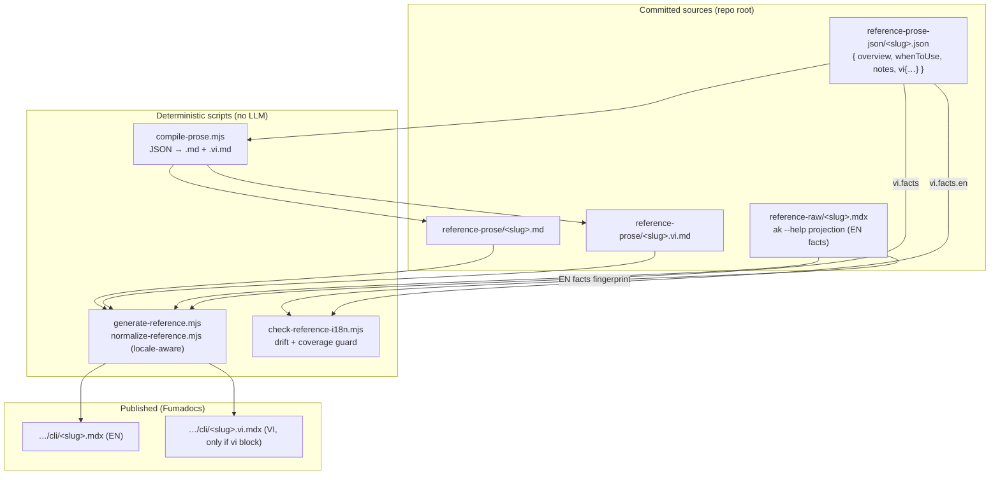
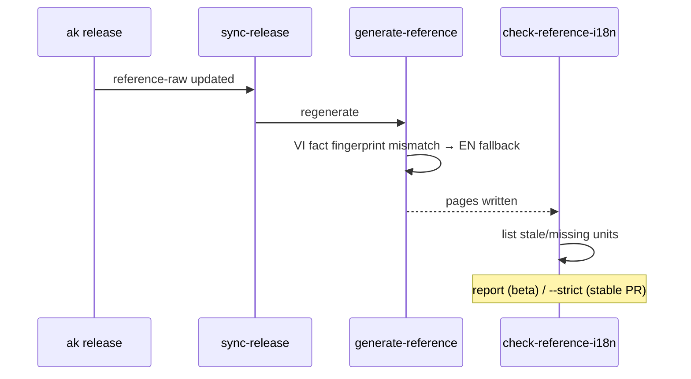

# CLI reference i18n (Vietnamese)

**Status:** Design proposal — not yet implemented.
**Scope:** Localize the machine-derived CLI reference (`content/docs/<channel>/reference/cli/`) into Vietnamese, matching the human-authored prose pages that already ship `.vi.mdx`.

Companion docs: [cli-reference-pipeline.md](./cli-reference-pipeline.md) (how the reference is built today), [release-and-deploy.md](./release-and-deploy.md).

---

## 1. Problem

Every CLI reference page (`ak.mdx`, `ak_*.mdx`, `index.mdx`) exists **only in English**. There is no `.vi.mdx` counterpart anywhere under `reference/cli/`. Because Fumadocs is configured with `fallbackLanguage: 'en'` ([lib/i18n.ts](../../lib/i18n.ts)), visiting `/vi/docs/<channel>/reference/cli/*` renders the **English** body — only the sidebar label (`meta.vi.json` → `"Lệnh CLI"`) is localized. The result reads as a broken translation: Vietnamese nav, English content.

This is a direct consequence of the pipeline, not a bug: the reference is **derived** (`generate-reference.mjs` = `normalize(reference-raw + prose overlay)`), CI asserts a zero diff, and both source layers are English-only. There is no path for a translated page to exist without extending the generator.

## 2. Goal / non-goals

**Goal.** A first-class Vietnamese CLI reference: `reference/cli/<slug>.vi.mdx` derived by the same deterministic pipeline, covering **both the narrative lead and the factual sections** (flags, exit codes, output modes, related-command descriptions, section headings).

**Explicitly in scope (per decision): full translation.** Flag descriptions, exit-code meanings, output-mode behaviors, and related-command descriptions **are translated**, not left in English.

**Non-goals.**
- Translating command *names*, flag *names/specs* (`--channel string`), usage invocation lines, or example command blocks — these are literal shell tokens and stay verbatim in every locale.
- Auto-translation at build time (no LLM in the deterministic path — translations are committed sources, same as prose overlays today).
- Locale detection / redirect changes — `_redirects` and `hideLocale: 'never'` are unchanged.

## 3. The core tension: full translation vs. drift

Facts come from the `ak` binary (`reference-raw/`) and change on **every release**. Translating them means a translation can silently fall out of sync with the English source it was made from — the exact "silent drift" the zero-diff pipeline was built to prevent.

The design resolves this with a **source-fingerprinted translation memory**: every translated fact stores the English string it was translated *from*. At generate time the generator compares that stored source against the current English text:

- **match** → use the Vietnamese translation.
- **mismatch or missing** → fall back to the English string for that unit **and** flag it as stale/missing.

A translation is therefore never shown against a source it no longer matches. Drift degrades gracefully to English + a warning, instead of shipping a wrong translation. This is the "guard rail" that makes full translation safe.

### Translatable units

| Unit | Key (stable id) | Source | Translate? |
| --- | --- | --- | --- |
| `overview`, `whenToUse`, `notes` | — (narrative) | `reference-prose-json` | ✅ narrative |
| frontmatter `description` | — | raw frontmatter | ✅ fingerprinted |
| flag description | flag spec, e.g. `--json` | `### Flags` table | ✅ fingerprinted |
| inherited-flag description | flag spec | `### Inherited flags` | ✅ fingerprinted |
| output-mode behavior | mode name | `### Output modes` | ✅ fingerprinted |
| exit-code meaning | code number | `### Exit codes` | ✅ fingerprinted |
| related-command description | href, e.g. `./ak_doctor` | `### Related commands` | ✅ fingerprinted |
| section headings + table headers + `**When to use it:**` + `Docs / feedback:` footer | — | generator constants | ✅ static label map |
| flag names / specs, usage line, examples, mode names, exit-code numbers, hrefs | — | raw | ❌ verbatim |

Narrative fields need no per-unit fingerprint: their English source lives in the *same* JSON file, so a reviewer editing the English `overview` sees the `vi.overview` right beside it. Facts need fingerprints because their English source lives in a *different*, machine-owned file (`reference-raw/`) that the sync bot rewrites.

## 4. Source model — extend the JSON wire format

Keep one source of truth per slug (the chosen option): extend `reference-prose-json/<slug>.json` with an optional `vi` block. `vi` is optional, so coverage grows page-by-page; a slug with no `vi` block simply has no `.vi.mdx` emitted and Fumadocs falls back to English (today's behavior, unchanged).

```json
{
  "overview": "Run health checks on your AgentKit installation…",
  "whenToUse": "After install, upgrade, or unexpected behavior…",
  "notes": "Read-only by default. `--offline` skips network checks.",
  "vi": {
    "description": "Chạy chẩn đoán sức khỏe cho bản cài AgentKit.",
    "overview": "Chạy kiểm tra sức khỏe cho bản cài AgentKit của bạn…",
    "whenToUse": "Sau khi cài, nâng cấp, hoặc khi gặp hành vi bất thường…",
    "notes": "Mặc định chỉ đọc. `--offline` bỏ qua các bước kiểm tra mạng.",
    "facts": {
      "flags": {
        "--json": { "en": "Output as JSON", "vi": "Xuất kết quả dạng JSON" },
        "--offline": { "en": "Skip network checks", "vi": "Bỏ qua kiểm tra mạng" }
      },
      "exitCodes": {
        "0": { "en": "All checks passed", "vi": "Tất cả kiểm tra đều đạt" },
        "1": { "en": "One or more checks failed", "vi": "Một hoặc nhiều kiểm tra thất bại" }
      },
      "outputModes": {
        "json": { "en": "Machine-readable report", "vi": "Báo cáo máy đọc được" }
      },
      "related": {
        "./ak_doctor": { "en": "Diagnose the installation", "vi": "Chẩn đoán bản cài" }
      }
    }
  }
}
```

The `en` field inside each fact entry is the **fingerprint** — the English string the translation was made against. It doubles as review context (a reviewer sees source + target together) and as the drift check input. Storing the literal string (not a hash) keeps diffs human-readable.

> **Note on file size.** Facts + fingerprints roughly double a busy slug's JSON. If a slug grows unwieldy, the `vi.facts` object may later be split into a sibling `reference-prose-json/<slug>.vi.json` without changing the generator contract. Start in-file (the chosen option); split only if it hurts.

## 5. Data flow



Key architectural change from today: **the generator must read `reference-prose-json` directly** for `vi.facts` (facts are merged into machine-generated tables, so they cannot flow through the narrative-only markdown overlay). The narrative still flows JSON → `.md`/`.vi.md` → generator, preserving the "hand-editable markdown overlay" affordance.

## 6. File-by-file changes

### `reference-prose-json/schema.json`
Add an optional `vi` property (object, `additionalProperties: false`):
- required `overview`, `whenToUse`; optional `notes`, `description`, `facts`.
- `facts` groups: `flags`, `inheritedFlags`, `outputModes`, `exitCodes`, `related`; each is an object keyed by unit id → `{ en: string, vi: string }`.

### `scripts/lib/prose-json.mjs`
- Factor the narrative validation into a reusable `validateNarrative(obj)`; apply it to both the top-level object and `vi`.
- `FORBIDDEN_PATTERNS` continues to apply to all narrative fields (EN and VI) — no headings, no fact tables in narrative.
- `compileProseFromJson`: when `vi` present, also render `reference-prose/<slug>.vi.md` via `renderProseMarkdown(vi, { locale: 'vi' })`; when absent, delete a stale `.vi.md`. `--check` compares both.
- `renderProseMarkdown(overlay, { locale })`: localize the `**When to use it:**` label (`vi` → `**Khi nào dùng:**`).
- **Validate `vi.facts` shape only** here (keys are strings, entries are `{en, vi}`). Fingerprint matching against raw is a separate concern (§6 `check-reference-i18n.mjs`) — keep this file free of `reference-raw` coupling.

### `scripts/lib/normalize-reference.mjs`
- Introduce a `LABELS[locale]` map for every generator-owned string:
  ```js
  const LABELS = {
    en: { usage:'Usage', examples:'Examples', flags:'Flags', inherited:'Inherited flags',
          outputModes:'Output modes', exitCodes:'Exit codes', related:'Related commands',
          flagCol:['Flag','Description'], modeCol:['Mode','Behavior'], codeCol:['Code','Meaning'] },
    vi: { usage:'Cách dùng', examples:'Ví dụ', flags:'Cờ', inherited:'Cờ kế thừa',
          outputModes:'Chế độ xuất', exitCodes:'Mã thoát', related:'Lệnh liên quan',
          flagCol:['Cờ','Mô tả'], modeCol:['Chế độ','Hành vi'], codeCol:['Mã','Ý nghĩa'] },
  };
  ```
- Extend the signature: `normalizeReferenceMdx(input, { prose, locale = 'en', description, factTranslations })`.
  - Headings/table headers come from `LABELS[locale]`.
  - Frontmatter `description` is overridden by the localized value when supplied.
  - When building each fact table, translate the **description/meaning/behavior cell** (not the key) through `factTranslations`, which is a resolver: `resolve(group, key, englishText) → translatedText | englishText`. The resolver returns the translation only on fingerprint match; otherwise the English text (graceful fallback).
- Keep the idempotency guard (`looksRaw`) unchanged — same raw input feeds both locales.

### `scripts/lib/generate.mjs`
- For each raw page, load `proseEn` (`.md`), `proseVi` (`.vi.md`), and the JSON overlay (`vi.facts`, `vi.description`).
- Always write `<slug>.mdx` (EN) as today.
- Write `<slug>.vi.mdx` **only when a `vi` block exists**, passing `locale: 'vi'`, the localized `description`, and a `factTranslations` resolver built from `vi.facts` + the current raw fact strings.
- **Fix the delete-then-write loop (required):** today it removes any `*.mdx` not backed by a raw source. `<slug>.vi.mdx` is never in `derived` (which holds `ak.mdx`, not `ak.vi.mdx`), so it would be deleted on every run. Extend `derived` to include the `.vi.mdx` of each slug that currently has a `vi` block, and conversely delete a `.vi.mdx` when its `vi` block is removed.

### `scripts/check-reference-i18n.mjs` (new) + `scripts/lib/reference-i18n.mjs`
The drift guard. For every slug with a `vi` block:
- **stale** — a `vi.facts[group][key].en` that no longer equals the current raw string for that key.
- **missing** — a raw fact unit (flag/exit-code/…) with no translation entry.
- **orphan** — a translation entry whose key no longer exists in raw.
- **coverage** — translated units / total units per slug.

Modes:
- default (report): print a table; exit 0. Used after every beta sync so a release never fails on drift — the pages just fall back to English for stale/missing units.
- `--strict`: exit non-zero on any stale/orphan (optionally missing). Gate for the **stable promotion PR**, so production never ships a half-updated translation silently.

### `scripts/lib/reference-hygiene.mjs` / `check-reference-hygiene.mjs`
Widen the glob to include `.vi.mdx` so private-link scrubbing and MDX-safety checks cover translated pages too.

### `content/docs/<channel>/reference/cli/meta.vi.json`
No change required for content localization — nav labels already work and are guard-exempt.

### No React/layout changes
Fumadocs resolves `<slug>.vi.mdx` for `/vi/*` and falls back to `<slug>.mdx` otherwise. `lib/i18n.ts` and the route handlers are untouched.

## 7. Release lifecycle (what happens when `ak` changes)

1. `sync-release.mjs` refreshes `reference-raw/` from the release bundle.
2. `generate-reference.mjs` rewrites `<slug>.mdx` (EN, always fresh) and `<slug>.vi.mdx`. For any fact whose English text changed, the fingerprint no longer matches, so the VI page **auto-falls-back to English for that cell** — never a stale translation.
3. `check-reference-i18n.mjs` reports the stale/missing units (feeds an issue or a docs-agent task).
4. A translator/agent updates only the changed `vi.facts[key].{en,vi}` entries; regenerate restores a fully-Vietnamese page. Fingerprints mean **only changed units need re-translation**, not the whole page.



## 8. CI guards — net effect

| Guard | Change |
| --- | --- |
| `generate-reference.mjs` + zero-diff | Still holds — `.vi.mdx` is a pure function of `(raw + prose.vi + vi.facts + LABELS)`. Commit the output. |
| `compile-prose.mjs --check` | Extended to compare `.vi.md` against JSON `vi`. |
| `check-generated.mjs` | Unchanged — `reference/cli` is in `REPRODUCIBLE_DIRS`, exempt via the stronger regenerate-and-diff step. |
| `check-reference-hygiene.mjs` | Glob widened to `.vi.mdx`. |
| `check-reference-i18n.mjs` | New — report in CI on `dev`; `--strict` in the stable-promotion PR. |
| `promote-docs.mjs` | `.vi.mdx` is channel-neutral; whole-copy promotion inherits it. Verify the channel-neutral assertion tolerates `.vi.mdx`. |
| `check-agent-pr.mjs` | If the docs-agent is to translate the reference, widen its scope to `reference-prose-json/` (currently limited to `content/docs/beta/{getting-started,guides}`). Keep it off `reference-raw/` and `content/docs`. |

## 9. Fallback & incremental coverage

- No `vi` block → no `.vi.mdx` → Fumadocs serves the English body. Identical to today; nothing regresses.
- `vi` narrative but partial `vi.facts` → `.vi.mdx` ships with translated narrative + translated known facts + English for the rest. Always coherent, never blocked.
- This mirrors the prose pages' "fast-follow, page-by-page" model already documented in `lib/i18n.ts`.

## 10. Trade-offs

- **Maintenance cost is real but bounded.** Full fact translation means re-touching changed units on releases that alter help text. Fingerprinting bounds this to *only the changed units* and guarantees the page is never wrong in the meantime — the cost buys correctness, not risk.
- **Mixed-language pages during drift.** Between a release and its re-translation, a VI page can show English fact cells. This is intentional and preferable to a stale/incorrect translation; the coverage report makes the gap visible.
- **JSON grows.** Mitigated by the optional `<slug>.vi.json` split (§4).
- **Two render paths for facts vs. narrative.** Narrative goes JSON→md→generator; facts go JSON→generator. Slightly more surface, but keeps the hand-editable markdown overlay working.

## 11. Phasing

1. **Mechanism (no content).** Schema + `prose-json` + `normalize-reference` labels + `generate` (emit `.vi.mdx`, fix delete-loop) + `check-reference-i18n` + tests. Merges as a no-op: zero `vi` blocks → zero `.vi.mdx` → English fallback everywhere, exactly as now.
2. **Seed high-traffic slugs.** Translate `ak`, `ak_kit*`, `ak_self-update`, `ak_doctor`, `ak_login`, `index`. Wire `--strict` into the stable-promotion PR.
3. **Backfill + automate.** Optionally let the docs-agent propose `vi` blocks (scoped to `reference-prose-json/`), reviewed via CODEOWNERS.

## 12. Open questions

- Should `usage`/`examples` ever be localized (e.g. translating `# comment` lines inside example blocks)? Current design keeps them verbatim; revisit if examples carry explanatory prose.
- `--strict` threshold: fail on any stale unit, or allow a small budget with a tracking issue?
- Should the docs-agent own reference translations, or keep them human-reviewed only initially?
