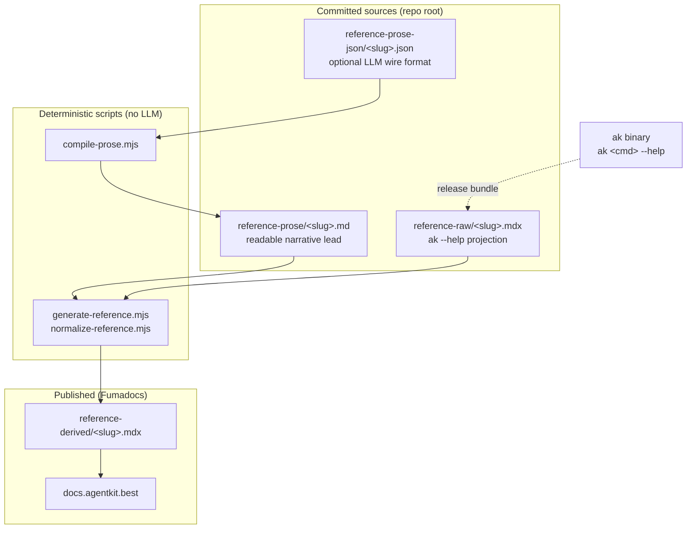
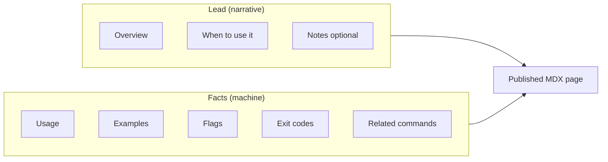
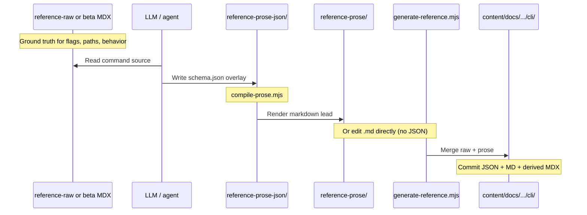
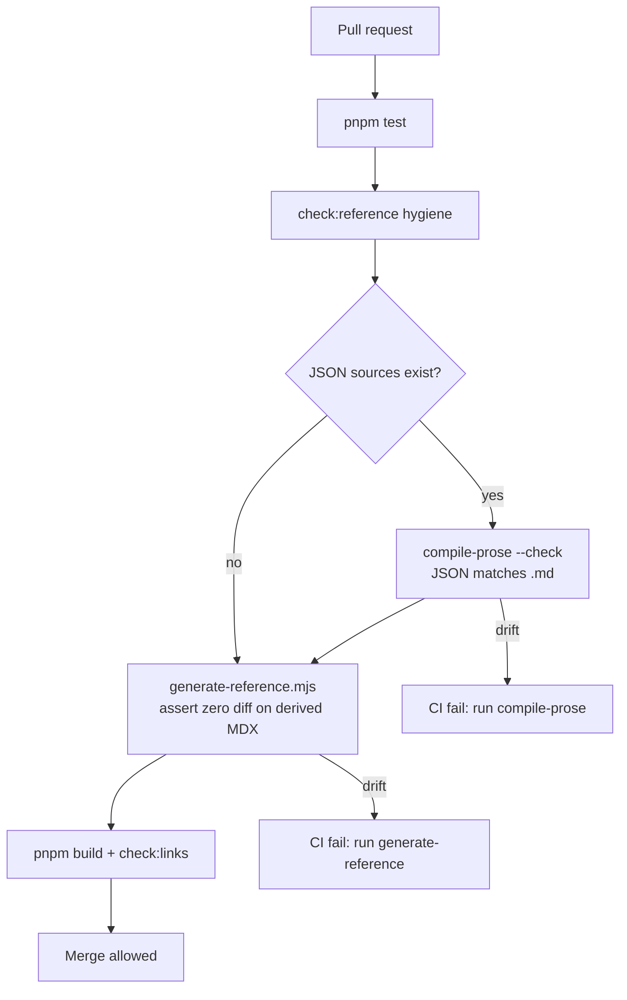
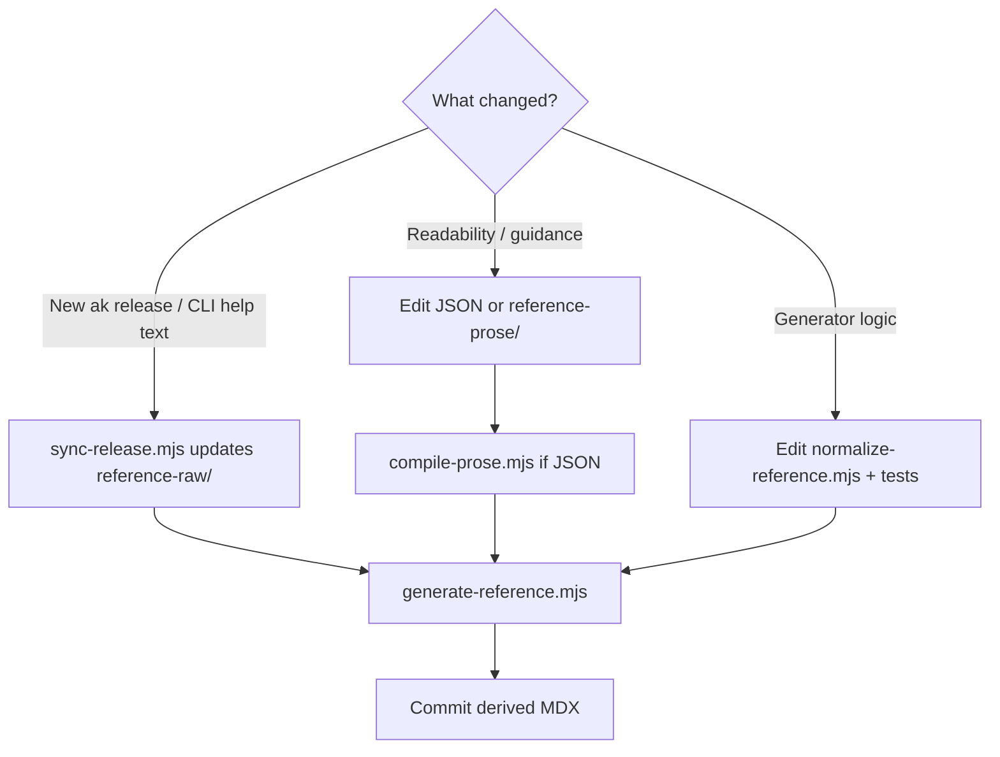

# CLI reference pipeline

How the published CLI reference is built: facts stay mechanical; narrative is
human/LLM-authored; the site reads **derived** pages only.

## Layer model



| Layer | Owner | Contents |
| --- | --- | --- |
| `reference-raw/` | Machine (sync from `ak-cli` release) | Usage, flags, exit codes, examples — exact CLI help |
| `reference-prose-json/` | LLM/agent (optional) | `{ overview, whenToUse, notes? }` |
| `reference-prose/` | Human/LLM reviewed | Markdown lead only |
| `reference-derived/` | **Derived** | Prose lead + generated fact sections (not published) |
| `content/docs/.../cli/` | **Authored** | Nested user-facing CLI reference |

Slugs without a prose overlay fall back to a mechanical synopsis from raw.

## One page: what the user sees



The lead comes from `reference-prose/` (or JSON compiled into it). Everything
from **Usage** downward is parsed from `reference-raw/` by `normalize-reference.mjs`.

Shared boilerplate is deduped at generation time: universal flags
(`--json`, `--quiet`, `--verbose`, `--yes`, `--no-interactive`, `--help`), the
canonical output-modes table, and the standard exit codes (`0`–`3`) are
documented once on the human-owned `cli-conventions` page; command pages keep
only rows specific to them (matched by exact flag+description / code+meaning,
so overloaded spellings survive) plus a pointer line. The `cli/index` page is
also compiled — a grouped table of contents built from each command page's
frontmatter (`scripts/lib/reference-index.mjs`) instead of the raw projection.

## Authoring workflow (LLM + human)



### Commands (local)

```bash
# Path A — JSON wire format (recommended for agents)
# 1. Write reference-prose-json/<slug>.json
node scripts/compile-prose.mjs              # → reference-prose/<slug>.md

# Path B — edit reference-prose/<slug>.md directly

# Both paths:
node scripts/generate-reference.mjs           # → reference-derived/
pnpm lint && pnpm check:reference && pnpm build && pnpm check:links
```

Bootstrap JSON from existing markdown:

```bash
node scripts/compile-prose.mjs --export-missing
```

## CI validation



Reproducibility rule: for unchanged `reference-raw/` + `reference-prose/`,
re-running `generate-reference.mjs` must produce **zero diff** on
`reference-derived/`.

## When each layer changes



After a CLI release sync, re-check prose overlays for commands whose behavior
changed — facts update automatically; narrative may need a human/LLM pass.

## File naming

| Published page | Slug | Overlay paths |
| --- | --- | --- |
| `ak_kit_install.mdx` | `ak_kit_install` | `reference-prose/ak_kit_install.md` |
| `ak.mdx` | `ak` | `reference-prose/ak.md` |

One slug per command; channel-neutral prose promotes to stable with the tree copy.
