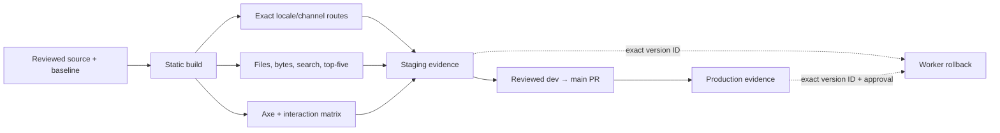

# Post-launch quality and operations

Use this runbook to produce a release-quality receipt, review the launched UX,
promote staging evidence, or roll back one exact Cloudflare Worker version. The
site remains a static export; these checks do not add a hosted search service or
runtime.

## Quality commands

Run with the Node version in `.nvmrc` and the pinned pnpm version in
`package.json`:

```bash
pnpm install --frozen-lockfile
pnpm check:catalog
pnpm test
pnpm build
pnpm check:quality
pnpm check:assets
pnpm check:links
pnpm --silent quality:receipt > quality-receipt.json
```

`check:quality` is deterministic and CI-blocking. It checks the built output,
so run `pnpm build` first. `quality:receipt` emits the same route and metric
results as JSON for a release record.

`quality:benchmark` runs search parsing/loading and five full builds on the
reviewed machine profile:

```bash
pnpm --silent quality:benchmark > quality-benchmark.json
```

Timing and heap data are advisory because hardware, filesystem cache, and
runner contention affect them. Use `--strict-advisory` with
`release-quality-metrics.mjs` only on the reviewed profile when a release owner
wants a blocking local comparison. CI does not treat hardware-sensitive timing
as a deterministic gate.

## Committed baseline and budgets

The executable baselines live in `scripts/release-quality-shape.mjs` and
`scripts/release-quality-metrics.mjs`; use `quality:receipt` to record their
current values. Changing a count, budget, exclusion, or reviewed variant is a
reviewed decision, not an automatic response to a red check.

The shape gate requires exact EN/VI source and published-route parity within
each channel. Across channels, every Stable route must exist in Beta, while Beta
may contain additional routes awaiting promotion. The same `stable ⊆ beta`
invariant applies to searchable routes. Search still requires exact EN/VI
parity within each channel and an exact match between published and searchable
routes after the reviewed exclusions.

Reviewed source-only routes, generated routes, locale variants, out-of-channel
search pages, output budgets, and Cloudflare limits are declared beside their
checks in those scripts. Do not copy Beta-only content into Stable to make a
count or parity check pass; fix the contract defect or update the reviewed
per-channel baseline from a fresh build.

### Fixed search relevance

Each expected route must appear in the first five results. The baseline build
recorded these ranks:

| Locale | Query | Beta / Stable expected routes | Ranks |
| --- | --- | --- | ---: |
| EN | `installation` | `/en/{beta,stable}/getting-started/installation` | 1 / 2 |
| EN | `engineer kit` | `/en/{beta,stable}/kits/engineer` | 1 / 2 |
| VI | `Marketing Kit` | `/vi/{beta,stable}/kits/marketing` | 1 / 2 |
| EN | `ak update` | `/en/{beta,stable}/reference/cli/update` | 3 / 4 |
| VI | `Ứng dụng Desktop` | `/vi/{beta,stable}/desktop-app` | 1 / 2 |
| VI | `quy ước CLI` | `/vi/{beta,stable}/reference/cli-conventions` | 1 / 2 |

Metadata-only Orama search meets the payload and relevance gates. Keep it.
Search sharding, a hosted provider, or a server runtime needs a separate plan
after a measured gate failure.

## Pinned benchmark receipt

Profile: Apple M3 Pro, 12 cores, 36 GiB RAM, arm64, macOS 26.5.1 (25F80),
Node 22.21.1, pnpm 10.26.2. Baseline source:
`b007636dea3b756d4e7b185dfc14d13ca0541d3f`.

| Advisory signal | Runs | Median | Review threshold |
| --- | ---: | ---: | ---: |
| Search JSON parse | 5 | 98.62 ms | 118.35 ms (+20%) |
| Search index load | 5 | 22.77 ms | 27.32 ms (+20%) |
| Search parse/load peak heap | 5 | 111,501,968 bytes | 133,802,362 bytes (+20%) |
| Full static build | 5 | 194.29 s | 242.86 s (+25%) |

Runtime samples are evidence for this profile only. Artifact bytes, file limits,
route parity, and top-five relevance remain deterministic across supported CI
machines. Build samples were 177.13, 281.55, 194.29, 186.91, and 198.73 seconds;
the slower sample is retained because the five-run median is robust to one
contention outlier.

The benchmark receipt records both expected and observed CPU, core count,
memory, OS product/build, kernel, architecture, Node, and pnpm values.
`--strict-advisory` fails on a profile mismatch as well as a threshold
regression; an unverified machine must never be labelled as the pinned profile.

## Representative browser matrix

Run against one exact static build served locally with `pnpm start`. Test every
row in dark and light themes; use both desktop and mobile widths across the
matrix.

| Surface | EN Stable | EN Beta | VI Stable | VI Beta |
| --- | --- | --- | --- | --- |
| Docs | `/en/stable/getting-started/installation` | `/en/beta/getting-started/installation` | `/vi/stable/getting-started/installation` | `/vi/beta/getting-started/installation` |
| Kits | `/en/stable/kits/engineer` | `/en/beta/kits/marketing` | `/vi/stable/kits/engineer` | `/vi/beta/kits/marketing` |
| CLI | `/en/stable/reference/cli/update` | `/en/beta/reference/cli/update` | `/vi/stable/reference/cli/update` | `/vi/beta/reference/cli/update` |
| Desktop | `/en/stable/desktop-app` | `/en/beta/desktop-app` | `/vi/stable/desktop-app` | `/vi/beta/desktop-app` |

For each surface, verify:

- axe-core reports zero `color-contrast` violations and zero serious/critical
  violations; include `/_showcase` in both themes;
- Tab order reaches skip link, navigation, search, channel selector, theme
  switch, and content links; focus remains visible;
- search opens by button and keyboard shortcut, labels match locale, the dialog
  traps focus, Escape closes it, and focus returns to the trigger;
- the mobile drawer opens, exposes the current product/channel, closes by
  keyboard, and returns focus;
- `prefers-reduced-motion: reduce` removes terminal/Mermaid animation and does
  not hide content;
- language fallback disclosure is absent when no fallback is active; any
  approved future fallback is visibly disclosed and is listed in the route
  baseline.

Record route, locale, channel, theme, viewport, axe version, browser version,
violations, and interaction result beside the release receipt. Do not change UI
code unless this matrix reproduces a failure.

### 2026-08-04 baseline browser receipt

- Artifact: static export from
  `b007636dea3b756d4e7b185dfc14d13ca0541d3f` plus the quality-only scripts and
  docs change; served from `out/` on loopback.
- Scanner: axe-core 4.10.3,
  `axe.min.js` SHA-256
  `880970c081707360e64f34cea25ff91892f5bc95675b0776925b9709dd8a68bb`,
  loaded through a temporary ignored same-origin runner and removed afterward.
- Browser: Codex in-app browser. The surface did not expose its Chromium build
  number, which is an evidence limitation.
- Axe: 10 representative routes (the eight cross-locale/channel surface routes
  plus EN/VI showcase), repeated in light and dark: 20 scans, zero
  `color-contrast`, zero serious/critical, and zero total violations.
- Search/focus: `Meta+K` opened the EN dialog with the localized accessible
  input name; `ak update` returned Beta/Stable CLI and troubleshooting results;
  Escape closed the dialog and focus returned to the search trigger. The
  focused trigger rendered the brand ring (`#7cb9ea`, 2 px).
- Mobile: 390 × 844 on `/vi/beta/desktop-app`; the drawer exposed the localized
  release-channel navigation, Beta/Stable links, and a focused native close
  button. Pointer activation closed it. The in-app browser's synthetic
  Enter/Space APIs did not generate a native button click, so keyboard
  activation of this control remains an automation limitation rather than a
  reproduced product failure.
- Reduced motion: this host reported `prefers-reduced-motion: reduce` as false.
  The browser-loaded CSS contained the terminal opacity/animation override and
  Mermaid transition/animation override. The in-app browser exposes viewport
  emulation but not media-preference emulation, so the active reduced-motion
  state could not be executed in this receipt.
- Locale fallback: the route guard found zero live English-body fallbacks. The
  VI Desktop page rendered `lang="vi"` and the native `Ứng dụng Desktop`
  heading; no fallback disclosure was expected.

## Staging evidence and exact rollback

### Deployment enforcement boundary

The CI workflow runs the Phase 2 catalog guard and Phase 6 quality guards, but
the existing staging and production deploy workflows are independent push
workflows. They do not currently depend on the CI job or repeat every quality
gate. Until the deploy-workflow owner adds an exact-SHA dependency, treat a
green CI run for the exact deployment SHA as a required human promotion check.
This is an explicit blocker to claiming fully automated quality-gated deploys;
do not infer deploy safety merely because the checks exist in `ci.yml`.

Before deploying, keep the CI run URL, commit SHA, `quality:receipt` JSON, axe
matrix, and the current staging deployment/version IDs. Listing is read-only:

```bash
pnpm exec wrangler deployments list --env staging
pnpm exec wrangler versions list --env staging --json
```

To roll back, select and peer-review one exact prior staging version ID from
those receipts. Never omit the ID: Wrangler otherwise chooses a previous
version implicitly.

```bash
pnpm exec wrangler rollback <EXACT_STAGING_VERSION_ID> \
  --env staging \
  --message "rollback staging to <EXACT_STAGING_VERSION_ID> after <INCIDENT_ID>"
```

Rollback immediately creates a deployment serving that version on the staging
routes. Verify the active ID with `deployments list`, then smoke all four
surface routes in EN and VI. Open a revert/fix PR against `dev`; the Worker
rollback does not change Git. Cloudflare documents the version-ID rollback
contract in the [Wrangler Workers commands](https://developers.cloudflare.com/workers/wrangler/commands/workers/#rollback).

## Production promotion evidence

Production is a reviewed `dev` to `main` promotion, never a direct content edit.
Attach all of the following to the promotion record:

1. exact green `dev` SHA and CI run URL;
2. staging workflow run URL, Worker deployment/version ID, and timestamp;
3. deterministic quality receipt, five-run pinned benchmark receipt, and axe/
   interaction matrix;
4. reviewed promotion PR URL, approver identity, and merge SHA;
5. production workflow run URL and Worker deployment/version ID;
6. HTTP and browser smoke evidence for Docs, Kits, CLI, and Desktop in EN/VI,
   plus a comparison of channels/version display.

If production evidence disagrees with staging, stop. Do not re-run promotion to
hide the mismatch. Roll back the exact production Worker version under the
production environment approval policy, then revert/fix through `dev`.

## Exact-target cleanup

Keep receipts before cleanup. Delete only reproducible ignored build or
dependency directories, never a workspace root, wildcard, generated reference,
or content directory. Resolve the absolute target, prove Git ignores that exact
path, and record its size first:

```bash
git check-ignore -v -- /absolute/path/to/ak-docs/out
du -sh -- /absolute/path/to/ak-docs/out
rm -r -- /absolute/path/to/ak-docs/out
```

For `node_modules`, repeat the same three commands with the exact absolute
`node_modules` path; restore it with `pnpm install --frozen-lockfile`. In CI,
prefer the runner's normal workspace disposal. Never use a repository root,
home directory, unresolved variable, glob, or recursive force option as the
cleanup target.

## Quality flow


