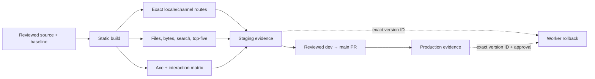

# Post-launch quality and operations

Use this runbook to produce a release-quality receipt, review the launched UX,
promote staging evidence, or roll back one exact Cloudflare Worker version. The
site remains a static export; these checks do not add a hosted search service or
runtime.

## Quality commands

Run with the Node version in `.nvmrc` and the pinned pnpm version in
`package.json`:

```bash
pnpm install --frozen-lockfile
pnpm check:catalog
pnpm test
pnpm build
pnpm check:quality
pnpm check:assets
pnpm check:links
pnpm check:seo
pnpm --silent quality:receipt > quality-receipt.json
```

`check:quality` is deterministic and CI-blocking. It checks the built output,
so run `pnpm build` first. `quality:receipt` emits the same route and metric
results as JSON for a release record.

`quality:benchmark` runs search parsing/loading and five full builds on the
reviewed machine profile:

```bash
pnpm --silent quality:benchmark > quality-benchmark.json
```

Timing and heap data are advisory because hardware, filesystem cache, and
runner contention affect them. Use `--strict-advisory` with
`release-quality-metrics.mjs` only on the reviewed profile when a release owner
wants a blocking local comparison. CI does not treat hardware-sensitive timing
as a deterministic gate.

## Committed baseline and budgets

The executable baselines live in `scripts/release-quality-shape.mjs` and
`scripts/release-quality-metrics.mjs`; use `quality:receipt` to record their
current values. Changing a count, budget, exclusion, or reviewed variant is a
reviewed decision, not an automatic response to a red check.

The shape gate requires exact EN/VI source and published-route parity within
each channel. Across channels, every Stable route must exist in Beta, while Beta
may contain additional routes awaiting promotion. The same `stable ⊆ beta`
invariant applies to searchable routes, asserted per scope: each of the four
shards must contain exactly the pages published under its own locale/channel
prefix — after the reviewed exclusions — and nothing else, so a foreign-scope
record fails the gate instead of being ranked. Searchable routes also keep exact
EN/VI parity within each channel.

Reviewed source-only routes, generated routes, locale variants, out-of-channel
search pages, output budgets, and Cloudflare limits are declared beside their
checks in those scripts. Do not copy Beta-only content into Stable to make a
count or parity check pass; fix the contract defect or update the reviewed
per-channel baseline from a fresh build.

### Search relevance and scope isolation

Search is scoped, not whole-index. The build emits one Orama shard per locale ×
release channel (`/api/search/{locale}/{channel}`), each containing only the
pages published under its own prefix. The dialog, the quality CLI and the
navigation start links all resolve destinations inside the reader's own locale
and channel: a query never downloads, ranks or renders a foreign-scope record,
and a missing route is never answered by another scope's page.

The acceptance matrix lives in `scripts/release-quality-metrics.mjs`; the
dialog and the checks call the same query implementation in
`lib/search-client.mjs`, so the UI and the CLI cannot disagree.

- **Positive rows** — `fixedQueries` names a locale, a channel-relative route
  and a `maxRank`; each row is expanded over both channels, and the expected
  page must appear inside its bound, counted in distinct page groups (heading
  rows cannot inflate a rank).
- **Negative controls** — `fixedNegativeQueries` declares `absentRoutes` that a
  query must not promote into the top three page groups, and `zeroResults` rows
  that must match nothing. A blanket landing-page boost or an overreaching alias
  fails here even though it would look fine on the positive rows.
- **Payload** — the four shards share one 22 MiB aggregate budget; every asset
  still has to stay below Cloudflare's 25 MiB per-file limit, and a shard under
  `api/search/` that is not one of the four required scopes is rejected and
  counted against the budget.

Record a fresh receipt against one exact build:

```bash
pnpm build
pnpm --silent quality:receipt > quality-receipt.json
```

The receipt is the record of truth for the matrix: per-row query, locale,
channel, rank against `maxRank`, the top-three page groups, the negative
controls, and the observed shard bytes against their budgets. `check:quality` is
deterministic and CI-blocking, and reads the built `out/` artifact, so it always
follows `pnpm build`.

Historical receipts remain historical. The pre-sharding single-index ranks and
byte figures recorded in earlier receipts and in Git history describe an
artifact that no longer ships; do not rewrite them and do not compare them with
a current receipt. Treat a per-scope row as verified only once a receipt
produced from the exact build under review records it.

Sharding is the current contract: the single whole-corpus index met its
relevance gate but exceeded the aggregate asset budget and answered broad
queries with pages from the wrong product. A hosted provider, a server runtime,
or a change back to one shared index still needs a separate plan and a measured
gate failure.

### Engineer navigation contract

Engineer must be reachable without knowing a search term. Every product surface
shows exactly one immediately visible Engineer destination — one activation
away in a freshly opened sidebar, counting distinct URL nodes so no duplicate
entry can appear — and the channel home and Engineer landing render one
localized start-link block (Installation, Engineer overview, Engineer Skills,
Workflows, Migration). Those routes are the same canonical routes the search
matrix asserts, so navigation and search cannot drift apart.

The block is navigation chrome rendered by the page, not content: it is
deliberately absent from the exported page Markdown (`.md` siblings) and from
release prose. Verify it in the browser, never in exported Markdown, and never
add it to MDX release evidence to make a check pass. Destinations are resolved
against the reader's own locale and channel before rendering, so a VI or Beta
link can only point at a VI or Beta route.

`node --test scripts/product-navigation.test.mjs` defends this contract at the
source level (one immediately visible destination per projection, no duplicate
URL node, no cross-locale or cross-channel link, scope-correct start-link hrefs,
and existence of every required route in all four scopes).

**Metadata-only Orama search meets the payload and relevance gates. Keep it.**

## Pinned benchmark receipt

**Historical, pre-sharding.** The table below is the original whole-corpus
record and is kept as recorded history; do not rewrite it and do not read it as
the current per-scope baseline. `benchmarkSearch` now reports the worst of the
four scope shards (`scope: "worst shard of 4"`), so a ratio against these
whole-index medians is not comparable and the runner reports the two scopes
instead of presenting them as a regression. A new receipt must be recorded on
this profile before `--strict-advisory` is used as a gate.

Profile: Apple M3 Pro, 12 cores, 36 GiB RAM, arm64, macOS 26.5.1 (25F80),
Node 22.21.1, pnpm 10.26.2. Baseline source:
`b007636dea3b756d4e7b185dfc14d13ca0541d3f`.

| Advisory signal | Runs | Median | Review threshold |
| --- | ---: | ---: | ---: |
| Search JSON parse | 5 | 98.62 ms | 118.35 ms (+20%) |
| Search index load | 5 | 22.77 ms | 27.32 ms (+20%) |
| Search parse/load peak heap | 5 | 111,501,968 bytes | 133,802,362 bytes (+20%) |
| Full static build | 5 | 194.29 s | 242.86 s (+25%) |

Runtime samples are evidence for this profile only. Artifact bytes, file limits,
route parity, and top-five relevance remain deterministic across supported CI
machines. Build samples were 177.13, 281.55, 194.29, 186.91, and 198.73 seconds;
the slower sample is retained because the five-run median is robust to one
contention outlier.

The benchmark receipt records both expected and observed CPU, core count,
memory, OS product/build, kernel, architecture, Node, and pnpm values.
`--strict-advisory` fails on a profile mismatch as well as a threshold
regression; an unverified machine must never be labelled as the pinned profile.

## SEO / sitemap indexing policy

`app/sitemap.ts` and `app/robots.ts` (Next.js Metadata Route convention;
require `export const dynamic = 'force-static'` under `output: 'export'` —
Next.js 16.2.10 otherwise fails collecting page data for these routes)
generate `out/sitemap.xml` and `out/robots.txt` from `source.getPages()`,
filtered to real channel routes. `pnpm check:seo` (CI-blocking, after
`pnpm build`) enforces the policy below against the built `out/` artifact;
see `scripts/check-seo.mjs` for the exact assertions and
[issue #61](https://github.com/bestagentkits/agentkit-docs/issues/61) for the
full rationale and scope decisions.

- Both `stable` and `beta` channels are indexable — Beta is a real, public,
  versioned release, not a staging environment.
- `lastmod` is intentionally omitted: no per-page timestamp in this repo is
  trustworthy at content-revision granularity (`channels.json`'s `syncedAt`
  is one timestamp shared by an entire channel).
- The `.md` sibling of every docs page (`scripts/emit-markdown-siblings.mjs`)
  is excluded from the sitemap and served with `X-Robots-Tag: noindex`
  (`public/_headers`) — it is a byte-identical duplicate of the HTML page.
- No English-fallback Vietnamese canonical/hreflang mechanism ships yet:
  zero such routes exist today (verified against the full content tree), and
  `check:quality:shape` already blocks a new one from landing silently. A
  real per-route canonical + sitemap-exclusion + hreflang-alternate-removal
  mechanism is deferred to
  [issue #119](https://github.com/bestagentkits/agentkit-docs/issues/119),
  to implement once one is approved.
- `BreadcrumbList` structured data is not added: no route currently renders
  a visible breadcrumb trail (`page.tsx` disables it), which is the same
  condition the original request itself gates this data on. Tracked in
  [issue #120](https://github.com/bestagentkits/agentkit-docs/issues/120).
- `staging.docs.agentkit.best` and production deploy the same `out/`
  artifact shape (`wrangler.toml`) but from separate CI build+deploy jobs
  (`deploy-staging.yml` / `deploy-production.yml`), each running its own
  `pnpm build`. The staging build sets `DOCS_DEPLOY_ENV=staging` (only in
  `deploy-staging.yml` and the local `deploy:staging` script), which
  `app/robots.ts` reads at build time to emit `Disallow: /` with no
  `Sitemap:` line instead of production's `Allow: /` plus the production
  sitemap URL. Production and `pnpm check:seo` (CI's plain, unflagged build)
  are unaffected. `out/sitemap.xml` still ships on staging with production
  URLs — harmless since it is unadvertised and crawl-blocked, but not
  filtered; pages also self-declare non-canonical via `metadataBase`
  pointing at the production origin. Landed in
  [issue #118](https://github.com/bestagentkits/agentkit-docs/issues/118).

## Representative browser matrix

Run against one exact static build served locally with `pnpm start`. Test every
row in dark and light themes; use both desktop and mobile widths across the
matrix.

| Surface | EN Stable | EN Beta | VI Stable | VI Beta |
| --- | --- | --- | --- | --- |
| Docs | `/en/stable/getting-started/installation` | `/en/beta/getting-started/installation` | `/vi/stable/getting-started/installation` | `/vi/beta/getting-started/installation` |
| Kits | `/en/stable/kits/engineer` | `/en/beta/kits/marketing` | `/vi/stable/kits/engineer` | `/vi/beta/kits/marketing` |
| CLI | `/en/stable/reference/cli/update` | `/en/beta/reference/cli/update` | `/vi/stable/reference/cli/update` | `/vi/beta/reference/cli/update` |
| Desktop | `/en/stable/desktop-app` | `/en/beta/desktop-app` | `/vi/stable/desktop-app` | `/vi/beta/desktop-app` |
| Channel home | `/en/stable` | `/en/beta` | `/vi/stable` | `/vi/beta` |

For the two scoped surfaces (channel home and the Engineer landing) also run the
search matrix in the browser, on one exact served build:

| Scenario | Pass condition |
| --- | --- |
| First open, cold cache | Only the current scope's shard is requested; no combined or foreign-scope download |
| Reopen the same scope | Uses the cached shard; results stay correct |
| Matrix queries + VI aliases | The expected canonical route meets its `maxRank`, counting distinct pages; clicking it opens that page |
| Heading result | Opens an existing section anchor, never a fabricated fragment |
| Marketing / exact command / CLI control | Explicit intent beats an unrelated Engineer or generic landing promotion |
| Rapid typing and scope switch during load | No stale or foreign-scope result paints after the new request |
| Empty and unknown query | Localized shortcuts and a helpful empty state; no fake match or wrong release link |
| Block the shard request, then retry | Error state is distinct from zero results; unblocking and Retry recovers |
| Keyboard / focus | Button and shortcut open the dialog, focus is trapped, arrows/Enter work, Escape closes and returns focus |
| Navigation | Engineer is one activation away from every product surface; the start-link block resolves in-scope; Marketing stays reachable |
| Start-link chrome boundary | The block renders in the browser only — confirm it is absent from the exported `.md` sibling rather than editing release prose |

Record the navigation click counts from a fresh browser state (not persisted
expanded groups). The start-link block is navigation chrome rendered by the
page; it is intentionally not part of the exported page Markdown, so an absence
in `.md` output is expected and must not be "fixed" by editing content.

For each surface, verify:

- axe-core reports zero `color-contrast` violations and zero serious/critical
  violations; include `/_showcase` in both themes;
- Tab order reaches skip link, navigation, search, channel selector, theme
  switch, and content links; focus remains visible;
- search opens by button and keyboard shortcut, labels match locale, the dialog
  traps focus, Escape closes it, and focus returns to the trigger;
- the mobile drawer opens, exposes the current product/channel, closes by
  keyboard, and returns focus;
- `prefers-reduced-motion: reduce` removes terminal/Mermaid animation and does
  not hide content;
- language fallback disclosure is absent when no fallback is active; any
  approved future fallback is visibly disclosed and is listed in the route
  baseline.

Record route, locale, channel, theme, viewport, axe version, browser version,
violations, and interaction result beside the release receipt. Do not change UI
code unless this matrix reproduces a failure.

### 2026-08-04 baseline browser receipt

- Artifact: static export from
  `b007636dea3b756d4e7b185dfc14d13ca0541d3f` plus the quality-only scripts and
  docs change; served from `out/` on loopback.
- Scanner: axe-core 4.10.3,
  `axe.min.js` SHA-256
  `880970c081707360e64f34cea25ff91892f5bc95675b0776925b9709dd8a68bb`,
  loaded through a temporary ignored same-origin runner and removed afterward.
- Browser: Codex in-app browser. The surface did not expose its Chromium build
  number, which is an evidence limitation.
- Axe: 10 representative routes (the eight cross-locale/channel surface routes
  plus EN/VI showcase), repeated in light and dark: 20 scans, zero
  `color-contrast`, zero serious/critical, and zero total violations.
- Search/focus: `Meta+K` opened the EN dialog with the localized accessible
  input name; `ak update` returned Beta/Stable CLI and troubleshooting results;
  Escape closed the dialog and focus returned to the search trigger. The
  focused trigger rendered the brand ring (`#7cb9ea`, 2 px).
- Mobile: 390 × 844 on `/vi/beta/desktop-app`; the drawer exposed the localized
  release-channel navigation, Beta/Stable links, and a focused native close
  button. Pointer activation closed it. The in-app browser's synthetic
  Enter/Space APIs did not generate a native button click, so keyboard
  activation of this control remains an automation limitation rather than a
  reproduced product failure.
- Reduced motion: this host reported `prefers-reduced-motion: reduce` as false.
  The browser-loaded CSS contained the terminal opacity/animation override and
  Mermaid transition/animation override. The in-app browser exposes viewport
  emulation but not media-preference emulation, so the active reduced-motion
  state could not be executed in this receipt.
- Locale fallback: the route guard found zero live English-body fallbacks. The
  VI Desktop page rendered `lang="vi"` and the native `Ứng dụng Desktop`
  heading; no fallback disclosure was expected.

## Staging evidence and exact rollback

### Deployment enforcement boundary

The CI workflow runs the Phase 2 catalog guard and Phase 6 quality guards, but
the existing staging and production deploy workflows are independent push
workflows. They do not currently depend on the CI job or repeat every quality
gate. Until the deploy-workflow owner adds an exact-SHA dependency, treat a
green CI run for the exact deployment SHA as a required human promotion check.
This is an explicit blocker to claiming fully automated quality-gated deploys;
do not infer deploy safety merely because the checks exist in `ci.yml`.

Before deploying, keep the CI run URL, commit SHA, `quality:receipt` JSON, axe
matrix, and the current staging deployment/version IDs. Listing is read-only:

```bash
pnpm exec wrangler deployments list --env staging
pnpm exec wrangler versions list --env staging --json
```

To roll back, select and peer-review one exact prior staging version ID from
those receipts. Never omit the ID: Wrangler otherwise chooses a previous
version implicitly.

```bash
pnpm exec wrangler rollback <EXACT_STAGING_VERSION_ID> \
  --env staging \
  --message "rollback staging to <EXACT_STAGING_VERSION_ID> after <INCIDENT_ID>"
```

Rollback immediately creates a deployment serving that version on the staging
routes. Verify the active ID with `deployments list`, then smoke all four
surface routes in EN and VI. Open a revert/fix PR against `dev`; the Worker
rollback does not change Git. Cloudflare documents the version-ID rollback
contract in the [Wrangler Workers commands](https://developers.cloudflare.com/workers/wrangler/commands/workers/#rollback).

## Production promotion evidence

Production is a reviewed `dev` to `main` promotion, never a direct content edit.
Attach all of the following to the promotion record:

1. exact green `dev` SHA and CI run URL;
2. staging workflow run URL, Worker deployment/version ID, and timestamp;
3. deterministic quality receipt, five-run pinned benchmark receipt, and axe/
   interaction matrix;
4. reviewed promotion PR URL, approver identity, and merge SHA;
5. production workflow run URL and Worker deployment/version ID;
6. HTTP and browser smoke evidence for Docs, Kits, CLI, and Desktop in EN/VI,
   plus a comparison of channels/version display.

If production evidence disagrees with staging, stop. Do not re-run promotion to
hide the mismatch. Roll back the exact production Worker version under the
production environment approval policy, then revert/fix through `dev`.

## Exact-target cleanup

Keep receipts before cleanup. Delete only reproducible ignored build or
dependency directories, never a workspace root, wildcard, generated reference,
or content directory. Resolve the absolute target, prove Git ignores that exact
path, and record its size first:

```bash
git check-ignore -v -- /absolute/path/to/ak-docs/out
du -sh -- /absolute/path/to/ak-docs/out
rm -r -- /absolute/path/to/ak-docs/out
```

For `node_modules`, repeat the same three commands with the exact absolute
`node_modules` path; restore it with `pnpm install --frozen-lockfile`. In CI,
prefer the runner's normal workspace disposal. Never use a repository root,
home directory, unresolved variable, glob, or recursive force option as the
cleanup target.

## Quality flow


