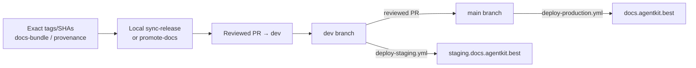
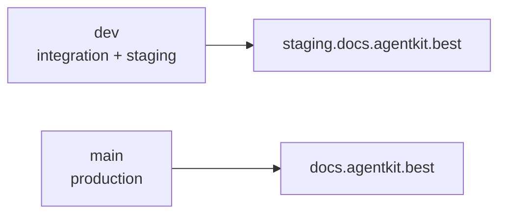
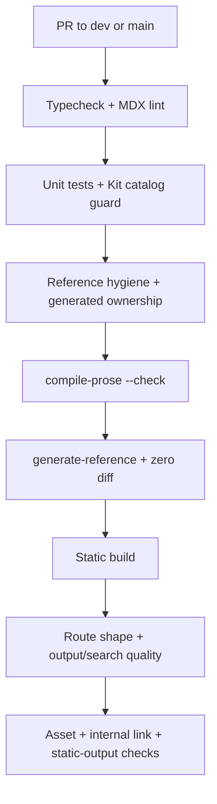

# Release maintenance & deploy

How `ak-docs` stays aligned with product releases and reaches
staging/production.

## Authoritative operating model (manual local)

Release maintenance is **manual, local, and human-reviewed**:

1. Collect **exact** release evidence (tag, product SHA, channel, and for
   stable: `promotedFrom` + the exact beta docs snapshot).
2. Run the local sync or promote script against a verified docs-bundle
   directory (or fixture-shaped bundle).
3. Open a **normal PR into `dev`**.
4. Verify **staging** (`staging.docs.agentkit.best`).
5. Open a reviewed **`dev` → `main` PR** for production
   (`docs.agentkit.best`).

Do **not** hand-edit `content/docs/stable/`. Ordinary release updates fix Beta
(or the bundle), then promote. The equal-artifact Kit-closure case below is a
blocked deterministic reconciliation, not hand authoring or promotion. Do
**not** treat `repository_dispatch` / `docs-sync.yml` as the operating authority
for this phase — that path is legacy and non-authoritative (see below).
Automation may be reintroduced only after the same manual contract
has succeeded more than once, and it must still open a PR rather than merge
itself.



## Release evidence

When a docs bundle is available, treat its **manifest** as evidence and verify
it against the exact release tag or SHA before applying:

```
manifest.json      # schemaVersion, channel, tag, sha, version, generatedAt
                   # (+ promotedFrom on stable)
reference/cli/     # raw ak --help MDX per command
release-notes.md   # channel release notes (semi-trusted input; required)
```

If upstream did not attach `docs-bundle.tar.gz` to the release, construct an
equivalent local directory from the same contract (manifest + notes +
reference) from an **exact temporary product checkout**. Never mutate a shared
long-lived product working tree as part of docs ops.

### Stable/Beta Kit evidence and production gate

Run this gate before interpreting channel tag differences, choosing a Kit audit
route, or opening `dev` → `main`.

For the exact releases bound to the resulting `channels.stable` and
`channels.beta` states, enumerate the complete Kit release-asset inventory keyed
by `(kitId, runtime)` for `claude-code`, `codex`, `cursor`,
`grok`, `omp`, and `pi`. Each key needs exactly one manifest, archive, and
`.sha256` sidecar. Record the exact expected and observed sorted inventories.
Validate manifest channel, tag, runtime, Kit ID, and archive metadata, then
verify the archive SHA-256 against all four sources: downloaded bytes, manifest,
sidecar, and release-page digest. Missing runtimes, missing or duplicate triad
members, unbound assets, or digest disagreement block the gate. An `audit/*` or
`docs/*` tag is lineage, not a substitute for this evidence.

Compare the complete verified key inventories and archive hashes **before**
interpreting tag, version, timestamp, URL, signature, or source-commit metadata.
A tag delta alone is not a Kit payload delta.

| Evidence result | Required action |
| --- | --- |
| Either channel matrix is incomplete or invalid | Block and repair evidence. |
| Key inventory or any archive hash differs | Use the normal release audit: identity, full `SKILL.md` body, support-file, and cross-page claim scans. |
| Complete matrices are equal and Kit-doc closures are exactly equal | Kit production gate passes. |
| Complete matrices are equal but Kit-doc closures differ | Block `dev` → `main`; use deterministic Kit-closure reconciliation only. |

The **Kit-doc closure** is the normalized path-and-byte inventory under
`content/docs/<channel>/kits/**`, any channel-specific catalog projection, and
a deterministic ledger of Kit-derived claim spans elsewhere in that channel.
The claim scan covers all human-owned MDX, including installation, quickstart,
onboarding, Kit guides, runtime concepts, troubleshooting, and human-owned CLI
prose. It records public identities and aliases, invocations, counts, runtime
availability, install paths, package/version requirements, configuration keys,
lifecycle behavior, and retired forms. Compare Kit-tree bytes exactly; for a
cross-page file that also contains unrelated CLI evidence, compare only its
normalized Kit claim spans.

An equal-artifact closure mismatch is not authority for ordinary Stable hand
edits, `--stable-docs-exception`, or a whole Beta promotion when unrelated CLI
or release evidence differs. Reconciliation must be deterministic and bind both
manifest-set and matrix digests, the exact Beta source commit/blob hashes, the
Stable destination commit/preimage blob hashes, an exact closure allowlist, and
all result blob hashes. It must prove no non-allowlisted path changed and finish
with exact closure equality. Reconciliation validates only the finite external-
claim ledger supplied by the release audit; it does not discover arbitrary
cross-page claims, so an incomplete audit remains a blocker. If available
tooling cannot produce and verify that record, production remains blocked.

The executable gate is:

```bash
pnpm check:catalog
pnpm check:kit-docs
pnpm check:kit-docs:history
node scripts/reconcile-kit-docs.mjs --check-diff <base-sha>
```

`check:kit-docs` requires the recorded reconciliation postimages in the current
Stable tree. `check:kit-docs:history` instead revalidates the immutable manifest,
embedded catalog triads, historical source/preimages, closure, and claim ledger
without binding later Stable promotions to those old postimages. CI selects the
historical check only for no-Stable diffs or ordinary whole-copy promotions;
reconciliation diffs continue through the exact `--check-diff` allowlist.

Committed manifest/sidecar evidence lives in `release-evidence/kit-catalog/`;
reconciliation manifests live in `docs-reconciliations/`. After human review,
`node scripts/reconcile-kit-docs.mjs --apply` writes only exact preimages and is
resumable: postimages are skipped, while any third state fails closed.

### Beta sync (`scripts/sync-release.mjs`)

Wholesale-replaces `reference-raw/`, regenerates non-published
`reference-derived/`, writes beta `reference/release-notes.mdx` via the shared
release-note renderer (`scripts/lib/release-notes.mjs`: channel/tag frontmatter
+ private-link hygiene), and updates `channels.json.beta` only. Published nested
CLI pages under `content/docs/beta/reference/cli/` remain reviewed, human-owned
content.

Re-running the same bundle/tag is **idempotent**.

A Beta sync may publish routes that do not yet exist in Stable. EN and VI must
keep identical source, published, and searchable route sets within each
channel, while every Stable route in those sets must still exist in Beta. The quality gates in
`scripts/release-quality-shape.mjs`, `scripts/release-quality-metrics.mjs`, and
the route tests enforce this `stable ⊆ beta` contract.

### What Beta sync does *not* refresh

`sync-release.mjs` is scoped to what the docs-bundle carries. Three surfaces
drift silently across releases and need their own manual passes on the same
Beta PR (or an immediate follow-up):

1. **Human-owned CLI prose** under `content/docs/beta/reference/cli/**/*.mdx`
   is never written by the sync. When upstream changes a command's behavior
   (new flags, new subcommands, changed defaults, changed storage model), the
   nested prose stays pinned to whatever it said before. Detect drift by
   running the SKILL's V0 with `--from-ref` set to the source of the current
   stable and `--to-ref` set to the new beta:

   ```bash
   node scripts/check-docs-release-update.mjs --mode v0 \
     --from-ref v<previous-beta-source> \
     --to-ref   v<new-beta> \
     --from-source path/to/from-bundle \
     --to-source   path/to/to-bundle \
     --channel beta \
     --repo-root . \
     --output-root plans/releases \
     --target <new-beta>-catchup
   ```

   Review the impact-map for `cli:*` `update` claims, get owner approval, then
   refresh the exact nested prose pages by hand (EN + VI parity, technical
   tokens unchanged). See `.agents/skills/ak-docs-release-audit/SKILL.md` for
   the full V0 → approval → V1 authoring flow.

   If an actionable release-note claim has no source-supplied route but manual
   review identifies exact existing Beta prose, put those repository-relative
   paths in a JSON array and rerun V0 with `--owner-paths <file>`. The approval
   request records them as `ownerDirectedPaths` and binds the complete final
   path set into its ID and digest; the impact map remains blocked to preserve
   the distinction between source evidence and owner-directed scope. The file
   may name only existing, modify-only, EN/VI-paired human-owned Beta prose or
   metadata paths, including nested `content/docs/beta/reference/cli/**` pages
   but excluding other `reference/`, generated, and Stable content. V1 requires
   `HEAD` to match the approved docs base and checks that `--changes` exactly
   matches the tracked Git diff; use an empty manifest before authoring and
   regenerate it from the final diff afterward.

2. **Kit catalog + public skill pages.** The docs-bundle contract v1 does
   **not** carry Kit inventory. Start with the six-runtime evidence gate above,
   not tag comparison. If verified key inventory or archive hashes differ,
   expand every changed archive and compare public identity, complete
   `SKILL.md` bodies, and all support files, including `skill.yaml`,
   `.env.example`, scripts, templates, and runtime configuration. Scan every
   human-owned Beta MDX page for stale or missing Kit-derived claims.

   Under approved Beta scope, add or refresh public EN/VI skill pages,
   `skills/meta.{json,vi.json}`, skill indexes, Kit overview counts, and
   `kit-catalog-identities.json`. Skills with
   `disable-model-invocation: true` but not `user-invocable: true` remain
   `internal` and get no public route. Keep EN/VI parity and do not copy a
   Beta-only artifact delta into Stable to satisfy a guard.

   If verified Stable and Beta matrices are identical, do not run a normal
   delta audit based on their tags. Require exact Kit-doc closure equality. A
   mismatch blocks production and follows only the deterministic reconciliation
   route above, including the complete external claim ledger.

3. **Desktop App section.** `content/docs/beta/desktop-app/**` describes
   product-state for a specific Desktop release: artifact filenames, sizes,
   SHA-256 hashes, download URLs, and behavior notes. Docs-bundle contract
   v1 does not carry Desktop provenance, so V0 never flags this section.
   Refresh has three layers:

   - **A. Version and artifact bump.** Update package tables (filenames,
     bytes, SHA-256) from the target release's `ak-gui_*` assets, and bump
     `releases/tag/vX.Y.Z` links. Verify hashes against the release page.
   - **B. Feature and behavior authoring.** New sections (in-app updater,
     native Wails MCP bridge, trust center, in-app announcements, `ak
     config` native window, Windows startup diagnostics, etc.) require
     human/LLM authoring against release-note evidence, subject to owner
     approval.
   - **C. Screenshots.** Capture per `public/gui/README.md` from the
     target Desktop build (viewport, theme, state, redaction rules). Not
     possible without a running Desktop binary.

   Until a full refresh lands, leave a callout at the top of
   `content/docs/beta/desktop-app/index.{en,vi}.mdx` stating which release
   the page was verified against, and open a follow-up PR when Desktop
   binaries are available for verification.

Do these three passes in the **same PR** as the sync when the drift lands on
the same release; batching them keeps the catch-up honest and prevents
multi-hop stale prose (as happened between `v2.8.0-beta.14` and
`v2.11.0-beta.1`, where three sync PRs shipped without any of the passes and
the fourth release had to absorb the whole delta).

### Stable promotion (`scripts/promote-docs.mjs`)

First run the Stable/Beta Kit evidence gate for the target Stable release and
its exact `promotedFrom` Beta, then rerun it for the resulting current Stable and
Beta channel states. Different artifacts follow the normal audited release
route. Equal artifacts must already have exact Kit-doc closure equality; if they
do not, stop for deterministic reconciliation. Do not
whole-copy a newer Beta tree merely to repair Kit closure when its unrelated CLI
or release evidence differs from Stable.

For an ordinary compatible release, Stable is a **whole-copy** of the **exact**
Beta docs snapshot named by
`manifest.promotedFrom`. The CLI binds that snapshot via git (default tag
`docs/{promotedFrom}`; optional `--beta-ref <ref>` must still point at that
same tree). An arbitrary current `content/docs/beta` working directory is
**not** sufficient evidence and is refused without an explicit fixture override.

After the whole-copy, promote:

1. Rewrites `content/docs/stable/reference/release-notes.mdx` from the **stable**
   bundle's `release-notes.md` using the **same** release-note renderer as beta
   sync (stable channel + stable tag — never leave copied beta metadata).
2. Asserts the promoted tree is channel-neutral (no hard-coded `/docs/beta/`
   links).
3. Updates `channels.json.stable` only (`version`, `tag`, `sha`,
   `syncedAt = manifest.generatedAt`).

Beta content and `channels.json.beta` are never modified. Repeat runs of the
same inputs are byte-identical. Open a normal PR; do not commit stable as a
direct push to production.

```bash
# Real promote — fails closed unless docs/{promotedFrom} (or --beta-ref) resolves:
node scripts/promote-docs.mjs --bundle path/to/docs-bundle-stable
node scripts/promote-docs.mjs --bundle path/to/docs-bundle-stable \
  --beta-ref docs/v2.8.0-beta.14

# Fixture dry-run only (not evidence of promotedFrom):
node scripts/promote-docs.mjs \
  --bundle fixtures/docs-bundle-stable \
  --beta-source content/docs/beta \
  --allow-unverified-beta-source
```

## Branch → environment



| Branch | Deploy workflow | Site |
| --- | --- | --- |
| `dev` | `deploy-staging.yml` | staging.docs.agentkit.best |
| `main` | `deploy-production.yml` | docs.agentkit.best |

Production changes only via reviewed `dev` → `main` merge. That PR is blocked
until both six-runtime Kit matrices are complete and valid and any equal-artifact
pair has exact Kit-doc closure equality.

Every release handoff reports Beta and Stable separately: bound tag/SHA,
manifest-set digest, exact expected and observed artifact inventory, sidecar and
hash result, matrix digest, Kit-tree inventory, body/support-file drift,
cross-page claim scan, blockers, and reconciliation status. Follow those rows
with the matrix relation, closure relation, and explicit `dev` → `main`
decision.

## CI on every PR



See [CLI reference pipeline](./cli-reference-pipeline.md) for layer details and
[post-launch quality & operations](./post-launch-operations.md) for baselines,
browser evidence, promotion, and rollback.

## Ownership & guards (summary)

| Actor | Role |
| --- | --- |
| Maintainers (manual) | Evidence, local sync/promote, PR authoring |
| Humans | Review PRs; approve `dev` → `main` |
| CI | Enforce generated ownership, reproducibility, routes, links, and static export |

Generated reference dir: reproducibility check (`generate-reference` zero diff)
is stronger than the hand-edit guard for that path.

## Legacy automation (non-authoritative)

`.github/workflows/docs-sync.yml` (and the post-sync docs agent chain) implement
an older automatic path: `repository_dispatch` → download release asset → beta
direct-commit + `docs/<tag>` or stable promotion branch. That path is **not**
the current operating authority:

- Prefer local scripts + normal PRs for every release.
- Upstream releases without `docs-bundle.tar.gz` cannot use the workflow as
  designed.
- Whether to **disable or delete** `docs-sync.yml` is a separate ops decision;
  do not re-enable it as the default process until the manual contract is
  routine and any missing upstream assets are fixed.

Deploy workflows (`deploy-staging.yml`, `deploy-production.yml`) remain active
and authoritative for environment publishes after merges.

## Local validation (no live product checkout)

```bash
node scripts/sync-release.mjs --bundle fixtures/docs-bundle-beta
node scripts/promote-docs.mjs --bundle fixtures/docs-bundle-stable \
  --beta-source content/docs/beta --allow-unverified-beta-source
node scripts/compile-prose.mjs --check
node scripts/generate-reference.mjs
pnpm test
```

The `--beta-source` + `--allow-unverified-beta-source` path is **fixture shape
only**. It does not prove the tree is `manifest.promotedFrom`. Real promotion
must resolve `docs/{promotedFrom}` (or an explicit `--beta-ref` to that exact
snapshot). After any dry-run that writes Stable, inspect
`content/docs/stable/reference/release-notes.mdx` (stable channel + stable tag)
and reset the worktree if the run was only for validation.
