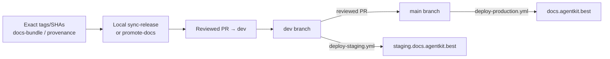
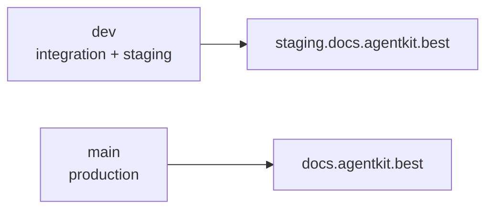
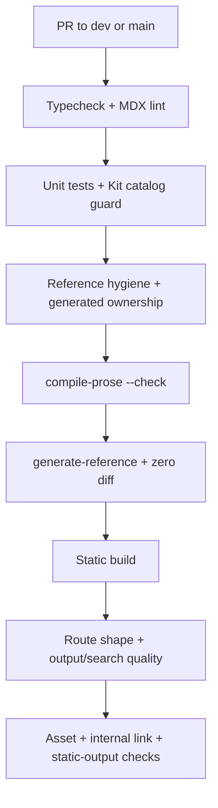

# Release maintenance & deploy

How `ak-docs` stays aligned with product releases and reaches
staging/production.

## Authoritative operating model (manual local)

Release maintenance is **manual, local, and human-reviewed**:

1. Collect **exact** release evidence (tag, product SHA, channel, and for
   stable: `promotedFrom` + the exact beta docs snapshot).
2. Run the local sync or promote script against a verified docs-bundle
   directory (or fixture-shaped bundle).
3. Open a **normal PR into `dev`**.
4. Verify **staging** (`staging.docs.agentkit.best`).
5. Open a reviewed **`dev` → `main` PR** for production
   (`docs.agentkit.best`).

Do **not** hand-edit `content/docs/stable/`. Fix Beta (or the bundle), then
promote. Do **not** treat `repository_dispatch` / `docs-sync.yml` as the
operating authority for this phase — that path is legacy and non-authoritative
(see below). Automation may be reintroduced only after the same manual contract
has succeeded more than once, and it must still open a PR rather than merge
itself.



## Release evidence

When a docs bundle is available, treat its **manifest** as evidence and verify
it against the exact release tag or SHA before applying:

```
manifest.json      # schemaVersion, channel, tag, sha, version, generatedAt
                   # (+ promotedFrom on stable)
reference/cli/     # raw ak --help MDX per command
release-notes.md   # channel release notes (semi-trusted input; required)
```

If upstream did not attach `docs-bundle.tar.gz` to the release, construct an
equivalent local directory from the same contract (manifest + notes +
reference) from an **exact temporary product checkout**. Never mutate a shared
long-lived product working tree as part of docs ops.

### Beta sync (`scripts/sync-release.mjs`)

Wholesale-replaces `reference-raw/`, regenerates non-published
`reference-derived/`, writes beta `reference/release-notes.mdx` via the shared
release-note renderer (`scripts/lib/release-notes.mjs`: channel/tag frontmatter
+ private-link hygiene), and updates `channels.json.beta` only. Published nested
CLI pages under `content/docs/beta/reference/cli/` remain reviewed, human-owned
content.

Re-running the same bundle/tag is **idempotent**.

### Stable promotion (`scripts/promote-docs.mjs`)

Stable is a **whole-copy** of the **exact** Beta docs snapshot named by
`manifest.promotedFrom`. The CLI binds that snapshot via git (default tag
`docs/{promotedFrom}`; optional `--beta-ref <ref>` must still point at that
same tree). An arbitrary current `content/docs/beta` working directory is
**not** sufficient evidence and is refused without an explicit fixture override.

After the whole-copy, promote:

1. Rewrites `content/docs/stable/reference/release-notes.mdx` from the **stable**
   bundle's `release-notes.md` using the **same** release-note renderer as beta
   sync (stable channel + stable tag — never leave copied beta metadata).
2. Asserts the promoted tree is channel-neutral (no hard-coded `/docs/beta/`
   links).
3. Updates `channels.json.stable` only (`version`, `tag`, `sha`,
   `syncedAt = manifest.generatedAt`).

Beta content and `channels.json.beta` are never modified. Repeat runs of the
same inputs are byte-identical. Open a normal PR; do not commit stable as a
direct push to production.

```bash
# Real promote — fails closed unless docs/{promotedFrom} (or --beta-ref) resolves:
node scripts/promote-docs.mjs --bundle path/to/docs-bundle-stable
node scripts/promote-docs.mjs --bundle path/to/docs-bundle-stable \
  --beta-ref docs/v2.8.0-beta.14

# Fixture dry-run only (not evidence of promotedFrom):
node scripts/promote-docs.mjs \
  --bundle fixtures/docs-bundle-stable \
  --beta-source content/docs/beta \
  --allow-unverified-beta-source
```

## Branch → environment



| Branch | Deploy workflow | Site |
| --- | --- | --- |
| `dev` | `deploy-staging.yml` | staging.docs.agentkit.best |
| `main` | `deploy-production.yml` | docs.agentkit.best |

Production changes only via reviewed `dev` → `main` merge.

## CI on every PR



See [CLI reference pipeline](./cli-reference-pipeline.md) for layer details and
[post-launch quality & operations](./post-launch-operations.md) for baselines,
browser evidence, promotion, and rollback.

## Ownership & guards (summary)

| Actor | Role |
| --- | --- |
| Maintainers (manual) | Evidence, local sync/promote, PR authoring |
| Humans | Review PRs; approve `dev` → `main` |
| CI | Enforce generated ownership, reproducibility, routes, links, and static export |

Generated reference dir: reproducibility check (`generate-reference` zero diff)
is stronger than the hand-edit guard for that path.

## Legacy automation (non-authoritative)

`.github/workflows/docs-sync.yml` (and the post-sync docs agent chain) implement
an older automatic path: `repository_dispatch` → download release asset → beta
direct-commit + `docs/<tag>` or stable promotion branch. That path is **not**
the current operating authority:

- Prefer local scripts + normal PRs for every release.
- Upstream releases without `docs-bundle.tar.gz` cannot use the workflow as
  designed.
- Whether to **disable or delete** `docs-sync.yml` is a separate ops decision;
  do not re-enable it as the default process until the manual contract is
  routine and any missing upstream assets are fixed.

Deploy workflows (`deploy-staging.yml`, `deploy-production.yml`) remain active
and authoritative for environment publishes after merges.

## Local validation (no live product checkout)

```bash
node scripts/sync-release.mjs --bundle fixtures/docs-bundle-beta
node scripts/promote-docs.mjs --bundle fixtures/docs-bundle-stable \
  --beta-source content/docs/beta --allow-unverified-beta-source
node scripts/compile-prose.mjs --check
node scripts/generate-reference.mjs
pnpm test
```

The `--beta-source` + `--allow-unverified-beta-source` path is **fixture shape
only**. It does not prove the tree is `manifest.promotedFrom`. Real promotion
must resolve `docs/{promotedFrom}` (or an explicit `--beta-ref` to that exact
snapshot). After any dry-run that writes Stable, inspect
`content/docs/stable/reference/release-notes.mdx` (stable channel + stable tag)
and reset the worktree if the run was only for validation.
