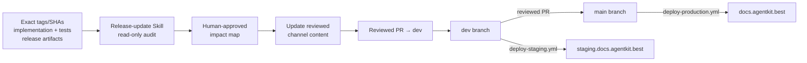
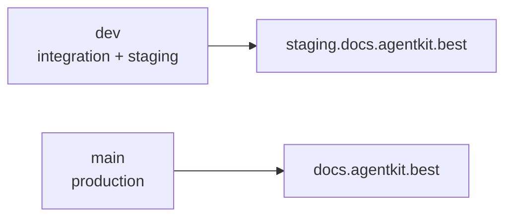
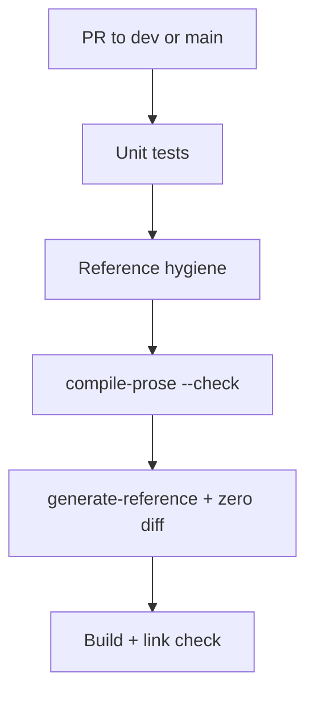

# Release maintenance & deploy

How `ak-docs` stays aligned with `ak-cli` releases and reaches
staging/production.

## Post-launch operating direction

Release maintenance is Skill-first, manually invoked, and human-reviewed. The
repo-local release-update Skill is the intended entry point: it audits immutable
release evidence, maps changed claims to affected pages, and stops before
authoring. Until the Skill lands, maintainers follow the same gates manually.
After a maintainer approves the impact map, changes are authored in the release
channels currently in scope and opened as a normal PR. Stable promotion is not
part of the current operating workflow; add that contract when the Stable
workflow is implemented.



Automation is not the operating authority for this phase. Workflow integration
starts only after the same manual release-update contract has succeeded more
than once. It must still open a PR and must never merge automatically.

## Release evidence

When a docs bundle is available, treat its manifest as one evidence input and
verify it against the exact release tag or SHA before using it:

```
manifest.json      # schemaVersion, channel, tag, sha, version, generatedAt
reference/cli/     # raw ak --help MDX per command
release-notes.md   # channel release notes (semi-trusted input)
```

`sync-release.mjs` can wholesale-replace `reference-raw/`, regenerate the
non-published `reference-derived/` dump from raw facts + prose overlays, and
update release notes and `channels.json.beta`. Published nested CLI pages under
`content/docs/beta/reference/cli/` remain reviewed, human-owned content.

Running the sync against the same bundle and tag is **idempotent**.

## Branch → environment



| Branch | Deploy workflow | Site |
| --- | --- | --- |
| `dev` | `deploy-staging.yml` | staging.docs.agentkit.best |
| `main` | `deploy-production.yml` | docs.agentkit.best |

Production changes only via reviewed `dev` → `main` merge.

## CI on every PR (reference-related excerpt)



See [CLI reference pipeline](./cli-reference-pipeline.md) for layer details.

## Ownership & guards (summary)

| Actor | Role |
| --- | --- |
| Planned release-update Skill | Read-only audit, impact mapping, approved authoring |
| Humans | Approve impact and review PRs |
| CI | Enforce generated ownership, reproducibility, routes, links, and static export |

Generated reference dir: reproducibility check (`generate-reference` zero diff)
is stronger than the hand-edit guard for that path.

## Local validation (no live ak-cli)

```bash
node scripts/sync-release.mjs --bundle fixtures/docs-bundle-beta
node scripts/compile-prose.mjs --check
node scripts/generate-reference.mjs
pnpm test
```
