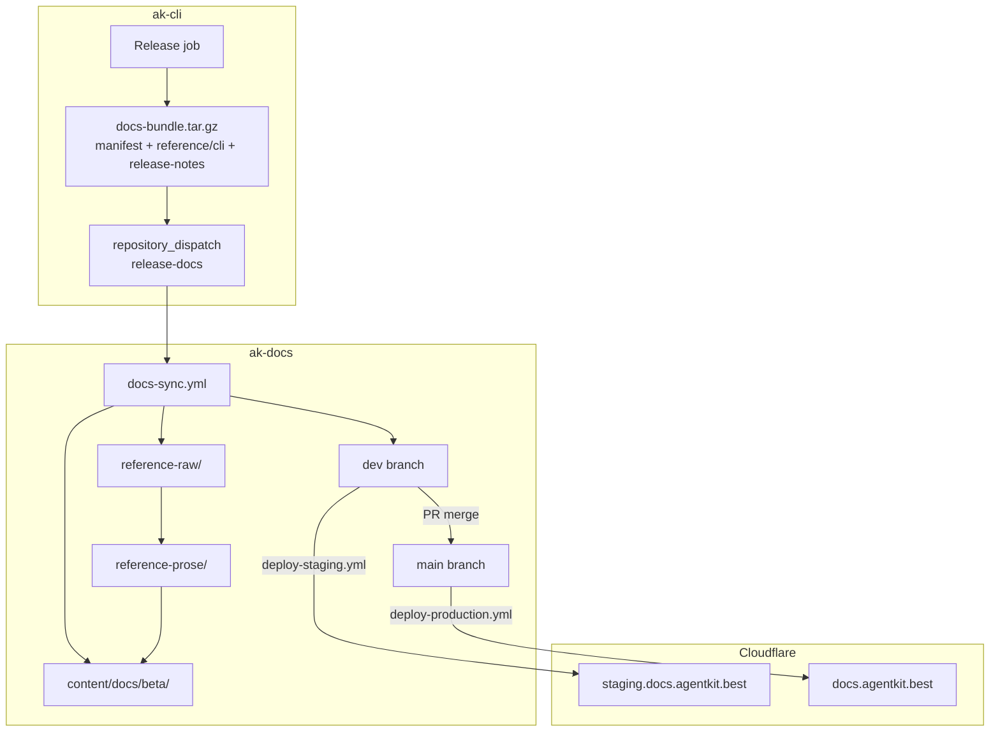
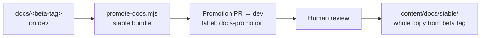
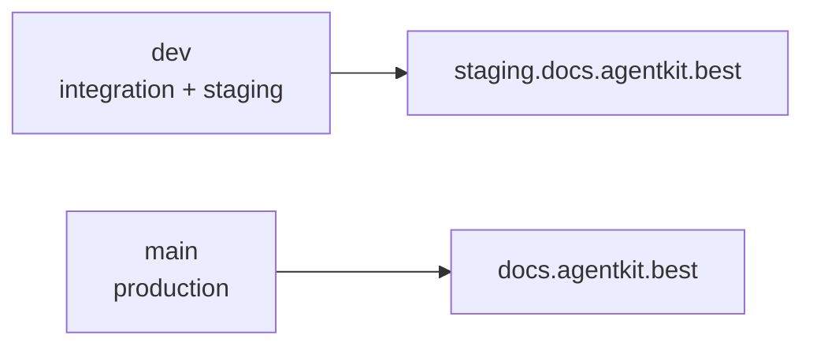
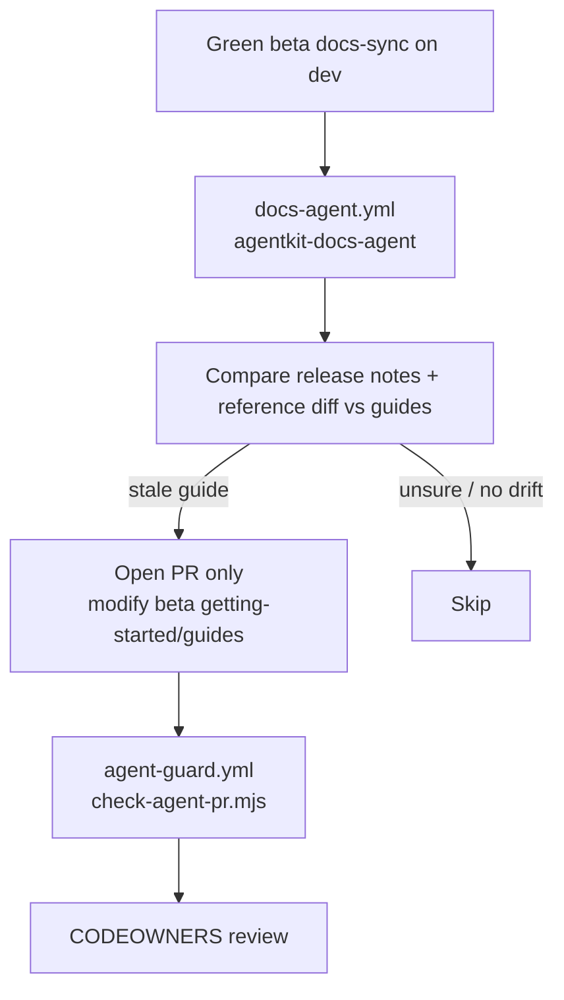
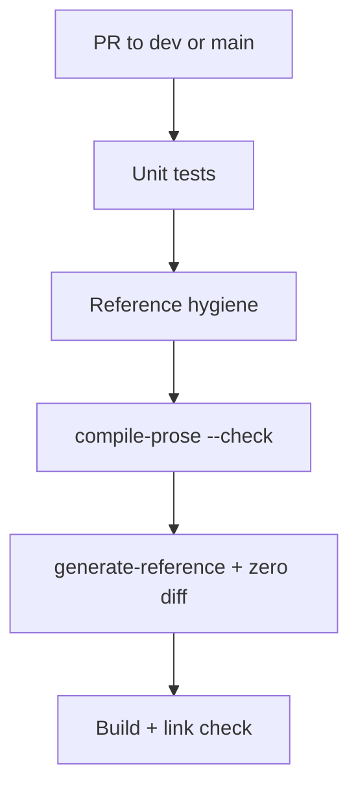

# Release sync & deploy

How `ak-docs` stays aligned with `ak-cli` releases and reaches staging/production.

## End-to-end overview



## Beta docs sync (per release)

```mermaid
sequenceDiagram
  participant CLI as ak-cli release
  participant GH as GitHub
  participant WF as docs-sync.yml
  participant BOT as agentkit-docs-bot
  participant REPO as ak-docs dev

  CLI->>GH: Upload docs-bundle.tar.gz
  CLI->>GH: repository_dispatch release-docs
  GH->>WF: channel=beta, tag, sha
  WF->>GH: Download bundle (manifest is source of truth)
  WF->>REPO: sync-release.mjs
  Note over REPO: reference-raw/ ← bundle reference/cli<br/>generate-reference ← raw + prose<br/>release-notes.mdx, channels.json
  BOT->>REPO: Commit docs-sync: beta &lt;tag&gt;
  BOT->>REPO: Tag docs/&lt;tag&gt;
  Note over REPO: deploy-staging.yml → staging site
```

### docs-bundle contract (v1)

```
manifest.json      # schemaVersion, channel, tag, sha, version, generatedAt
reference/cli/     # raw ak --help MDX per command
release-notes.md   # channel release notes (semi-trusted input)
```

`sync-release.mjs` wholesale-replaces `reference-raw/`, regenerates derived
`content/docs/beta/reference/cli/` from raw + prose overlays, preserves human-owned
`meta.json` / `meta.vi.json` nav, updates `channels.json.beta`.

Re-dispatching the same tag is **idempotent**.

## Stable promotion



Stable is never direct-committed. Promotion asserts content is channel-neutral
(no baked-in `beta`/`stable` wording). Prose overlays inherit for free because
they live outside `content/docs/`.

## Branch → environment



| Branch | Deploy workflow | Site |
| --- | --- | --- |
| `dev` | `deploy-staging.yml` | staging.docs.agentkit.best |
| `main` | `deploy-production.yml` | docs.agentkit.best |

Production changes only via reviewed `dev` → `main` merge.

## Docs agent (optional prose patches)



The agent cannot touch `reference/`, `stable/`, workflows, or generated dirs.
Disabling `docs-agent.yml` does not affect the sync pipeline.

## CI on every PR (reference-related excerpt)



See [CLI reference pipeline](./cli-reference-pipeline.md) for layer details.

## Identities & guards (summary)

| Actor | Role | Bypass on `dev`? |
| --- | --- | --- |
| `agentkit-docs-bot` | Beta sync commits + tags | Yes (ruleset bypass) |
| `agentkit-docs-agent` | Guide patch PRs | No — must pass guards |
| Humans | PRs via review | No |

Generated reference dir: reproducibility check (`generate-reference` zero diff)
is stronger than the hand-edit guard for that path.

## Local validation (no live ak-cli)

```bash
node scripts/sync-release.mjs --bundle fixtures/docs-bundle-beta
node scripts/promote-docs.mjs --bundle fixtures/docs-bundle-stable --beta-source content/docs/beta
node scripts/compile-prose.mjs --check
node scripts/generate-reference.mjs
pnpm test
```
